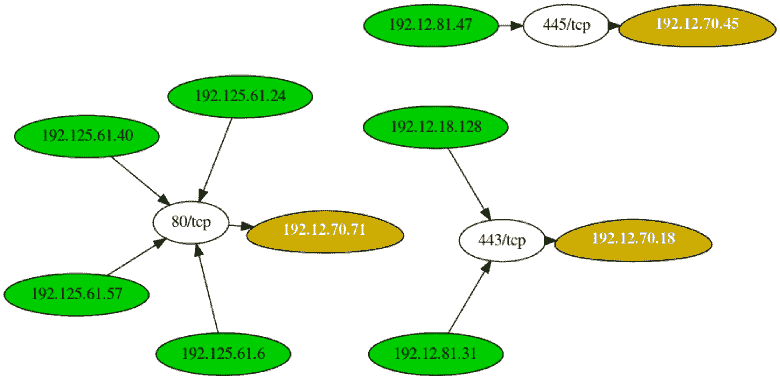

# Leprechaun:用于绘制网络数据流的工具，以帮助渗透测试人员

> 原文：<https://kalilinuxtutorials.com/leprechaun-map-out-network-data-flow-penetration-testers/>

[](https://1.bp.blogspot.com/-L1OqcT_52f8/Xdtw_YfiKZI/AAAAAAAADlI/PfekIZxJPwQFGKH-jx7j7FkSAh0QEGMeQCLcBGAsYHQ/s1600/Example%2B%25281%2529.png)

这个工具的目的是帮助渗透测试人员识别内部网络环境中潜在的有价值的目标。通过聚合来自多台主机的 netstat 路由，您可以很容易地弄清楚。

这些说明将为您提供一个项目的副本，并在您的本地机器上运行，用于开发和测试目的。有关如何在活动系统上部署项目的说明，请参见部署。

**先决条件**

你需要一些红宝石来开始——如果你还没有的话。

**gem 安装' securerandom'
gem 安装' terminal-table'
gem 安装' getopt'**

最后，确保你已经安装了 Graphviz。您可以使用以下命令进行安装:

**安装 graphviz -y**

**也可阅读-[Evil-Winrm:用于黑客攻击/测试的终极 Winrm 外壳](https://kalilinuxtutorials.com/evil-winrm-the-ultimate-winrm-shell-hacking-pentesting/)**

**工具帮助菜单**

如果不带任何参数运行该脚本，您将看到以下帮助菜单:

**【root:vonahisec-kali:~/scripts/leprechaun】#。/Leprechaun . Rb

————————————————————————
Leprechaun v 1.0–Alton Johnson(@ Alton njx)
————————————————————————————————————————————————————————————

用法:。/leprechaun . r b-f/path/to/netstat _ results . txt-p

-f 文件包含您感兴趣的 netstat 结果
-p 端口的输出。例如 80 度。指定“所有”、“公共”或用逗号分隔端口
-e 您要查看连接的目标 IP 地址的类型(例如外部/内部/所有)

示例:。/leprechaun . r b-f netstat _ output . txt-p 80
例:。/leprechaun . r b-f netstat _ output . txt-p all
例:。/leprechaun . r b-f netstat _ output . txt-p common
示例:。/leprechaun . r b-f netstat _ output . txt-p 80，443 -t 外部**

**示例输出**

```
+--------------+-----------------------------+----------------------------+
| Server       | Number of connected clients | Highest traffic destination port |
+--------------+-----------------------------+----------------------------+
| 192.12.70.71 | 4                           | 80/tcp (4 clients)               |
| 192.12.70.18 | 2                           | 443/tcp (2 clients)              |
| 192.12.70.45 | 1                           | 445/tcp (1 clients)              |
+--------------+-----------------------------+----------------------------+
```

**鸣谢:奥尔顿·约翰逊**

[**Download**](https://github.com/vonahisec/leprechaun)