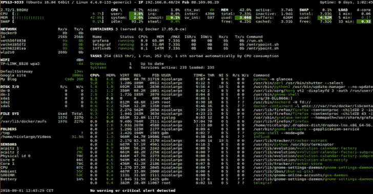
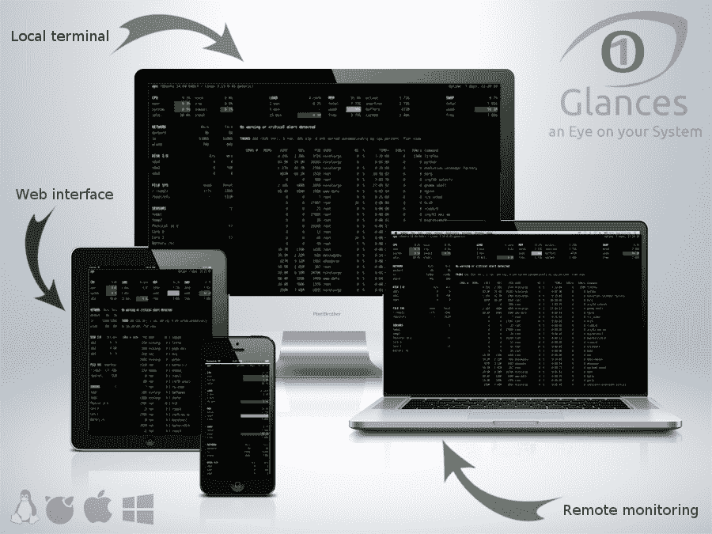

# glasses:GNU/Linux、BSD、Mac OS 和 Windows OS 的 Top/htop 替代方案

> 原文：<https://kalilinuxtutorials.com/glances-gnu-linux-bsd-mac-windows-os/>

**glasses**是一个跨平台的监控工具，旨在通过 curses 或基于 Web 的界面呈现大量的监控信息。信息根据用户界面的大小动态调整。

它也可以在客户机/服务器模式下工作。远程监控可以通过终端、Web 界面或 API (XML-RPC 和 RESTful)来完成。统计数据也可以导出到文件或外部时间/价值数据库。

它是用 Python 编写的，使用库从系统中获取信息。它基于一个开放的架构，开发者可以添加新的插件或导出模块。

**要求**

*   `**python 2.7,>=3.4**`
*   `**psutil>=5.3.0**`(最新版本更好)

可选依赖项:

*   **`bernhard`** (用于黎曼导出模块)
*   **`bottle`** (用于 Web 服务器模式)
*   `**cassandra-driver**`(用于 Cassandra 导出模块)
*   `**couchdb**`(针对 CouchDB 导出模块)
*   `**docker**`(用于 Docker 监控支持)【仅限 Linux/macOS】
*   `**elasticsearch**`(用于弹性搜索导出模块)
*   `**hddtemp**`(支持硬盘温度监控)【仅限 Linux】
*   `**influxdb**`(用于 InfluxDB 导出模块)
*   `**kafka-python**`(针对 Kafka 导出模块)
*   `**netifaces**`(用于 IP 插件)
*   `**nvidia-ml-py3**`(针对 GPU 插件)
*   `**pika**`(用于 RabbitMQ/ActiveMQ 导出模块)
*   `**potsdb**`(对于 OpenTSDB 导出模块)
*   `**prometheus_client**`(用于普罗米修斯导出模块)
*   `**py-cpuinfo**`(用于快速查看 CPU 信息模块)
*   `**pygal**`(用于图形导出模块)
*   `**pymdstat**`(用于 RAID 支持)【仅限 Linux】
*   `**pySMART.smartx**`(用于硬盘智能支持)【仅限 Linux】
*   `**pysnmp**`(用于 SNMP 支持)
*   `**pystache**`(动作脚本功能)
*   `**pyzmq**`(用于 ZeroMQ 导出模块)
*   `**requests**`(用于端口、云插件和 RESTful 导出模块)
*   `**scandir**`(用于文件夹插件)【仅用于 Python < 3.5】
*   `**statsd**`(用于 StatsD 导出模块)
*   `**wifi**`(用于 wifi 插件)【仅限 Linux】
*   `**zeroconf**`(用于自动发现模式)

**Python 2.6 用户注意事项**

它不再支持 Python 2.6。请升级到最低 Python 版本 2.7/3.4+或降级到 2.6.2(支持 Python 2.6 的最新版本)。

**CentOS Linux 6 和 7 用户注意事项**

Python 2.7 和 3.4 现在可以通过 SCL 库获得。见:[https://lists . centos . org/piper mail/centos-announce/2015-12 月/021555.html](https://lists.centos.org/pipermail/centos-announce/2015-December/021555.html) 。

**也读作-[自定义报头:自动向整个 BurpSuite HTTP 请求添加新报头](https://kalilinuxtutorials.com/custom-header-burpsuite-http-requests/)**

**安装**

有几种方法可以在您的系统上测试/安装它。选择你的武器！

**自动安装脚本:总方式**

要将依赖项和最新版本安装到生产就绪版本(又名*主*分支)，只需输入以下命令行:

**curl-L https://bit.ly/glances |/bin/bash**
或者
**wget-O-https://bit.ly/glances |/bin/bash**

**注意:**这仅在部分 GNU/Linux 发行版和 Mac OS X 上受支持，如果你想支持其他发行版，请贡献给 [glancesautoinstall](https://github.com/nicolargo/glancesautoinstall) 。

**PyPI:最简单的方法**

它在`PyPI`上。通过使用 PyPI，您将使用最新的稳定版本。

要安装，只需使用`**pip**`:

**皮普安装眼色**

**注意:**安装 [psutil](https://github.com/giampaolo/psutil) 需要 Python 头文件。例如，在 Debian/Ubuntu 上，你需要首先安装 python-dev 包。对于 Fedora/CentOS/RHEL 安装第一个 python-devel 包。对于 Windows，只需从二进制安装文件安装 psutil 即可。

**注意 2** (针对 Wifi 插件):如果你想使用 Wifi 插件，你需要在你的系统上安装 wireless-tools 包。

您还可以安装以下库，以便使用可选功能(如 Web 界面、导出模块等):

**pip install ' glasses[操作、浏览器、云、cpuinfo、docker、导出、文件夹、gpu、图形、ip、raid、snmp、web、wifi]'**

要将其升级到最新版本:

**pip 安装–升级扫视
pip 安装–升级扫视[…]**

如果您需要将其安装在特定的用户位置，请使用:

**导出 python userbase = ~/my local path
pip 安装–用户眼色**

**码头工人:搞笑方式**

容器可用。它包括最新的开发头版本。你可以用它来监控你的服务器和所有其他容器！

获取扫视容器:

**码头工人拉·尼古拉戈/眼色**

在*控制台模式*下运行容器:

**坞站运行–RM-v/var/run/docker . sock:/var/run/docker . sock:ro–PID host–network host-it docker . io/nicolaargo/glances**

此外，如果您想使用自己的 glances.conf 文件，可以创建自己的 docker 文件:

**FROM nicolar go/glasses
复制 glasses . conf/glasses/conf/glasses . conf
CMD python-m glasses-C/glasses/conf/glasses . conf $ glasses _ OPT**

或者，您可以使用 docker run 选项指定类似的内容:

**docker run-v ` pwd `/ glasses . conf:/glasses/conf/glasses . conf-v/var/run/docker . sock:/var/run/docker . sock:ro–PID host-it docker.io/nicolargo/glances**

其中,` pwd `/ glasses . conf 是包含您的 glasses . conf 文件的本地目录。

在 *Web 服务器模式*下运行容器(注意为 it to startup 命令设置参数的 GLANCES _ OPT 环境变量):

docker run-d–restart = " always "-p 61208-61209:61208-61209-e glasses _ OPT = "-w "-v/var/run/docker . sock:/var/run/docker . sock:ro–PID 主机 docker.io/nicolargo/glances

**GNU/Linux**

它在许多 Linux 发行版上都有，所以您应该能够使用您最喜欢的包管理器来安装它。请注意，当您使用此方法时，它的操作系统[包](https://repology.org/metapackage/glances/packages)可能不是最新版本。

**FreeBSD**

要安装二进制软件包:

**# pkg 安装 py27-扫视**

要从端口安装它:

**# CD/usr/ports/sysutils/py-glasses/
# make install clean**

**macOS**

如果不想使用 glancesautoinstall 脚本，请按照以下步骤操作。

macOS 用户可以使用 **`Homebrew`或`MacPorts`安装。**

**家酿**

**$ brew 安装眼色**

**MacPorts**

**$ sudo 端口安装眼色**

**视窗**

安装[Python](https://www.python.org/getit/)for Windows(Python 2 . 7 . 9+和 3.4+附带 pip)，然后运行以下命令:

**$ pip 安装眼色**

或者，您可以克隆存储库并使用以下命令进行安装。

**$ git 克隆 https://github.com/nicolargo/glances.git
$ CD 扫视
$ python setup.py 安装**

**安卓**

你需要一个根设备和一个 [Termux](https://play.google.com/store/apps/details?id=com.termux) 应用程序(谷歌 Play 商店上有)。

在您的设备上启动 Termux 并输入:

**$ apt 更新
$ apt 升级
$ apt 安装 clang python-dev
$ pip 安装瓶子
$ pip 安装眼色**

并启动它:

**$眼色**

您也可以在服务器模式(-s 或-w)下运行它，以便远程监控您的 Android 设备。

**来源**

要从源代码安装它:

$ wget https://github.com/nicolargo/glances/archive/vX.Y.tar.gz-O-| tar xz
$ CD glasses-*
# python setup . py install

*注意*:安装 psutil 需要 Python 头文件。

**用法**

对于独立模式，只需运行:

**$眼色**

对于 Web 服务器模式，运行:

**$ glasses-w**

并在您最喜欢的网络浏览器中输入网址`**http://<ip>:61208**`。

对于客户端/服务器模式，运行:

**$ glasses-s**

在服务器端运行:

**$眼色-c < ip >**

在客户端上。

您还可以检测和显示网络上可用的或配置文件中定义的所有 it 服务器:

**$ glasses–浏览器**

您还可以在 stdout 上显示原始统计数据:

**$ glasses–stdout CPU . user，mem.used，load** CPU . user:30.7
mem . used:3278204928
load:{ ' cpucore ':4，' min1': 0.21，' min5': 0.4，' min15 ':0.27 }
CPU . user:3.4 mem . used:3275251712
load:{ ' cpucore ':4，' min 1

或者由于 stdout-csv 选项而采用 CSV 格式:

**$ glasses–stdout-CSV
now，cpu.user，mem.used，load now，cpu.user，mem.used，load.cpucore，load.min1，load.min5，load . min 15 2018-12-08 22:04:20 CEST，7.3，5948149760，4，1.04，0.99，1.04
2018-12-08 22:08**

还有 RTFM，一直都是。

[**Download**](https://github.com/nicolargo/glances)