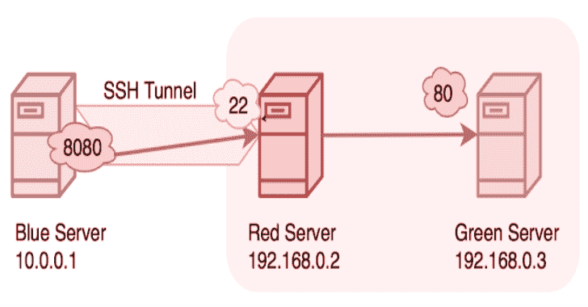

# SSHTunnel : SSH 隧道到远程服务器

> 原文：<https://kalilinuxtutorials.com/sshtunnel-ssh-tunnels-remote-server/>

[](https://1.bp.blogspot.com/-TZEwyC4MDUo/Xdw_8CssEvI/AAAAAAAADmE/CWGGmKYV630-Oid_d9HAMn6lb_VeKGl5gCLcBGAsYHQ/s1600/ssh-local%25281%2529.png)

SSHTunnel 是一个通过 SSH 隧道连接到远程服务器的工具。

**安装**

sshtunnel 在 PyPI 上，所以只需运行:

**pip 安装 sshtunnel**

或者

**简易安装隧道**

或者

**康达安装-康达锻造隧道**

在您的环境中安装它。

对于从源安装，克隆 [repo](https://github.com/pahaz/sshtunnel) 并运行:

**python setup.py 安装**

**也可阅读-[检测实验室:流浪者&打包脚本构建实验室环境](https://kalilinuxtutorials.com/detectionlab-vagrant-packer-scripts/)**

**测试包**

为了运行测试，您首先需要 [tox](https://testrun.org/tox/latest/) 并运行:

**python setup.py 测试**

**使用场景**

下图描述了`sshtunnel`有用的一个典型场景。用户可能需要连接远程服务器的一个端口(即 8080 ),而只有 SSH 端口(通常是端口 22)是可到达的。

```
----------------------------------------------------------------------

                            |
-------------+              |    +----------+
    LOCAL    |              |    |  REMOTE  | :22 SSH
    CLIENT   | <== SSH ========> |  SERVER  | :8080 web service
-------------+              |    +----------+
                            |
                         FIREWALL (only port 22 is open)

----------------------------------------------------------------------
```

**图 1** :如何通过 SSH 隧道连接到被防火墙屏蔽的服务。

如果 SSH 服务器允许，也有可能到达一个从外部(`LOCAL CLIENT`的视角)不直接可见的私有服务器(从`REMOTE SERVER`的视角)。

```
----------------------------------------------------------------------

                            |
-------------+              |    +----------+               +---------
    LOCAL    |              |    |  REMOTE  |               | PRIVATE
    CLIENT   | <== SSH ========> |  SERVER  | <== local ==> | SERVER
-------------+              |    +----------+               +---------
                            |
                         FIREWALL (only port 443 is open)

----------------------------------------------------------------------

```

**图二**:如何通过 SSH 隧道连接到`PRIVATE SERVER`。

**用法举例**

API 允许初始化隧道并启动它，或者使用一个`with`上下文，它将负责启动**和停止**隧道:

**例 1**

给定远程服务器的地址为`**pahaz.urfuclub.ru**`，密码验证和随机分配的本地绑定端口，对应于上述**图 1** 的代码如下。

```
from sshtunnel import SSHTunnelForwarder

server = SSHTunnelForwarder(
    'pahaz.urfuclub.ru',
    ssh_username="pahaz",
    ssh_password="secret",
    remote_bind_address=('127.0.0.1', 8080)
)

server.start()

print(server.local_bind_port)  # show assigned local port
# work with `SECRET SERVICE` through `server.local_bind_port`.

server.stop()
```

**例 2**

无法直接到达的转发到私有服务器的端口示例，假设密码保护的 pkey 身份验证，远程服务器的 SSH 服务正在侦听端口 443，并且该端口在防火墙中是开放的(**图 2** ):

```
import paramiko
import sshtunnel

with sshtunnel.open_tunnel(
    (REMOTE_SERVER_IP, 443),
    ssh_username="",
    ssh_pkey="/var/ssh/rsa_key",
    ssh_private_key_password="secret",
    remote_bind_address=(PRIVATE_SERVER_IP, 22),
    local_bind_address=('0.0.0.0', 10022)
) as tunnel:
    client = paramiko.SSHClient()
    client.load_system_host_keys()
    client.set_missing_host_key_policy(paramiko.AutoAddPolicy())
    client.connect('127.0.0.1', 10022)
    # do some operations with client session
    client.close()

print('FINISH!')
```

**例 3**

流浪 MySQL 本地端口的端口转发示例:

```
from sshtunnel import open_tunnel
from time import sleep

with open_tunnel(
    ('localhost', 2222),
    ssh_username="vagrant",
    ssh_password="vagrant",
    remote_bind_address=('127.0.0.1', 3306)
) as server:

    print(server.local_bind_port)
    while True:
        # press Ctrl-C for stopping
        sleep(1)

print('FINISH!')
```

或者简单地使用 CLI:

**(bash)$ python-m ssh tunnel-U vagger-P vagger-L:3306-R 127 . 0 . 0 . 1:3306-P 2222 localhost**

**例 4**

打开跨越两个隧道的 SSH 会话。SSH 传输和隧道将被守护，不会等待连接在关闭时间停止。

```
import sshtunnel
from paramiko import SSHClient

with sshtunnel.open_tunnel(
    ssh_address_or_host=('GW1_ip', 20022),
    remote_bind_address=('GW2_ip', 22),
    block_on_close=False
) as tunnel1:
    print('Connection to tunnel1 (GW1_ip:GW1_port) OK...')
    with sshtunnel.open_tunnel(
        ssh_address_or_host=('localhost', tunnel1.local_bind_port),
        remote_bind_address=('target_ip', 22),
        ssh_username='GW2_user',
        ssh_password='GW2_pwd',
        block_on_close=False
    ) as tunnel2:
        print('Connection to tunnel2 (GW2_ip:GW2_port) OK...')
        with SSHClient() as ssh:
            ssh.connect('localhost',
                port=tunnel2.local_bind_port,
                username='target_user',
                password='target_pwd',
            )
            ssh.exec_command(...)
```

CLI 用法

```
$ sshtunnel --help
usage: sshtunnel [-h] [-U SSH_USERNAME] [-p SSH_PORT] [-P SSH_PASSWORD] -R
                 IP:PORT [IP:PORT ...] [-L [IP:PORT [IP:PORT ...]]]
                 [-k SSH_HOST_KEY] [-K KEY_FILE] [-S KEY_PASSWORD] [-t] [-v]
                 [-V] [-x IP:PORT] [-c SSH_CONFIG_FILE] [-z] [-n] [-d [FOLDER [FOLDER ...]]]
                 ssh_address 
Pure python ssh tunnel utils
Version 0.1.5

positional arguments:
  ssh_address           SSH server IP address (GW for SSH tunnels)
                        set with "-- ssh_address" if immediately after -R or -L

optional arguments:
  -h, --help            show this help message and exit
  -U SSH_USERNAME, --username SSH_USERNAME
                        SSH server account username
  -p SSH_PORT, --server_port SSH_PORT
                        SSH server TCP port (default: 22)
  -P SSH_PASSWORD, --password SSH_PASSWORD
                        SSH server account password
  -R IP:PORT [IP:PORT ...], --remote_bind_address IP:PORT [IP:PORT ...]
                        Remote bind address sequence: ip_1:port_1 ip_2:port_2 ... ip_n:port_n
                        Equivalent to ssh -Lxxxx:IP_ADDRESS:PORT
                        If port is omitted, defaults to 22.
                        Example: -R 10.10.10.10: 10.10.10.10:5900
  -L [IP:PORT [IP:PORT ...]], --local_bind_address [IP:PORT [IP:PORT ...]]
                        Local bind address sequence: ip_1:port_1 ip_2:port_2 ... ip_n:port_n
                        Elements may also be valid UNIX socket domains:
                        /tmp/foo.sock /tmp/bar.sock ... /tmp/baz.sock
                        Equivalent to ssh -LPORT:xxxxxxxxx:xxxx, being the local IP address optional.
                        By default it will listen in all interfaces (0.0.0.0) and choose a random port.
                        Example: -L :40000
  -k SSH_HOST_KEY, --ssh_host_key SSH_HOST_KEY
                        Gateway's host key
  -K KEY_FILE, --private_key_file KEY_FILE
                        RSA/DSS/ECDSA private key file
  -S KEY_PASSWORD, --private_key_password KEY_PASSWORD
                        RSA/DSS/ECDSA private key password
  -t, --threaded        Allow concurrent connections to each tunnel
  -v, --verbose         Increase output verbosity (default: ERROR)
  -V, --version         Show version number and quit
  -x IP:PORT, --proxy IP:PORT
                        IP and port of SSH proxy to destination
  -c SSH_CONFIG_FILE, --config SSH_CONFIG_FILE
                        SSH configuration file, defaults to ~/.ssh/config
  -z, --compress        Request server for compression over SSH transport
  -n, --noagent         Disable looking for keys from an SSH agent
  -d [FOLDER [FOLDER ...]], --host_pkey_directories [FOLDER [FOLDER ...]]
                        List of directories where SSH pkeys (in the format `id_*`) may be found

```

**信用:** [帕哈斯](https://github.com/pahaz)

[**Download**](https://github.com/pahaz/sshtunnel)