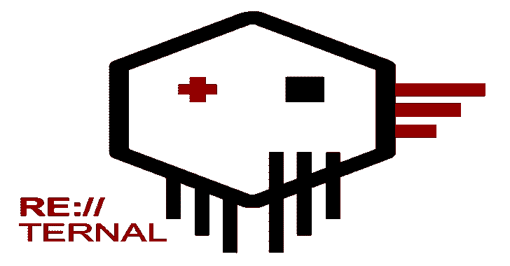
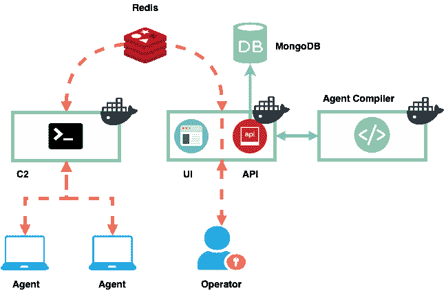
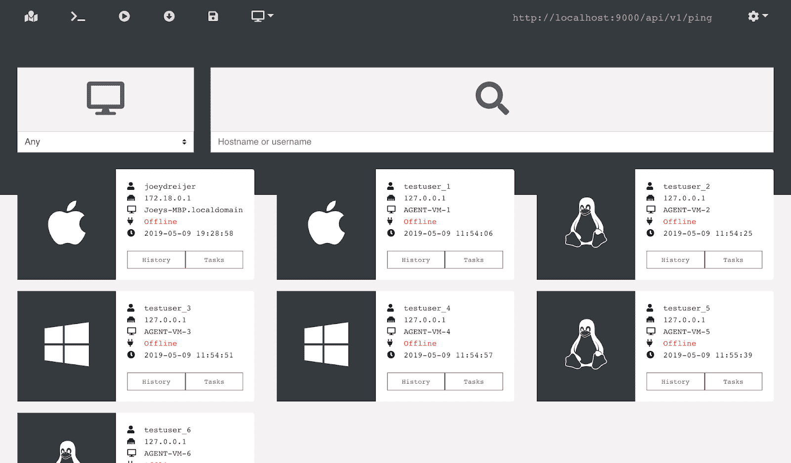
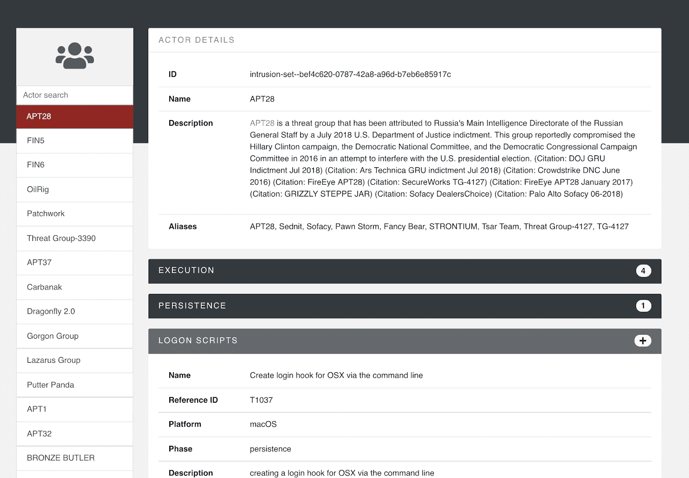
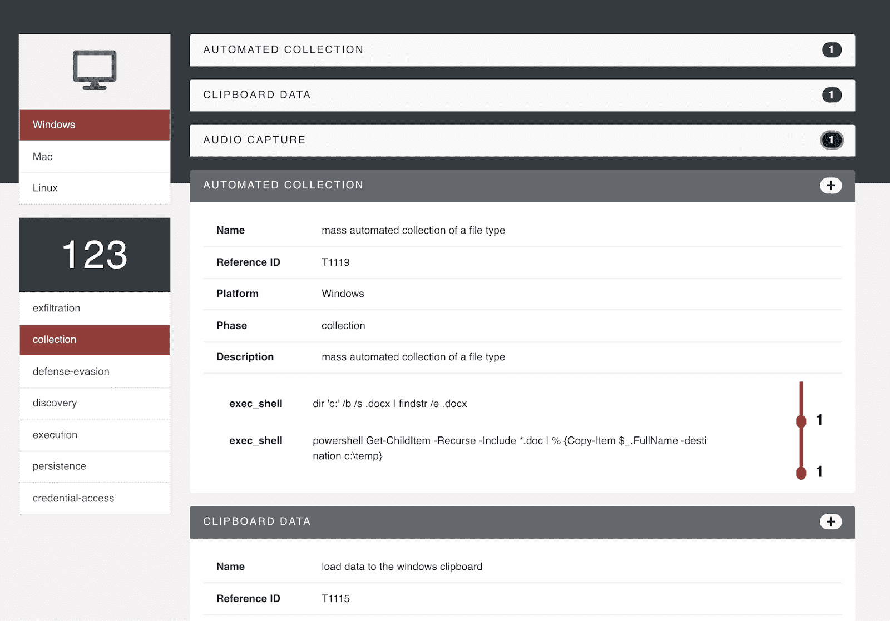
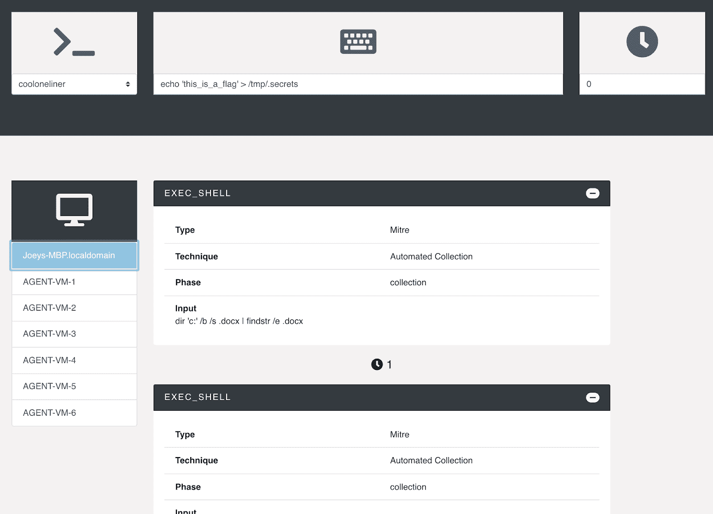

# 回复:包含 Docker-Compose 文件和设置脚本的报告

> 原文：<https://kalilinuxtutorials.com/reternal-repo-containing-docker-compose-files-setup-scripts/>

**RE:TERNAL** 是一个集中的紫色团队模拟平台。Reternal 使用安装在模拟网络上的代理来执行各种已知的红队技术，以测试蓝队的能力。

模拟被映射到米特 ATT 和 CK 框架。这个报告包含了构建文件，以便通过 docker 建立网络平台。一个额外的导入脚本可用于创建您的第一个用户和导入 Mitre 和 Metta 数据库。

**残留成分**

| 成分 | 描述 | 密码 | 建设 |
| --- | --- | --- | --- |
| [API](https://github.com/d3vzer0/reternal-backend) | 调度任务的管理 API |  |  |
| [UI](https://github.com/d3vzer0/reternal-ui) | 基于 VueJS 的 UI 构建脚本和 NGinx 服务器 |  |  |
| [C2](https://github.com/d3vzer0/reternal-c2) | 代理用来通信的独立 API 端点 |  |  |
| [代理编译器](https://github.com/d3vzer0/reternal-agent) | 编译代理(Golang)有效负载的服务 |  |  |
| [斜接](https://github.com/d3vzer0/reternal-mitre) | 储存库包含已经存在的用于保留的映射技术 |  |  |

| 成分 | 描述 | 建设 |
| --- | --- | --- |
| 总堆栈 | 通过 docker-compose 在此存储库中构建并验证整个堆栈 |  |

**也可阅读-[Fireprox:AWS API 网关管理工具，用于动态创建 HTTP](https://kalilinuxtutorials.com/fireprox-aws-api-gateway-creating-http/)**

**安装&配置**

该存储库包含一个可行的部署行动手册，用于自动化 Reternal 的安装和配置。该指南可以在回购的维基@[https://github.com/d3vzer0/reternal-quickstart/wiki/1.找到一个可安装的安装指南](https://github.com/d3vzer0/reternal-quickstart/wiki/1.A-Ansible-Install-Guide)。手动 docker-compose 文件也可用于本地测试。

**首个测试版路线图(2019 年 6 月)**

*   验证技术:执行验证和确认成功运行技术/任务的命令
*   代理条件:设计依赖于不同代理上的任务执行的任务。即。如果代理 A 完成了任务 B，让代理 X 执行任务 Y
*   为已执行的任务制定时间表
*   更多错误修复

**正式 Alpha 发布前的路线图(2019 年 5 月底)**

*   证书锁定:仅接受来自具有固定 TLS 指纹的服务器的命令
*   ~~密钥交换:实现在代理和服务器之间交换加密密钥的方法来加密代理内容~~完成
*   ~~加载保存的活动:完成加载保存的活动的能力~~完成
*   ~~完成可行行动手册:完成配置和部署所有剩余组件的可行行动手册~~完成
*   错误修复

这个名字是怎么回事？

这个项目已经被重新开发了很多次，它可能永远不会真正完成。因此 RE(重做)和 Ternal(永恒)。

**举例&截图**

所有功能都将记录在维基@[https://github.com/d3vzer0/reternal-quickstart/wiki](https://github.com/d3vzer0/reternal-quickstart/wiki)的欢迎页面上。下面是几个主要组件的例子。

**代理概述**

**演员映射**

Reternal 自动将可用的命令和技术映射到参与者。您可以直接将演员常用的所有技术添加到您的任务集中。

**技术映射**

命令被映射到 MITRE ATTCK 技术。您可以浏览可用的命令，并将它们直接添加到您的任务列表中。

**配方生成器**

调度在代理上运行的任务称为配方。您可以向配方添加手动命令，或者选择一个现有的映射技术或 actor TTPs。您可以拖放来更改配方中任务的顺序。

**演示**

[https://player.vimeo.com/video/328926622?dnt=1&app_id=122963](https://player.vimeo.com/video/328926622?dnt=1&app_id=122963)

[**Download**](https://github.com/d3vzer0/reternal-quickstart)