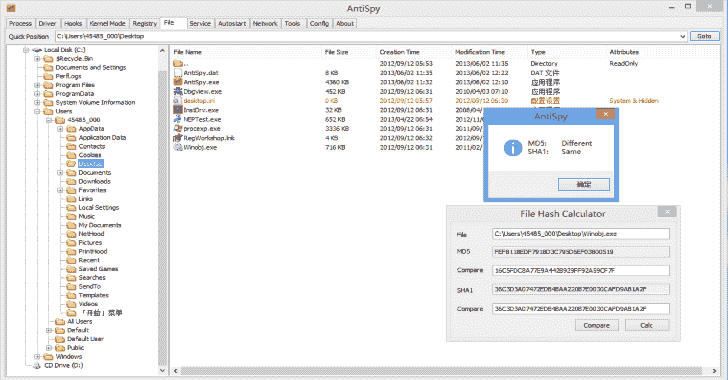
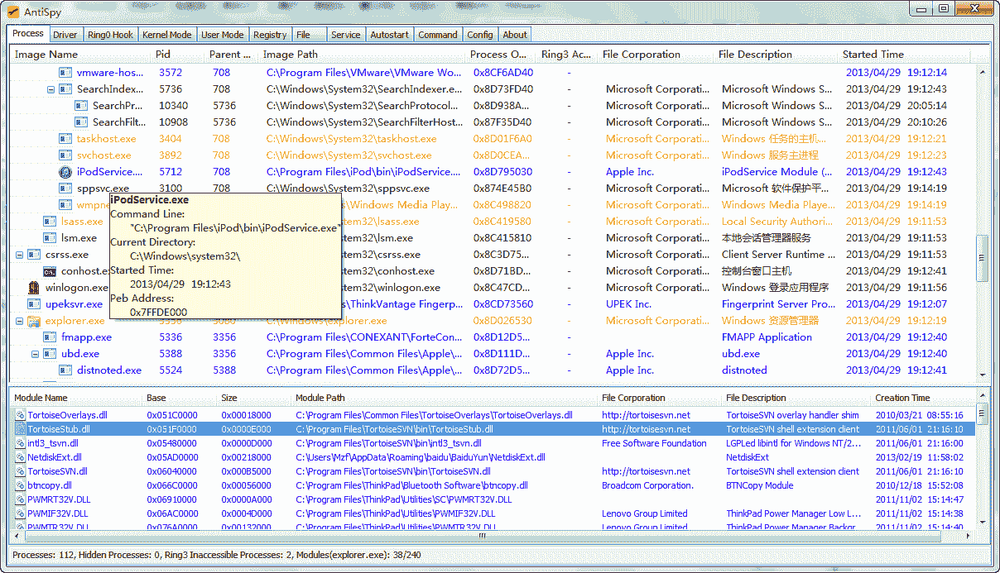
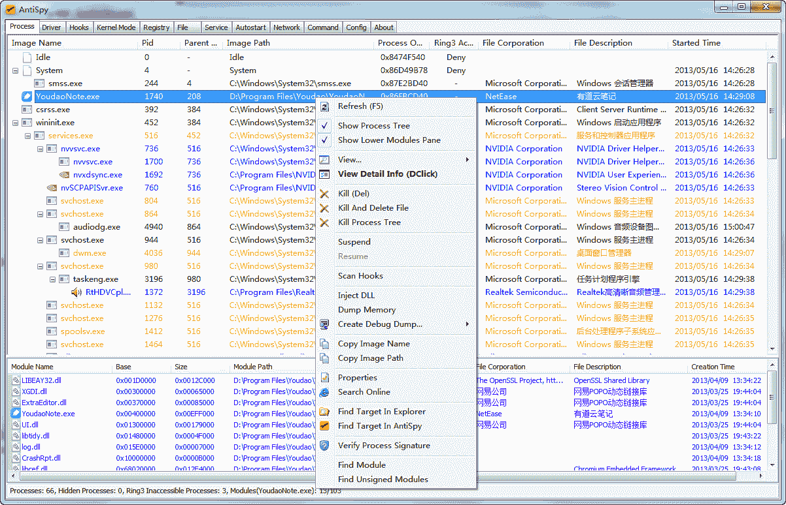
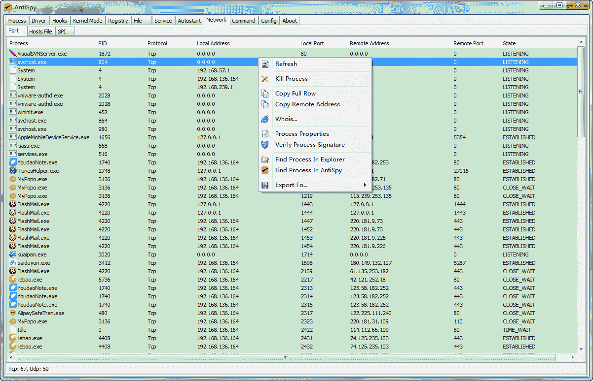
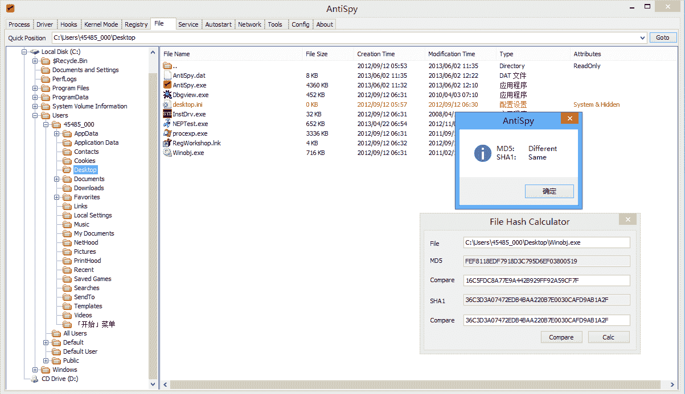
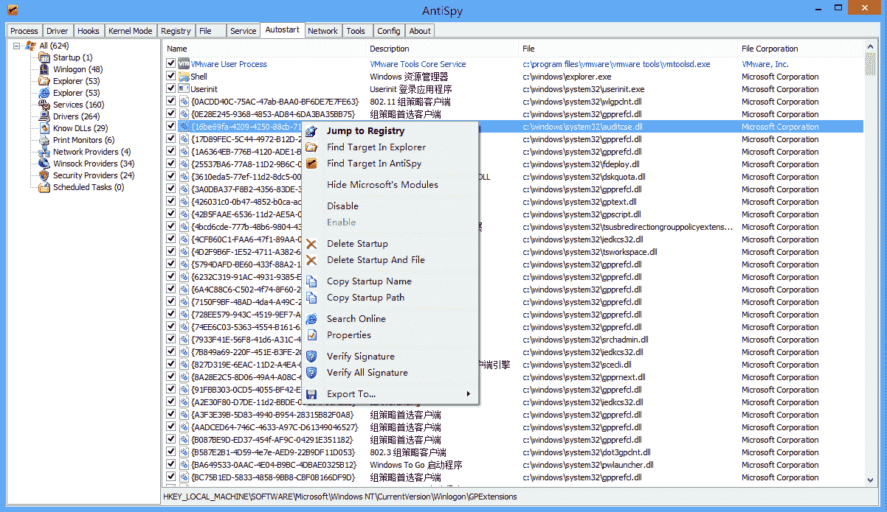

# 反间谍:免费但功能强大的反病毒和 Rootkits 工具包

> 原文：<https://kalilinuxtutorials.com/antispy-free-but-powerful-anti-virus-rootkits-toolkit/>

AntiSpy 是一个免费但强大的反病毒和 rootkits 工具包。它为您提供了最高权限的能力，可以检测、分析和恢复各种内核修改和挂钩。在它的帮助下，你可以很容易地发现和压制隐藏在普通探测器之外的恶意软件。

**开发**

*   IDE: Visual Studio 2008
*   用户空间:MFC
*   WDK: WDK7600
*   第三方库:Codejock toolkit pro

**特性**

目前，以下功能可用(包括但不限于):

**流程经理**

*   显示系统进程和线程基本信息。
*   检测隐藏的进程、线程、进程模块。
*   终止、挂起和恢复进程和线程。
*   查看和操作进程句柄、窗口和内存区域。
*   查看和操作进程热键、权限和计时器。
*   检测和恢复进程挂钩，包括内联挂钩、补丁、iat 和 eat 挂钩。
*   注入 dll，转储进程内存。
*   创建调试转储，包括小型转储和完全转储。

**内核模块查看器**

*   显示内核模块基本信息，包括图像库、大小、驱动程序对象等等。
*   检测隐藏的内核模块。
*   卸载内核模块。
*   转储内核映像内存。
*   显示和删除系统驱动程序服务信息。

**也可阅读-[RDPThief:使用 API 挂钩从 mstsc.exe 提取明文密码](https://kalilinuxtutorials.com/rdpthief-passwords-mstsc-exe-api-hooking/)**

**挂钩检测器**

*   检测和恢复 SSDT，影子 SSDT，系统中心和 int2e 挂钩。
*   检测和恢复 FSD 和键盘显示挂钩。
*   检测和恢复内核代码挂钩，包括内核内嵌挂钩，补丁，iat 和 eat 挂钩。
*   检测和恢复全局和本地的消息挂钩。
*   检测和恢复内核对象类型挂钩。
*   显示中断描述符表(IDT)。

**其他内核信息查看器**

*   查看和删除内核通知。
*   常见设备的视图过滤器包括磁盘、卷、键盘和网络设备。
*   查看 IO 计时器、DPC 计时器、系统线程等。

**注册管理器**

*   查看和编辑系统注册表。
*   使用实时注册表配置单元分析检测隐藏的注册表项。

**文件管理器**

*   显示文件的基本信息，包括文件名、大小、属性等。
*   检测隐藏文件。
*   查看和删除锁定的文件和文件夹。

**服务经理**

*   显示系统服务基本信息。
*   控制服务状态。
*   修改服务启动类型。

**自动运行管理器**

*   显示几乎所有种类的系统自动运行类型。
*   启用、禁用或永久删除自动运行。

**网络浏览器**

*   显示当前网络连接，包括 TCP 和 UDP 信息。
*   查看和删除 IE 插件和上下文菜单。
*   显示 winsock 提供程序(LSP)。
*   查看和编辑主机文件。

**其他工具**

*   十六进制编辑器–查看和编辑内存，包括 ring3 进程内存和 ring0 系统内存。
*   反汇编器——像 OllyDBG 一样，支持 ring3 进程内存和 ring0 系统内存。

**设置**

*   自定义颜色设置。

**用户界面**

**流程树**

**程序菜单**

**网络**

**文件管理器**

**自动运行管理器**

**信用:[zhenfei.mzf@gmail.com](mailto:zhenfei.mzf@gmail.com)**

[**Download**](https://github.com/mohuihui/antispy)