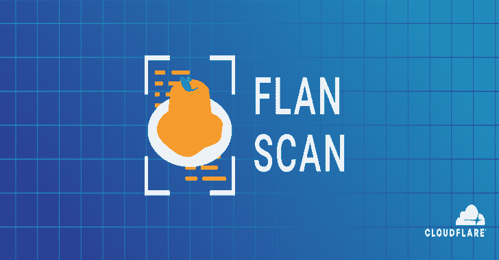
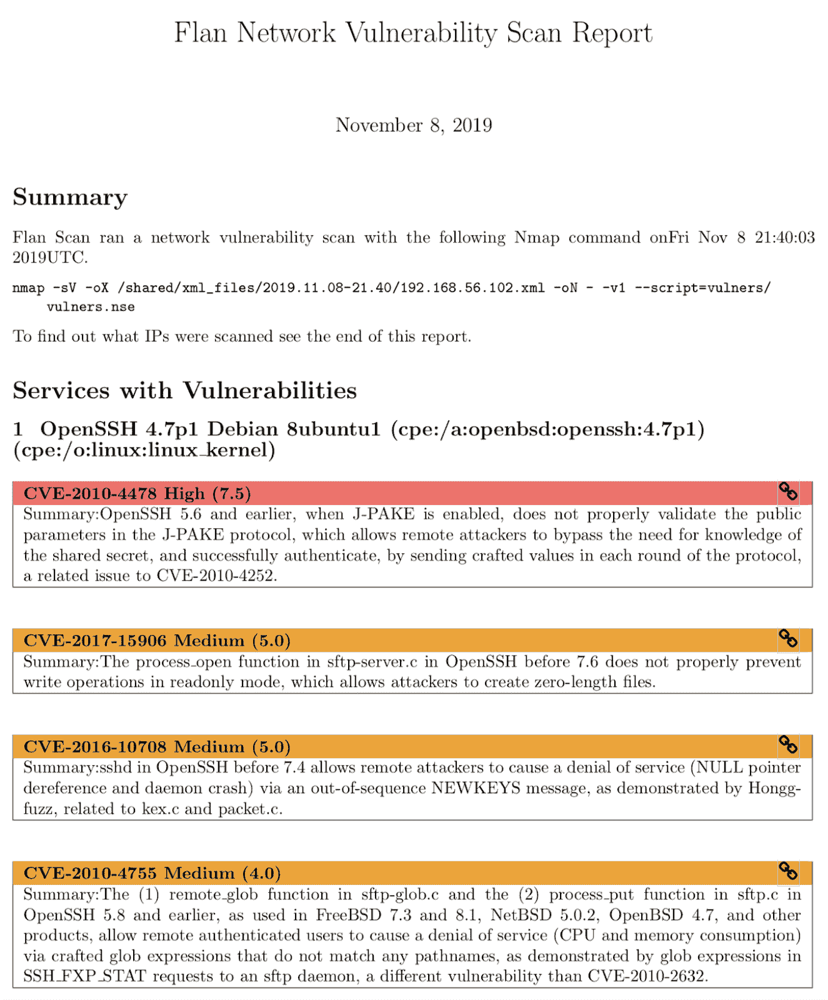

# 果馅饼:一个非常可爱的漏洞扫描器

> 原文：<https://kalilinuxtutorials.com/flan-pretty-sweet-vulnerability-scanner/>

**Flan Scan** 是一款轻量级的网络漏洞扫描器。使用 Flan Scan，您可以轻松找到网络上打开的端口，识别服务及其版本，并获得影响您网络的相关 CVE 列表。

它是 Nmap 和 vulneraners 脚本的包装器，将 Nmap 转变为成熟的网络漏洞扫描器。Flan Scan 使得在容器中本地部署 Nmap、将结果推送到云中以及在 Kubernetes 上部署扫描器变得很容易。

**入门**

*   克隆此存储库
*   确保您有 docker 设置:

**$ docker–版本**

*   将您希望扫描的 IP 地址或 CIDRS 列表添加到`**shared/ips.txt**`。
*   构建容器:

**$ make build**

*   开始扫描！

**$启动**

扫描完成后，您将在`**shared/reports**`中找到一份总结扫描的 Latex 报告。您还可以在`**shared/xml_files**`中看到 Nmap 的原始 XML 输出。

**也读作-[RE:TERNAL:Repo 包含 Docker-Compose 文件&安装脚本](https://kalilinuxtutorials.com/reternal-repo-containing-docker-compose-files-setup-scripts/)**

**自定义 Nmap 配置**

默认情况下，Flan 扫描运行以下 Nmap 命令:

**$ nmap-sV-oX/shared/XML _ files-oN –- v1 $ @–script = vulners/vulners . NSE<IP 地址>**

`**-oX**`标志将扫描结果的 XML 版本添加到`**/shared/xml_files**`目录，而`**-oN -**`标志将“正常”的 Nmap 结果输出到控制台。`**-v1**`标志将详细度增加到 1，`**-sV**`标志运行服务检测扫描(除了 Nmap 的默认端口和 SYN 扫描之外)。`**--script=vulners/vulners.nse**`是将检测到的服务与相关 CVE 相匹配的脚本。

Nmap 还允许您运行 UDP 扫描和扫描 IPv6 地址。要在运行`**make build**`之后添加这些和其他标志来扫描 Flan 的 Nmap 命令，请运行容器并像这样传递 Nmap 标志:

**$ docker run-v $(shell pwd)/shared:/shared flan _ scan<Nmap-flags>**

**将结果推送到云端**

Flan Scan 目前支持将 Latex 报告和原始 XML Nmap 输出文件推送到 GCS 存储桶或 AWS S3 存储桶。Flan 扫描需要 2 个环境变量来将结果推送到云。

第一个是 **`upload`** ，它取两个值 **`gcp`** 或`**aws**`中的一个。第二个是 **`bucket`** ，其值是将结果上传到的 S3 或 GCS 存储桶的名称。要设置环境变量，在运行`**make build**`后运行容器像这样设置环境变量:

**$ docker run–name \
-v $(pwd)/shared:/shared \
-e upload = \
-e bucket = \
flan _ scan**

下面是一些在容器中添加必要的 AWS 或 GCP 认证密钥作为环境变量的例子。然而，这也可以通过 Kubernetes 中公开必要环境变量的秘密或其他秘密管理工具来实现。

**GCS 铲斗配置示例**

将服务帐户的 GCS 私钥复制到`**/shared**`文件中

**$ CP<path-to-local-GCS-key>/key . JSON shared/**

运行容器，将环境变量`**GOOGLE_APPLICATION_CREDENTIALS**`设置为 GCS 键的路径

**$ docker run–name \
-v $(pwd)/shared:/shared \
-e upload = GCP \
-e bucket = \
-e GOOGLE _ APPLICATION _ CREDENTIALS =/shared/key . JSON
flan _ scan**

**AWS S3 铲斗配置示例**

将`**AWS_ACCESS_KEY_ID**`和`**AWS_SECRET_ACCESS_KEY**`环境变量设置为您的 S3 服务帐户的相应变量。

**docker run–name \
-v $(pwd)/shared:/shared \
-e upload = AWS \
-e bucket = \
-e AWS _ ACCESS _ KEY _ ID = \
-e AWS _ SECRET _ ACCESS _ KEY = \
flan _ scan**

**在 Kubernetes 上部署**

当将 Flan Scan 部署到一个容器编排系统(比如 Kubernetes)时，您必须确保容器能够访问目录`**/**`中的一个名为`**ips.txt**`的文件。

在 Kubernetes 中，这可以通过一个 ConfigMap 来完成，config map 会在您的本地文件系统上挂载一个文件，作为容器在部署后可以访问的卷。`**kustomization.yaml**`文件有一个如何创建名为`**shared-files**`的配置图的例子。然后这个配置图作为一个卷被挂载到`**deployment.yaml**`文件中。

以下是在 Kubernetes 上部署 Flan 扫描的一些简单步骤:

*   要创建配置图，在`**kustomization.yaml**`中添加一个本地`**ips.txt**`文件的路径，然后运行`**kubectl apply -k .**`。
*   现在运行`**kubectl get configmap**`以确保正确创建了配置图。
*   在`**deployment.yaml**`内为您的云提供商设置必要的环境变量和密码。
*   现在运行`**kubectl apply -f deployment.yaml**`来启动运行 Flan 扫描的部署。

Flan 扫描应该在 Kubernetes 上成功运行！

[**Download**](https://github.com/cloudflare/flan)