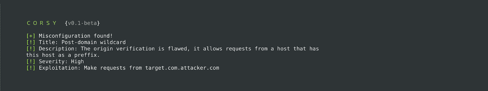

# 科尔西:CORS 错误配置扫描仪

> 原文：<https://kalilinuxtutorials.com/corsy-cors-misconfiguration-scanner/>

Corsy 是一个轻量级程序，它扫描 CORS 实现中所有已知的错误配置。

**要求**

它仅与`**Python 3**`一起工作，并具有以下依赖性:

*   **T2`tld`**
*   **T2`requests`**

要安装这些依赖项，导航到工具目录并执行`**pip3 install -r requirements.txt**`

**也可阅读-[扫视:GNU/Linux、BSD、Mac OS 的 Top/htop 替代方案&Windows OS](https://kalilinuxtutorials.com/glances-gnu-linux-bsd-mac-windows-os/)**

**用法**

使用 Corsy 非常简单

**python 3 corsy . py-u https://example.com**

连续请求之间的延迟可通过`-d`选项指定。

**注意:**这是测试版，JSON 输出、扫描多台主机等功能会在后面加入。

**测试实施**

*   预域旁路
*   域后旁路
*   反滴漏旁路
*   零原点旁路
*   非转义点旁路
*   无效值
*   通配符值
*   原点反射测试
*   第三方津贴测试
*   HTTP 允许测试

[**Download**](https://github.com/s0md3v/Corsy)