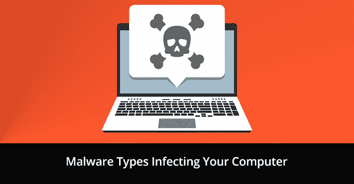

# 感染您计算机的恶意软件有哪些类型

> 原文：<https://kalilinuxtutorials.com/malware-infection/>

恶意软件是一种恶意的计算机程序，旨在感染您的系统，并在未经用户许可的情况下获取敏感信息。基于开发者的意图，软件被称为恶意软件。如果任何软件设计的意图都是恶意的，那么这个程序就被认为是恶意软件。

根据入侵者或黑客的意图，恶意软件可以分为几类。不同类型的恶意软件包括勒索软件、广告软件、间谍软件、特洛伊木马和病毒。让我们更详细地讨论这些不同类型的恶意软件。

## **恶意软件的类型**

### **1。勒索软件**

勒索软件是一种复杂的恶意软件程序，专门用于加密用户数据并将其作为人质，以金钱换取数据。多年来，发生了许多勒索软件攻击，对各种公司和其他类型的组织(包括医院)造成了不可挽回的损失。

在勒索软件攻击期间，用户被拒绝访问他们的个人文件和文件夹。网络罪犯通过使用加密机制和/或通过将用户锁定在他们的系统之外来做到这一点。它迫使用户向黑客支付赎金，以重新获得对他们计算机的访问权。

### **2。广告软件**

顾名思义，广告软件就是[用于广告的恶意软件](https://kalilinuxtutorials.com/masc/)。一些最常见的传播广告软件感染计算机的方式是通过各种网站上的弹出窗口。广告软件也可以采取广告的形式，由您已经安装或试图安装在您的系统上的不同软件程序显示。

在互联网上，免费提供的程序中装载了大量的广告软件程序。这些类型的广告软件是开发商创收的方式之一。

### **3。间谍软件**

间谍软件是网络罪犯设计的另一种恶意程序，用于在未经用户同意的情况下监视用户的系统和数据。众所周知，这些类型的恶意软件会留意用户试图在键盘上键入的内容。他们还收集击键数据来破译用户的密码和其他敏感信息。

众所周知，间谍软件会主动监控用户在其系统和互联网上执行的所有活动。然后，他们利用这些数据窃取他们的信息，并获取他们的银行信息。间谍软件还可以改变用户计算机系统的安全设置，以获得后门进入。

### **4。木马**

也称为特洛伊木马，特洛伊木马是一种恶意软件，它伪装用户，使他们相信这是一个原始文件，并让他们在自己的计算机系统上安装它。这些类型的恶意程序可以创建远程访问，以便感染用户的系统并在用户不知情的情况下窃取他们的数据。

除此之外，一旦建立了远程访问，黑客就可以在用户系统上安装其他恶意程序。这些恶意程序的目的各不相同，从修改用户文件到跟踪他们的活动。

### **5。病毒**

这种类型的恶意程序是最常见的恶意软件。它有能力创建自己的副本，并通过其他计算机系统传播。病毒从一个系统传播到另一个系统的原因是因为被感染的文件从一个系统共享到另一个系统。

检测病毒很重要，因为它们可以修改和删除文件和文件夹的内容。它们感染其他系统的能力使它们成为最危险的恶意软件之一。

## **如何保护您的系统免受恶意软件攻击**

系统上的恶意软件[攻击](https://en.wikipedia.org/wiki/Cyberattack)的数量不断增加。虽然没有办法完全消除它们，但至少您可以尝试通过增加一层安全性来保护您的数据。这种额外的安全层可以通过使用有效的防病毒解决方案来实现。

市场上有许多不同的反病毒品牌，提供免费和付费软件程序。除了针对病毒和恶意软件的基本安全保护之外，防病毒解决方案还具有各种功能，如家长控制、防火墙、密码管理器和系统扫描。

在这里，你可以获得所有不同类型的免费和付费抗病毒药物的详细评论。这些评论提供了关于它们的特性、定价、优点和缺点以及其他细节的详细解释。选择最适合您需求的防病毒解决方案，开始保护您自己和您的系统免受恶意软件的侵害。

## **最终想法**

恶意软件不断增加，同时积极寻求窃取数据并从中赚钱。在您的系统上安装防病毒解决方案可以帮助您防御不同类型的恶意软件。