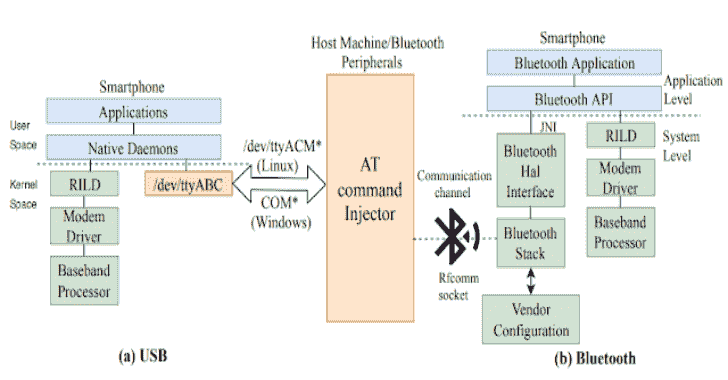

# ATFuzzer:Android 智能手机 AT 界面的动态分析

> 原文：<https://kalilinuxtutorials.com/atfuzzer-dynamic-analysis-at-interface-android/>

通过 ATFuzzer 打开潘多拉的盒子:Android 智能手机 AT 界面的动态分析”被接受参加 2019 年第 35 届年度计算机安全应用大会(ACSAC)。

本文重点检查蜂窝基带处理器通过蓝牙和 USB 公开的 AT 命令接口的正确性和健壮性。

设备的应用处理器使用该接口向基带处理器发出高级命令(或 AT 命令)，以执行蜂窝网络操作(例如拨打电话)。恶意蓝牙外设可以利用该接口中的漏洞发起各种攻击，包括 DoS 和隐私攻击。

为了识别这样的漏洞，我们提出了 atFuzzer，它使用一种语法引导的进化模糊化方法，该方法改变 AT 命令语法的产生式规则，而不是具体的 AT 命令。

使用 ATFuzzer 对来自 5 家厂商的 8 款 Android 智能手机进行的实证评估显示，蓝牙上有 4 个无效的 AT 命令语法，USB 上有 13 个无效的 AT 命令语法，其影响范围从 DoS、蜂窝协议版本降级到严重的隐私泄露。

**也可阅读-[Antispy:免费但强大的反病毒软件& Rootkits 工具包](https://kalilinuxtutorials.com/antispy-free-but-powerful-anti-virus-rootkits-toolkit/)**

**要求**

Python 2.7.15。请不要使用 python 3，因为存在库不兼容问题。所需的库在 requirements.txt 文件中指定，可以通过执行以下命令来安装:

**pip install-r requirements . txt**

**注意**:python 2.7 的模块 pybluez 与 Windows 不兼容。要在 Windows 上安装 pybluez，需要下载以前的版本。在 [pybluez](https://github.com/Imtiazkarimik23/ATFuzzer/blob/master/www.lfd.uci.edu/~gohlke/pythonlibs/#pybluez) 下载 py bluez-0.22-cp27，并使用以下命令安装:

**pip 安装< pybluez file.whl >**

**怎么跑？**

要运行 ATFuzzer，请执行以下命令:

**sudo python executefuzzer . py<list _ of _ grammars><device _ name><port(可选)>**

或者，可以使用以下命令使用多个随机选择的语法来执行 ATFuzzer:

**sudo python executefuzzer . py multi<设备 _ 名称> <端口(可选)>**

然后，程序要求在 4 个选项中进行选择:

*   0–标准模糊器(包括交叉、变异、反馈评估)
*   1–无反馈模糊器
*   2–无交叉模糊器
*   3–无突变模糊器

这些选项允许用户选择运行哪种类型的 ATFuzzer。这是测试和评估我们的引信有效性的基础。

最后，ATFuzzer 要求指定哪个信道将用于 AT 命令传输。可以从三个选项中选择一个:

*   b–蓝牙
*   u–USB
*   t–测试执行(不需要任何连接的设备)

如果选择了蓝牙选项，程序会询问目标设备的蓝牙地址。用户可以以特定格式插入设备的蓝牙 MAC 地址:XX:XX:XX:XX:XX:XX:XX(例如，1A:2B:3C:4D:5E:6F)。

测试执行使用假的评估参数在 ATFuzzer 上执行，并且不向设备提交任何命令。此选项仅用于测试目的，所以不要用它来模糊实际的智能手机。

**注意**:如果在 Linux 上运行蓝牙 ATFuzzer，可能需要用 *sudo* 执行程序，这取决于系统配置。

**ATFuzzer 实现的结构**

下面我们将描述 ATFuzzer 的实现结构。

*   **command grammar . JSON**:JSON 文件，包含一组超过 80 个 at 命令的语法。语法是按照特定的结构定义的，这种结构允许程序有效地阅读它们。
*   **executeFuzzer.py** :允许用户运行 ATFuzzer 的主程序。它提供了不同的执行选项(参见如何运行)。
*   **grammarFuzzer.py** :实现实际的模糊化。它读取用户提交的 AT 命令的语法，并执行模糊循环:输入生成-输入提交-语法评估-语法演变。
*   **multiGrammarFuzzer.py** :实现实际的模糊化。它读取随机选择的 AT 命令的语法，并执行模糊循环:输入生成-输入提交-语法评估-语法进化。
*   **grammarModifier.py** :实现进化阶段的功能。这种功能包括语法交叉和语法变异。
*   **inputGen.py** :给定一个输入语法，生成一个随机 AT 命令实例。
*   **atCmdInterface.py** :实现与目标设备的 AT 接口交互所需的功能。它负责建立与设备的通信，提交 AT 命令实例，并最终收集和评估响应。
*   **afl_fuzzer.py** :实现用于在 AT 命令环境下执行 AFL fuzzer 的功能。
*   **utilityFunctions.py** :实现主程序执行的支持功能。

[**Download**](https://github.com/Imtiazkarimik23/ATFuzzer)