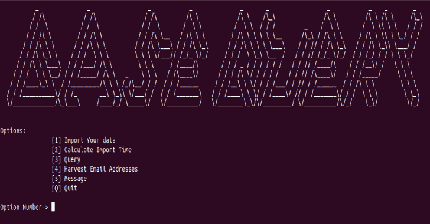
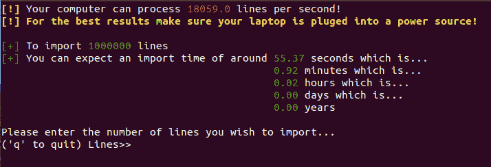
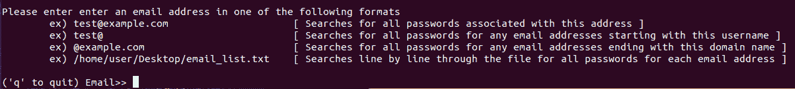

# BaseQuery:一种组织公共组合列表和漏洞的方法，可以方便地搜索所有内容

> 原文：<https://kalilinuxtutorials.com/basequery/>

BaseQuery 是一种组织公共组合列表和漏洞的方式，你可以很容易地搜索所有的东西。

我们说话这会儿你的私人数据正在网上交易和出售。每天都有大量的信息泄露出来，这让你感到无能为力。大多数用户密码和其他敏感信息已经被公布在互联网/暗网的某个地方，让任何窥探的人看到，不管你喜欢与否。

为了更好地控制现有的个人信息，您可以使用 [Haveibeenpwned](https://haveibeenpwned.com/) 来缩小您的信息暴露在哪些漏洞中。这是一个很好的开始，但是如果你想知道其他人可以访问你的哪些信息呢？BaseQuery 是一个一体化的程序，它使得导入和搜索成千上万的数据漏洞变得容易。

**包括的功能**

*   4x 嵌套存储结构
*   每秒 12，000 多个条目的平均导入速度(英特尔酷睿 i7-7700HQ CPU @ 2.8GHz)
*   即时查询系统
*   脸书的 zstd 无损压缩算法可减少数据的大小(平均将数据减少到原始大小的 10%以下)
*   根据您的特定硬件计算导入所有文件所需的时间
*   重复数据保护
*   以标准格式输出您的所有发现
*   内置电子邮件收集

**安装**

要安装 BaseQuery，请键入以下命令

**git 克隆 https://github.com/g666gle/BaseQuery.git
sudo chmod 755-R base query/
CD base query
。/dependencies.sh
。/run.sh**

**也读作-[Netstat 2 Neo4j:Netstat 可视化与 Neo4j](https://kalilinuxtutorials.com/netstat2neo4j-netstat-visualization-neo4j/)**

**入门**

*   将所有数据库放入“将数据库放在此处”文件夹中
    *   到目前为止，BaseQuery 只能接受每行都用冒号分隔的“[test@example.com](mailto:test@example.com):密码”或“密码:[test@example.com【T3”)格式的文件](mailto:test@example.com)
    *   如果行格式在同一个文件中混淆了，也没有关系。例如，第一行可以是“电子邮件:密码”，第二行可以是“密码:电子邮件”
    *   每行一个条目！！
    *   如果你需要更好的视觉效果，在“PutYourDataBasesHere”文件夹中有一个 example.txt 文件
    *   您应该在运行程序之前删除示例文件。
*   现在您已经将所有文件放在了正确的文件夹中
    *   在 BaseQuery 目录中打开一个终端。
    *   类型。/dependencies.sh 来安装所有需要的资源(您只需要这样做一次)
    *   类型。/run.sh 启动程序
    *   请注意，如果你使用的是笔记本电脑，请确保它已接通电源。导入数据库使用大量的处理能力，将使导入速度平均提高 4 倍！
*   按照屏幕上的说明进行操作
    *   就这样，好好享受吧！
    *   有任何问题联系我。

**基于硬件规格的导入时间**

**查询选项**

**先决条件**

**注意:**所有这些都是使用“dependencies.sh”脚本自动安装的

**更新包:(sudo apt-get 更新)

Python 版本 3.6+ (sudo apt-get 安装 Python 3.7)
Bash 4+
tar(sudo apt-get 安装 tar)
zstd (sudo apt-get 安装 zstd)
xterm (sudo apt-get 安装 xterm)**

**用**建造

*   Ubuntu 18.04 仿生
*   Bash 版本:GNU bash，版本 4 . 4 . 19(1)-release(x86 _ 64-PC-Linux-GNU)
*   Python 版本:3.7.1

**免责声明**

在使用这个程序之前，先仔细阅读你当地的法律。我对你用 BASEQUERY 做的任何事情不承担任何责任。在任何情况下，BASEQUERY 都不应用于非法目的。

[**Download**](https://github.com/g666gle/BaseQuery)