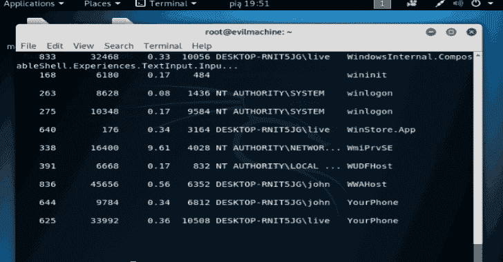

# 攻击监视器:端点检测和恶意软件分析软件

> 原文：<https://kalilinuxtutorials.com/attack-monitor-endpoint-detection-malware-analysis-software/>

**Attack Monitor** 是 Python 应用程序，旨在增强 Windows 7/2008(及所有更高版本)工作站/服务器的安全监控能力，并自动对恶意软件进行动态分析。

当前模式(互斥):

*   终点检测
*   恶意软件分析(在专用虚拟机上)

基于以下事件:

*   Windows 事件日志
*   Sysmon
*   看门狗(文件系统监控 Python 库)
*   TShark(仅恶意软件分析模式)

**支持的操作系统**

*   Windows 7、8、10 (x86 或 x64)
*   Windows 2008、2012、2016 (x86 或 x64)

**先决条件**

*   Powershell 5
*   Sysmon(由 installer.py 下载、配置和安装)
*   Python 3.6 (64 位)-应该可以在 Python 3.x 上运行
*   Tshark(仅恶意软件分析)
*   各种 Python3 库(requirements.txt)
*   StoneEngine 库(包括在内，首次发布，高级 windows 事件日志接口–Alpha 状态)

**支持的系统事件**

**某些事件仅在恶意软件分析模式下受支持**

*   文件系统变化
*   允许的网络连接
*   PowerShell 活动(仅在 PowerShell 5 中详细介绍)
*   流程创建
*   中小企业活动
*   计划任务
*   本地账户操纵
*   成功/失败的登录
*   驱动程序负载
*   原始磁盘访问
*   注册表监控
*   管道事件
*   服务
*   审核日志已清除
*   查询的 WMI 监控+ WMI 持久性
*   DNS 请求捕获(通过 Tshark)

**安装–端点检测模式**

**对于恶意软件分析模式，请参考下一节**

**步骤:**
<下载最新发布>
cmd.exe(以管理员身份运行)
pip 3 install-U-r requirements . txt
python installer . py sysmon
**=>**选择端点检测模式
python installer . py PS audit
python installer . py audit pol
python installer . py install
**=>**选择端点检测模式
python installer.py 异常

**安装–恶意软件分析模式**

对于端点检测模式，请参考上一节

步骤:
**<下载最新发布**>
cmd.exe(以管理员身份运行)
pip 3 Install-U-r requirements . txt
python installer . py sysmon
**=>选择恶意软件分析模式**
python installer . py PS audit
python installer . py audit pol
python installer . py Install
**=>选择恶意软件分析模式**
【安装 t shark】https://www.wireshark.org/download.html//(目前只有 DNS)
**【应用部分】安装—**如何启用 WMI 审计？
**【应用节】安装—**如何监控具体目录？

**也可阅读-[AT fuzzer:Android 智能手机 AT 界面的动态分析](https://kalilinuxtutorials.com/atfuzzer-dynamic-analysis-at-interface-android/)**

**安装–如何启用 WMI 审计？**

compmgmt.msc
服务和应用- > WMI 控制- >属性
安全- >安全- >高级- >审计- >添加

选择主体:所有人
类型:全部
显示高级权限:
全选(执行方法…编辑安全)

为什么不在 installer.py 脚本中？很难通过编程来实现

**安装–如何选择恶意软件监听的网络接口？**

**编辑 C:\ Program Files \ Attack Monitor \ config \ Attack _ Monitor . CFG**

更改[feeder_network_tshark]部分:network_interface= **将接口名称放在此处** #不带引号

**如何确定接口名称？**

TShark 正在使用控制面板\网络和互联网\网络连接(更改适配器设置)中的名称，例如名称: **WiFi AC** = >用户定义的自定义名称，例如名称:**以太网 0**

**安装–如何监控特定目录？**

**编辑 C:\ Program Files \ Attack Monitor \ config \ monitored _ directory . JSON**

对于恶意软件分析，建议在启用递归标记的情况下监控目录 C:\的所有事件(除了 dir_modified)。如果相关，请添加其他目录。

它是如何工作的？

*   警报来自源(Windows 事件日志、Sysmon、文件系统更改、TShark)
*   根据 config \ exceptions \ exception . JSON 检查警报，其中包含应被忽略的所有警报 A)对于端点检测–预定义的一组被忽略的警报随软件一起提供 B)对于恶意软件分析–您需要自己在干净状态的实时系统上添加异常
*   exception.json 中存在预警？是)被丢弃[转到步骤 1]否)转到下一步
*   学习模式是否启用？(可以在托盘图标中启用，或在配置文件中永久启用)是)弹出警报窗口，询问您是否要忽略此警报，如果是，哪些字段必须匹配才能认为事件被忽略？(简单比较、子字符串、正则表达式)
    *   如果您决定为此警报添加例外-警报将被添加到例外中[转到步骤 1]
    *   如果您决定跳过例外窗口–进入下一步否)进入下一步
*   提醒用户捕获事件。产出:
    *   系统托盘气球通知(仅当您移动鼠标且计算机未锁定时)
    *   警报保存到日志\文本文件（textfile）

**已知 bug**

*   退出并不光彩
*   托盘图标出现和消失

**演示**

[**Download**](https://github.com/yarox24/attack_monitor)