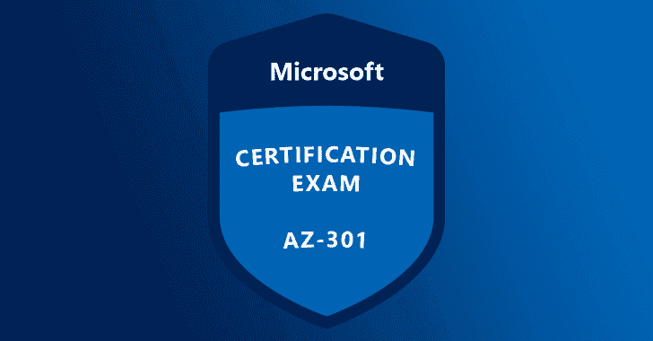

# 使用考试实验室的模拟测试准备 Microsoft AZ-301 考试。已验证！

> 原文：<https://kalilinuxtutorials.com/microsoft-az-301-exam/>

Microsoft Certified:[Azure](https://azure.microsoft.com/en-in/)Solutions Architect 专家证书验证您在广泛的 IT 角色方面的理解和熟练程度，包括网络、安全、虚拟化、数据管理、预算、身份和治理。

要获得这个证书，候选人需要通过两个考试:AZ-300 和 T2。本认证指南主要关注微软 AZ-301。在这篇文章中，我们将向你解释这个考试的所有内容，并告诉你如何在没有太大压力的情况下正确地准备考试。

## **微软 AZ-301 考试概述**

这个[exam-labs.com](https://www.exam-labs.com/dumps/AZ-301)认证考试符合其他 Azure 基于角色的考试的结构。微软不向公众透露问题的数量。

然而，你可以期待 40 到 60 个问题。您可能会遇到的一些问题类型包括回顾屏幕、多项选择、热点区域、拖放、建立列表、简答题、最佳答案、活动屏幕和案例研究。

有必要指出的是，你不会在考试中得到所有这些格式，但这些只是对应该期待什么的一般指导。

学生在参加 Microsoft AZ-301 考试之前需要了解的主题如下:

*   确定工作负载先决条件
*   为身份和安全性而设计
*   设计数据平台解决方案
*   设计基础设施战略
*   设计业务连续性战略
*   为迁移、集成和部署而设计

有必要提及的是，每个主题都有副主题及其相关百分比。您应该查看认证页面，了解有关考试目标的更多详细信息。

在测试过程中，你将有大约 150 分钟的时间来完成这些问题。考生需要在安排他们的微软 AZ-301 考试前支付考试费。如果你居住在美国，你需要支付 165 美元。

美国以外的个人应该检查官方网页，以了解适用的费用。此外，该校学生有资格获得考试费减免。但是，您必须提供有效的教育证明，才能享受这种减免。

微软 AZ-301 的及格分数最低为 700 分。较低的分数意味着学生考试不及格，必须重考。测试完成几分钟后，您将能够查看您的结果。

您还将收到一份打印结果，显示您的分数以及您在考试不同部分的表现分数。在你写完你的微软 AZ-301 之后，你可以期待在五天内得到这份拷贝。

万一你没有通过考试，你将被要求重考。然而，在你第一次尝试后，你必须等待至少 24 小时才能被允许再次尝试该测试。

万一你第二次没有通过，你至少要等 14 天才能再次尝试。一年内你总共有五次可以参加考试的机会。

值得一提的是，每重考一次，你都要重新付费。此外，如果您已经通过了考试，您将不能再次参加考试。

当谈到考试取消，有一些规则适用。如果您在考试日期前六个工作日取消并重新安排考试，我们将不会向您收取任何费用。

但是，如果您在五个工作日内取消并重新安排，您将支付象征性的费用。考试前 24 小时内取消或重新安排考试将被没收全部费用。这同样适用于不出现在测试中心。

#### **微软 AZ-301 考试备考资源**

在回顾了微软 AZ-301 考试的细节之后，是时候看看你可以如何准备来获得你想要的成功了。做这件事有不同的方法。

最重要的是认清自己的学习风格。了解这一点将有助于你制定适当的学习计划，选择能产生有效学习方式的资源。让我们看看准备微软 AZ-301 考试的选项。

*   **微软学习网页。**这是你可以开始准备的网站。你可以在本页的蓝图旁找到考试指南。您还可以获得关于考试主题、备考选项和考试时间安排、要求和政策的大量信息，以及许多其他信息。
*   **图书资源和白皮书。**你会发现要得到一本有效的 AZ-301 认证考试用书有点困难，但你总能幸运地得到一本好书。这个考试是一个新发布的考试，这也使得获取相关的学习资料有点困难。然而，你仍然可以查看微软 Azure 门户网站，找到一些记录良好的电子书和白皮书，让你开始准备。
*   **教员指导的培训。**您可以在微软网站上找到四种不同的面授培训课程。你不需要花几个星期来完成这些课程，几天就可以了。根据您所在的位置，您还可以为您的课堂培训做好准备。当选择这种类型的培训时，请确保您通过 Microsoft 培训合作伙伴。您可以从认证页面了解有关讲师指导培训的更多信息。
*   **练习测试。通过练习测试，你可以充分利用你的学习过程。微软在其网页上提供了不同的更新资源工具，包括模拟测试。不过，如果你想要更深入的练习题和答案，你可以查看其他在线平台。然而，当你选择网站进行模拟测试和智力测试时，你必须格外小心。查看考试实验室网站，了解最新的和相关的备考练习题。**

## **结论**

如果你专注于学习并使用好的学习材料，你可以在第一次考试中获得高分。微软官方网页是一个很好的平台。

你可以通过其他著名的在线网站如考试实验室来支持你的学习。所有的资料都会对你的准备有很大的帮助。这将增加你获得成功的机会。