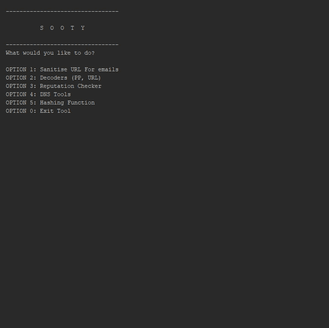
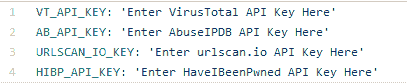
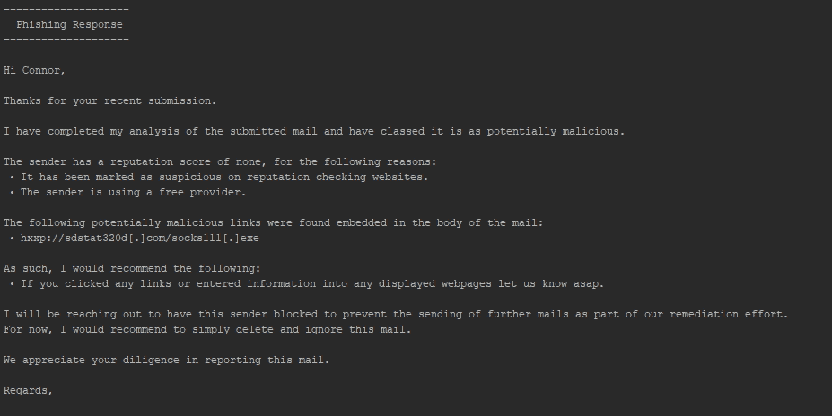
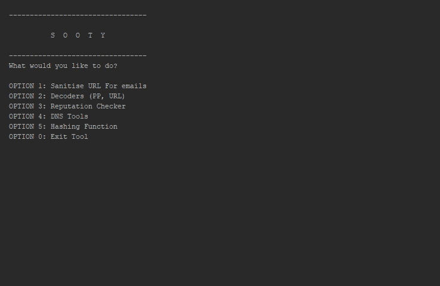

# sooty:SOC 分析师一体化 CLI 工具，用于自动化和加速工作流程

> 原文：<https://kalilinuxtutorials.com/sooty-soc-analysts-all-in-one-cli-tool/>

Sooty 是一款工具，旨在帮助 SOC 分析师实现部分工作流程的自动化。Sooty 的目标之一是执行尽可能多的例行检查，让分析员在相同的时间框架内有更多的时间进行更深入的分析。

**乌烟瘴气**

*   清理 URL 以确保发送电子邮件的安全性
*   执行反向 DNS 和 DNS 查找
*   从以下位置执行信誉检查:
    *   [VirusTotal](https://www.virustotal.com)
    *   [BadIP 的](https://www.badips.com/)
    *   [辱骂 IPDB](https://www.abuseipdb.com/)
*   检查 IP 地址是否是 TOR 出口节点
*   解码 Proofpoint URL、UTF-8 编码的 URL、Office SafeLink URL、Base64 字符串和 Cisco7 密码。
*   获取文件哈希并将它们与[病毒总数](https://www.virustotal.com)进行比较(参见要求)
*   执行 WhoIs 查找
*   对照[检查用户名和电子邮件，看看是否有违规行为。(参见要求)](https://haveibeenpwned.com)
*   简单的电子邮件分析检索网址，电子邮件和标题信息。
*   从电子邮件中提取 IP 地址。
*   已被外部服务缩短的未缩短 URL。(每小时限 10 次请求)
*   查询 [URLScan.io](https://urlscan.io) 获取信誉报告。
*   分析电子邮件地址中已知的恶意活动，并利用 [EmailRep.io](https://emailrep.io) 报告域信誉
*   创建动态电子邮件模板，用作网络钓鱼分类响应的基础。(.仅限味精，。eml 将在未来更新中推出)
*   使用 HaveIBeenPwned 数据库对网络钓鱼邮件执行分析浓缩(需要 API 密钥)。

**也可阅读-[攻击监视器:端点检测&恶意软件分析软件](https://kalilinuxtutorials.com/attack-monitor-endpoint-detection-malware-analysis-software/)**

**要求**

*   [Python 3.x](https://www.python.org/)
*   安装 requirements.txt 文件中的所有依赖项。`pip install -r requirements.txt`
*   需要几个 API 键来实现 Sooty 的全部功能，但是没有这些键它仍然可以工作，只是没有它们提供的附加功能，链接如下:
    *   [VirusTotal API 密钥](https://developers.virustotal.com/reference)
    *   [URLScan.io API 密钥](https://urlscan.io/about-api/)
    *   [AbuseIPDB API 密钥](https://www.abuseipdb.com/api)
    *   [已定义 API 密钥](https://haveibeenpwned.com/API/Key)
*   替换`example_config.yaml`文件中相应的键，并将文件重命名为`config.yaml`，布局示例如下:

**开发**

**代码贡献**

*   新功能/请求应该从提出问题开始。创建新问题时，请使用随附的模板。这有助于跟踪新特征并防止交叉。如有必要，附上任何相关的附加信息。
*   如果你想做一个专题，请在问题页面上留下评论，我会把你分配给它。
*   所有代码修改、增强或添加都必须通过拉请求来完成。
*   审查和合并后，contibutors 将被添加到自述文件中

发现了窃听器？给我看看！

**bug 和问题**

*   如果发现问题/错误，请在问题追踪器中打开一个票证，并使用错误报告模板。填写此模板，并包括任何其他相关信息。
*   如果您希望处理一个已知的 bug，请在问题页面上留下评论，并打开一个拉请求来跟踪进度。我会指派你去做。
*   如果有安装或使用的问题，使用提供的模板，我会尽快作出回应。

**变更日志**

**版本 1.3–模板更新**

*   添加了基于 Sooty 的分析生成的第一批动态电子邮件模板，示例如下:

**版本 1.2–网络钓鱼更新**

*   添加了网络钓鱼工具的第一个版本。
*   能够分析电子邮件(outlook /。目前只测试了邮件)和检索电子邮件，网址(如有必要，Proofpoint 解码)和提取信息的标题。
*   从邮件正文中提取 IP 地址。
*   对电子邮件发件人进行信誉检查，并提供丰富的信息。

**版本 1.1-信誉更新**

*   改进的重复检查器
*   添加了 HaveIBeenPwned 功能
*   增加了 DNS 工具和 WhoIs 功能
*   添加了哈希和病毒总数检查器
*   将滥用 IPDB、Tor 出口节点、BadIP 添加到信誉检查器

**1.0 版本**

*   初始发布
*   URL 和校样点解码器
*   信誉检查器的初步实现
*   净化链接，确保电子邮件安全

**路线图**

这是*在未来版本中会有什么特性*的概要。

**版本 1.2–网络钓鱼更新**

*   扫描电子邮件附件中的恶意内容、宏、文件、扫描哈希等。

**版本 1.3–模板更新**

*   ~~添加根据 Sooty 的分析生成的动态电子邮件模板。编辑:已添加~~
*   验证 MX 记录
*   执行 DKIM 验证

**版本 1.4–PCAP 分析更新**

*   增加分析能力。pcap 文件并提供简明、丰富的信息。

**版本 1 . x–案例更新**

*   添加“新案例”功能，允许将工具的输出输出到 txt 文件。

[**Download**](https://github.com/TheresAFewConors/Sooty)