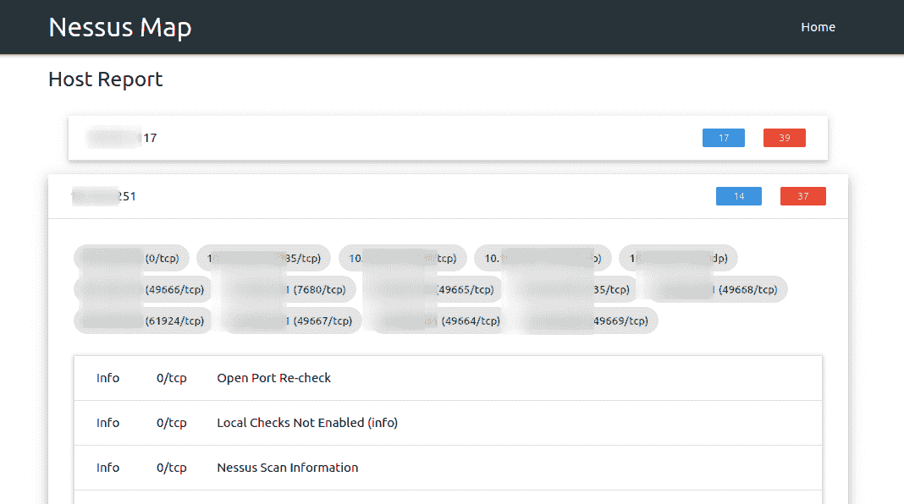
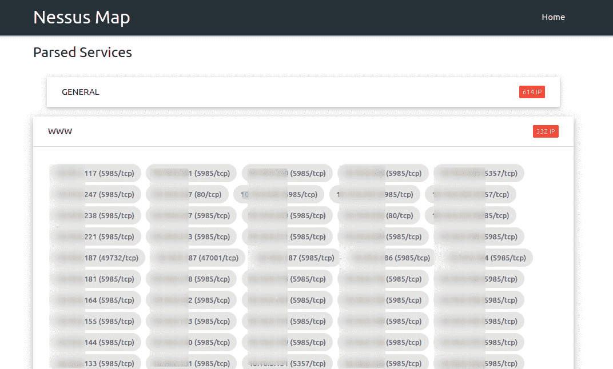
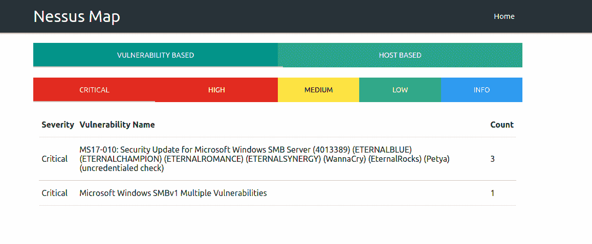
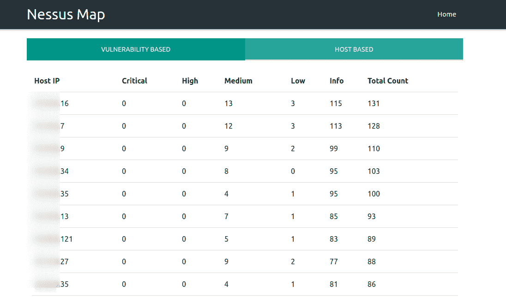
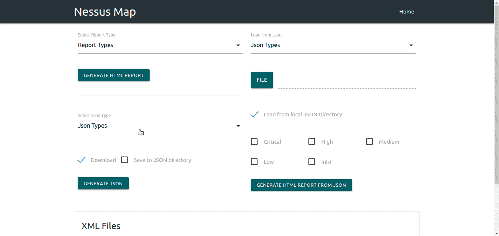
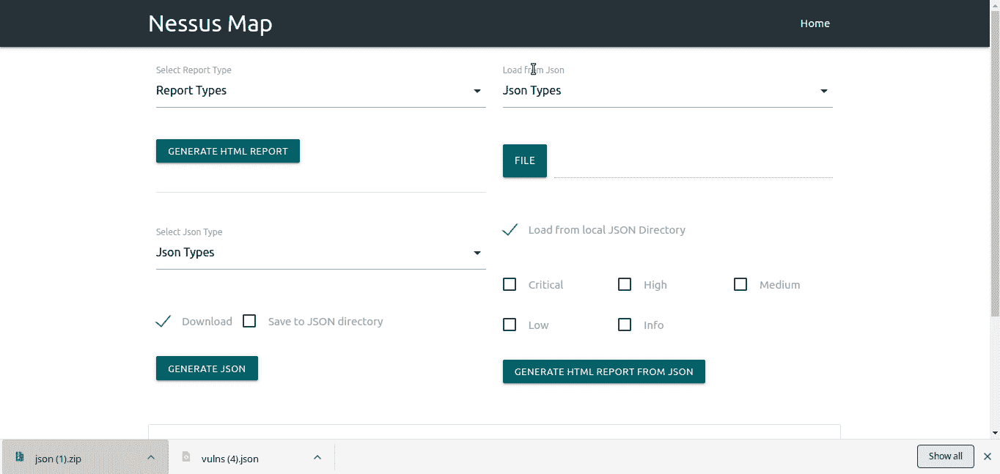

# Nessus 映射:解析 Nessus 文件并在交互式 UI 中显示输出

> 原文：<https://kalilinuxtutorials.com/nessus-map-parse-nessus-files-shows-output/>

[ & Shows Output In Interactive UI")](https://1.bp.blogspot.com/-gz-oTnSOtMA/XeeMdc4mbuI/AAAAAAAADxA/AkYkUtsZVhM-tLWXC_2cOZOBNb-Ku-N8ACLcBGAsYHQ/s1600/Nessus%2BMap-1%25281%2529.png)

**Nessus 地图**解析。nessus 文件，并在交互式用户界面中显示输出。它只是通过在 Nessus_Map 主目录中创建 XML 目录并放置 all。XML 目录下的 nessus 文件并启动服务器。

**内苏斯地图** **要求**

*   Python3
*   姜戈

**测试于**

*   Ubuntu 18.04

**它有什么作用？**

*   基于漏洞的解析
*   基于服务的解析
*   主机库解析
*   不支持的操作系统解析
*   生成扫描的执行摘要
*   导出已解析。nessus 到 JSON 文件
*   在 Nessus_Map 中导入 JSON 文件

**也可阅读-[Goblin:一个顽皮的、跨平台的二进制解析箱，用 Rust](https://kalilinuxtutorials.com/goblin-cross-platform-binary-parsing-crate-written-rust/) 编写**

**如何设置？**

*   克隆此回购`**git clone https://github.com/d3vilbug/Nessus_Map.git**`
*   更改目录`**cd Nessus_Map**`
*   复制`**XML**`目录下的所有`**.nessus**`文件
*   用`**python3 manage.py runserver**`启动服务器

**漏洞解析**

**主机解析**

**服务解析**

**执行报告**

**导出解析。nessus 到 JSON 文件**

**在 Nessus_Map 中导入 JSON 文件**

[**Download**](https://github.com/Ebryx/Nessus_Map#vulnerability-parsing)