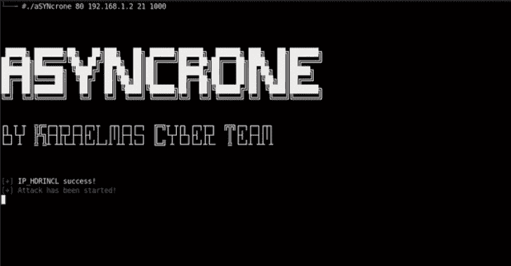

# aSYNcrone:多功能合成洪水 DDoS 武器

> 原文：<https://kalilinuxtutorials.com/asyncrone-multifunction-syn-flood-ddos-weapon/>

aSYNcrone 是一款基于 C 语言的故障 SYN Flood DDoS 武器。通过向目标集中发送一个 SYN 数据包来禁用目标系统。

**力量！！！**

**也读作-[CAPE:恶意软件配置和有效载荷提取](https://kalilinuxtutorials.com/cape-malware-configuration-payload-extraction/)**

**用途**

**git 克隆 https://github . com/Fatih 4842/asyncrone . git
CD asyncrone
gcc asyncrone . c-o asyncrone-lphread
。/异步电动机〔T4〕**

**规格**

*   内部随机 IP 生成器
*   使用线程和更快的准备和发送 SYN 数据包
*   不同的 IP 标识号

[**Download**](https://github.com/fatih4842/aSYNcrone)