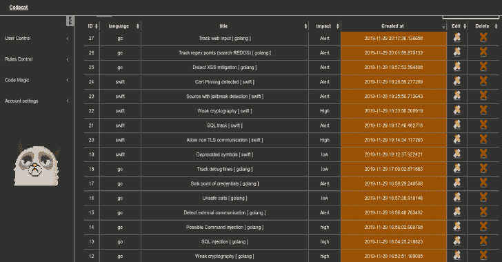

# CodeCat:在 CodeReview 中帮助手动分析的工具

> 原文：<https://kalilinuxtutorials.com/codecat-manual-analysis-codereview/>

CodeCat 是一个开源工具，可以帮助你在 codereview 中找到/跟踪 sinks，这一点遵循 regex 规则。

**怎么太安装了？**

**转到 CodeCat 目录，安装后端和前端库:**

$ CD Front
$ sudo python 3-m pip install-r requirements . txt
$ CD..
$ cd 后端
$ sudo python 3-m pip install-r requirements . txt

**运行后端和前端…**

$ CD Codecat
$ CD Frontend；python 3 wsgi . py&$ CD..
$ cd 后端；python3 wsgi.py &

**也可理解为-[Nessus 映射:解析 Nessus 文件&在交互 UI](https://kalilinuxtutorials.com/nessus-map-parse-nessus-files-shows-output/) 中显示输出**

**下一步您需要保存您的用户以登录:**

$ curl-I-X POST-H " Content-Type:application/JSON "-d ' { " email ":" admin 2 @ test . com "，" username":"admin "，" password ":" rubrik 123 "} ' https://127 . 0 . 0 . 1:5001/API/users-k

这个端点/api/users 在第一次部署时只运行一次，如果您试图再次发送请求以插入用户，端点返回 404…是为了安全。

转到下面这个"[https://127 . 0 . 0 . 1:9093/front/auth](https://127.0.0.1:9093/front/auth)/"。现在你可以在这个系统中输入 auth，使用登录名“admin”，通过“rubrik123”。

**关于 TLS 的注意:**您可以在“wsgi.py”中配置并加载您的 TLS 证书。

**鸣谢:安东尼奥·科斯塔**

[**Download**](https://github.com/CoolerVoid/codecat)