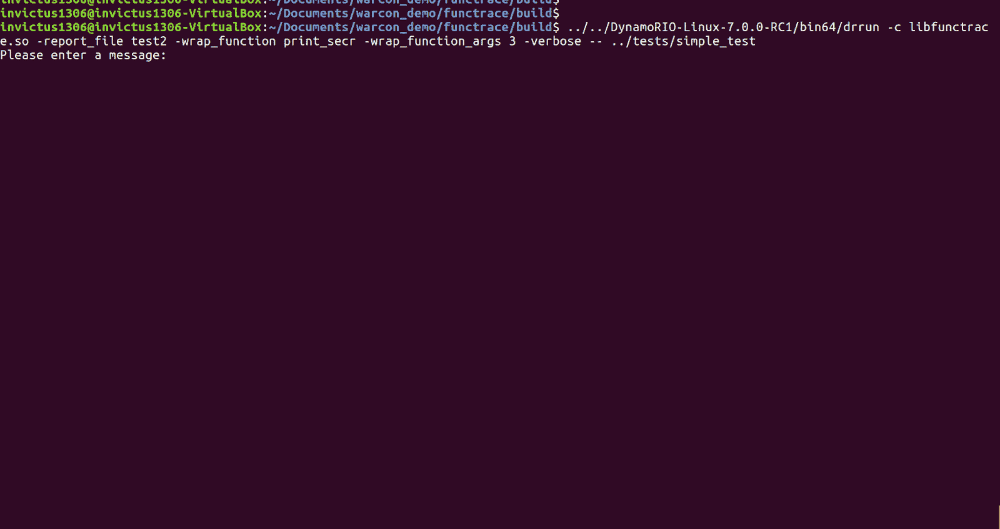
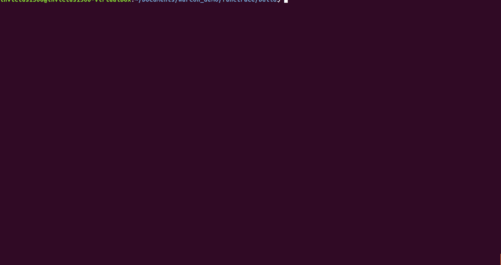

# Functrace:函数跟踪器

> 原文：<https://kalilinuxtutorials.com/functrace-function-tracer/>

**Functrace** 是一个使用 DynamoRIO 的动态工具来分析二进制文件的工具。以下是一些已实现的功能(基于 DynamoRIO):

*   反汇编所有执行的代码
*   反汇编一个特定的函数(如果这些是地址，则转储)
*   获取特定函数的参数(如果是地址，则转储)
*   获取特定函数的返回值(如果是地址，则转储)
*   监控应用信号
*   生成报告文件
*   ghidra(https://ghidra-sre.org/)覆盖脚本(基于 functrace 报告文件)

**设置**

**$ wget https://github . com/DynamoRIO/DynamoRIO/releases/download/release _ 7 _ 0 _ 0 _ rc1/DynamoRIO-Linux-7 . 0 . 0-rc1 . tar . gz
$ tar xvzf DynamoRIO-Linux-7.0.0-RC1.tar.gz**

或者

**$ wget https://github . com/DynamoRIO/DynamoRIO/releases/download/cron build-7 . 91 . 18047/DynamoRIO-x86 _ 64-Linux-7 . 91 . 18047-0 . tar . gz
$ tar xvzf DynamoRIO-x86 _ 64-Linux-7 . 91 . 18047-0 . tar . gz**

您也可以直接克隆和编译 DynamoRIO:

**$ git 克隆 https://github.com/invictus1306/functrace
$ mkdir-p 函数跟踪/构建
$ cd 函数跟踪/构建
$ cmake..-ddynamario _ DIR =/full _ DR _ path/cmake/
$ make-j4**

**也可阅读-[sharp hide:创建隐藏注册表项的工具](https://kalilinuxtutorials.com/sharphide/)**

**简单演示**

**使用 Functrace**

**$ dr run-c libfunctrace . so-report _ file report—target _ program[args]**

**选项**

支持以下*【func trace】*(【https://github.com/invictus1306/functrace】)选项:

**-反汇编- >** 反汇编所有函数
**-disas _ func function _ name->**只反汇编函数 function _ name
**-wrap _ function function _ name->**包装函数 function _ name
**-wrap _ function _ args num _ args->**包装函数的参数个数
**-cbr- >** 从缓存中移除 bb(从

**简单用法**

**选项-详细**

**$ dr run-c libfunctrace . so-report _ file report-verbose—target _ program[args]**

**选项-拆卸**

**$ dr run-c libfunctrace . so-report _ file 报表-反汇编— target_program [args]**

**选项-Disas_Func**

**$ dr run-c libfunctrace . so-report _ file report-disas _ func name _ function-target _ program[args]**

#### 选项-wrap_function 和-wrap_function_args

**$ dr run-c libfunctrace . so-report _ file report-wrap _ function name _ function-wrap _ function _ args num _ args—target _ program[args]**

**选项-CBR**

**$ dr run-c libfunctrace . so-report _ file report-CBR—target _ program[args]**

**CVE-2018-4013-漏洞分析**

LIVE555 RTSP 服务器库上的一个漏洞。这是[描述的](https://www.cvedetails.com/cve/CVE-2018-4013/)。

[**Download**](https://github.com/invictus1306/functrace/#options)