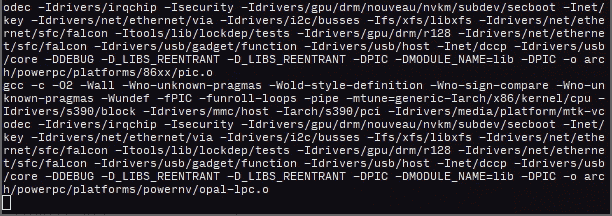
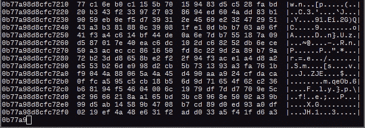

# Genact:一个无意义的活动生成器

> 原文：<https://kalilinuxtutorials.com/genact-nonsense-activity-generator/>

当你应该做真正的工作时，假装很忙或者在等你的电脑！用你疯狂的多任务处理能力给人们留下深刻印象。只要打开几个 **genact** 的实例，就可以看节目了。

它有多个场景，假装在做一些令人兴奋或有用的事情，而实际上什么都没发生。

**也读作-[Ngrev:角度应用逆向工程工具](https://kalilinuxtutorials.com/ngrev-reverse-engineering-angular-applications/)**

**安装**

什么都不用装！为了方便起见，这里[提供了预构建的 Linux、OSX 和 Windows 二进制文件，它们应该可以独立运行。**另外在**](https://github.com/svenstaro/genact/releases)**[https://svenstaro.github.io/genact/](https://svenstaro.github.io/genact/)T5 有网页版**

它兼容 FreeBSD、Linux、OSX、Windows 10(需要最新的 Windows 10 才能获得 ANSI 支持)和大多数支持 WebAssembly 的现代 web 浏览器。

**在 FreeBSD 上**:在这里你不需要做什么特别的事情。快跑吧

**pkg 安装 genact
genact**

Linux 上的**:从[的发布页面](https://github.com/svenstaro/genact/releases)下载`**genact-linux**`并运行**

 ****chmod +x genact-linux
。/genact-linux**

OSX 上的**:从的[发布页面下载`**genact-osx**`并运行](https://github.com/svenstaro/genact/releases)**

**chmod +x genact-osx
。/genact-osx**

**在 Windows** 上:从[的](https://github.com/svenstaro/genact/releases)发布页面下载`**genact-win.exe**`并双击。

如果你安装了最新版本的 Rust 和 Cargo，你可以运行

货物安装代理
代理

**With snap** :如果你想用 [snapcraft](https://snapcraft.io/) ，你可以在 [snap store](https://snapcraft.io/store/) 买到；

**快速安装 genact**

要使用 snap 自己构建它，请运行:

**snap craft clean build
snap install gen act _ *。snap–devmode–危险**

**运行中**

要查看所有可用选项的列表，您可以运行

**。/genact -h**

或者

**货物运行— -h**

或(在码头上)

**坞站运行-it-–RM svensero/gena CT-h**

帮助:

genact 0 . 7 . 0
Sven-Hendrik Haase[svenstaro@gmail.com](mailto:svenstaro@gmail.com)一个无意义的活动生成器

**用法:**
genact【标志】【选项】

**标志:**
-h，–help 打印帮助信息
-l，–List-modules 列出可用模块
-V，–version 打印版本信息

**选项:**
-e

在 web 版本中，您可以通过提供如下的`**?module**`参数来运行特定的模块:[https://svenstaro.github.io/genact?module=cc&模块=内存转储](https://svenstaro.github.io/genact?module=cc&module=memdump)

**编译**

您应该安装了最新版本的 rust and cargo。你不需要夜晚。然后，像往常一样克隆它和 **`cargo run`** 得到输出:

**git 克隆 https://github.com/svenstaro/genact.git
CD genact
货物运行**

**释放**

这是我关于如何发布这个东西的一个提示:

*   更新**`README.md``static/index.html``Cargo.toml``snapcraft.yaml`**版本。
*   `**git commit**`、**、`git tag -s`、`git push`、**。
*   `**cargo publish**`
*   Travis 将自动部署版本。
*   更新 AUR 包。

[**Download**](https://github.com/svenstaro/genact)**