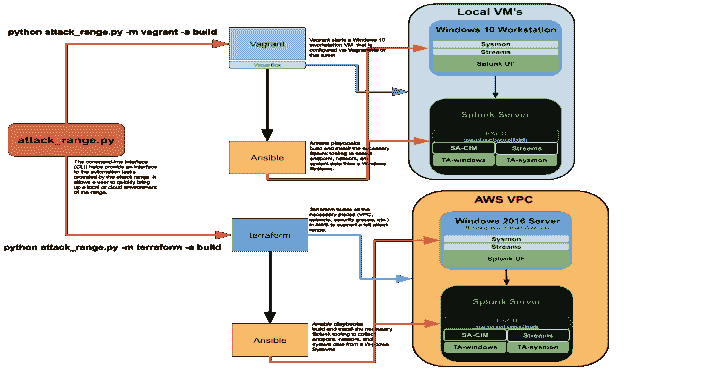

# 攻击范围:模拟针对 Splunk 的攻击并将数据收集到 Splunk 的工具

> 原文：<https://kalilinuxtutorials.com/attack-range-simulate-attacks-splunk/>

**攻击范围**是一个工具，允许您创建易受攻击的仪表化本地或云环境，以模拟针对 Splunk 的攻击并将数据收集到 Splunk 中。

它解决了检测发展中的两个主要挑战。首先，它允许用户快速构建一个尽可能接近您的生产环境的小型实验室基础设施。该实验室基础架构包含一个 Windows 域控制器、Windows 工作站和 Linux 服务器，并预配置了多种安全工具和日志记录配置。该基础架构附带一个 Splunk 服务器，从不同的服务器收集多个日志源。

其次，该框架允许用户使用不同的引擎来执行攻击模拟。因此，用户可以重复复制和生成尽可能接近“基本事实”的数据，其格式允许在 Splunk 中创建检测、调查、知识对象和行动手册。

**架构**

它有两种不同的用途:

*   本地使用流浪者和虚拟
*   在云中使用 terraform 和 AWS

为了让它在几乎每一台笔记本电脑上都能工作，使用 vagger 和 Virtualbox 的本地版本包含了使用 Terraform 的 AWS 中成熟的云基础设施的子集。

本地版本包括一个 Splunk 单实例和一个 Windows 10 工作站，根据 Splunk 的最佳实践日志记录配置进行了预配置。使用 Terraform 的 AWS 中的云基础架构由一台 Windows 10 工作站、一台 Windows 2016 服务器和一台 Splunk 服务器组成。更多信息可以在维基中找到。

**也可阅读-[file Intel:一个模块化的 Python 应用程序，用于获取有关恶意文件的情报](https://kalilinuxtutorials.com/fileintel-python-application-malicious-files/)**

**运行中**

它支持不同的操作:

*   建造它
*   执行攻击模拟
*   摧毁它
*   得了
*   继续

**建造**

*   使用**地形**建造它

**python attack _ range . py-m terra form-a build**

*   使用**流浪者**建造它

**python attack_range.py -m 流浪汉-a build**

**进行攻击模拟**

*   使用**地形**进行攻击模拟

**python attack _ range . py-m terraform-a simulate-ST t 1117，t 1003-t attack-range _ windows _ 2016 _ DC**

*   使用**流浪者**进行攻击模拟

**python attack_range.py -m 流浪者-a 模拟-st T1117，T1003 -t win10**

**摧毁**

*   使用**地形**摧毁它

**python attack _ range . py-m terra form-a destroy**

*   使用**流浪者**摧毁它

**python attack_range.py -m 流浪汉-a 毁灭**

**停止攻击范围**

*   使用**地形**停止

**python attack _ range . py-m terra form-a stop**

*   使用**流浪者**停止它

**python attack_range.py -m 流浪汉-a stop**

**恢复攻击范围**

*   使用**地形**恢复

**python attack _ range . py-m terra form-a 简历**

*   使用**流浪者**恢复

**python attack_range.py -m 流浪汉-a 简历**

致谢:[何塞·埃尔南德斯](https://twitter.com/d1vious)

[**Download**](https://github.com/splunk/attack_range)