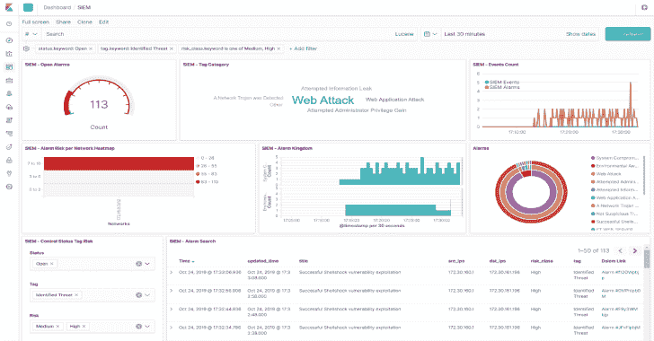
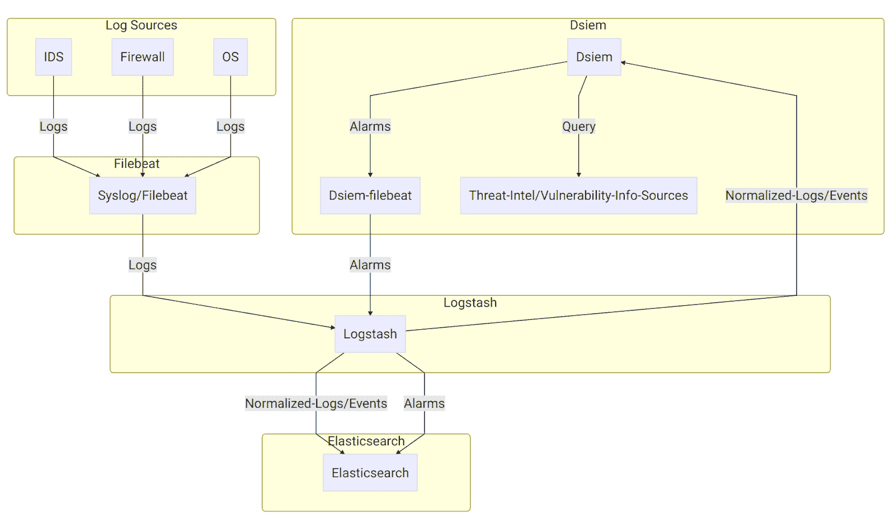

# DSI em:ELK 堆栈的安全事件关联引擎

> 原文：<https://kalilinuxtutorials.com/dsiem-security-event-correlation-engine-elk-stack/>

**Dsiem** 是一个用于 [ELK stack](https://www.elastic.co/elk-stack) 的安全事件关联引擎，允许该平台作为一个专用的全功能 [SIEM](https://en.wikipedia.org/wiki/Security_information_and_event_management) 系统使用。

它为规范化的日志/事件提供 [OSSIM](https://www.alienvault.com/products/ossim) 风格的关联，对威胁情报和漏洞信息源执行查找/查询，并生成风险调整警报。

**特性**

*   以独立或集群模式运行，使用 [NATS](https://nats.io/) 作为前端和后端节点之间的消息总线。与 ELK 一起，这使得整个 SIEM 平台可以水平扩展。
*   OSSIM 风格的相关性和指导性规则，简化了从 OSSIM 的过渡。
*   警报丰富了来自威胁情报和漏洞信息源的数据。内置支持 [Moloch Wise](https://github.com/aol/moloch/wiki/WISE) (支持 OTX 和其他人)和 Nessus CSV 输出。对其他来源的支持可以很容易地实现为[插件](https://github.com/defenxor/dsiem/blob/master/docs/plugins.md#about-threat-intel-lookup-plugin)。
*   通过 Metricbeat 和/或 Elastic APM 服务器支持的工具。为此不需要额外的堆栈。
*   内置速率和背压控制，根据您的硬件容量和事件处理中可接受的延迟，设置从 Logstash 接收的最小和最大事件/秒(EPS)。
*   松散耦合，设计为可与其他基础设施平台组合，并且不尝试做所有事情。松散耦合还意味着，如果需要，可以将它用作带有非 ELK 堆栈的 OSSIM 风格的关联引擎。
*   包括电池:
    *   一个指令转换工具，读取 OSSIM XML 指令文件并将其转换为 Dsiem-JSON 风格的配置。
    *   一个 SIEM 插件创建工具，它将从 Elasticsearch 中读取现有的索引模式，并创建必要的 Logstash 配置来克隆相关字段的内容。该工具还可以生成 it 所需的基本指令，以关联接收到的事件并生成警报。
    *   一个助手工具，通过网络向 it 部门提供 Nessus CSV 文件。
    *   一个轻量级的有角度的 web UI，仅用于基本的警报管理(关闭、标记)，并且可以轻松地旋转到 Kibana 中的相关索引来执行实际的分析。
*   显然是一个云原生的、十二因素的应用程序，以及所有这些东西。

**又读-[攻击范围:模拟攻击&的工具收集数据到 Splunk](https://kalilinuxtutorials.com/attack-range-simulate-attacks-splunk/)**

它是如何工作的？

**上图:**

*   日志源将它们的日志发送到 Syslog/Filebeat，然后 Syslog/Filebeat 将它们发送到带有唯一标识字段的 Logstash。Logstash 然后根据日志源类型使用不同的过滤器解析日志，并将结果发送给 Elasticsearch，通常为每种日志类型创建一个索引模式(例如，`**suricata-***`用于从 Suricata IDS 接收的日志，`**ssh-***`用于 SSH 日志，等等)。).
*   它使用一个特殊用途的 logstash 配置文件来克隆来自日志源的传入事件，就在 logstash 完成解析之后。通过同一个配置文件，新的克隆事件(独立于原始事件)用于收集所需的字段，如标题、源 IP、目的 IP 等。
*   上述步骤的输出被称为*规范化事件*，因为它以具有一组公共字段的单一格式表示来自多个不同来源的日志。这些事件然后通过 Logstash HTTP 输出插件发送给它，并在索引名模式`**siem_events-***`下发送给 Elasticsearch。
*   它根据配置的指令规则关联传入的规范化事件，执行威胁情报和漏洞查找，然后在满足规则条件时生成警报。然后，警报被写入本地日志文件，该文件由配置为将其内容发送到 Logstash 的本地 Filebeat 获取。
*   在 logstash 端，有另一个 Dsiem [特殊配置文件](https://github.com/defenxor/dsiem/blob/master/deployments/docker/conf/logstash/conf.d/80_siem.conf)，它读取那些提交的警报，并将它们推送到 Elasticsearch 中的最终 siem 警报索引。

上述过程的最终结果是，现在我们可以通过监控单个弹性搜索指数来观察新的警报和对现有警报的更新。

**安装**

测试 Dsiem 最快速和最可靠的方法是使用提供的 Docker Compose 文件。它们包括 Dsiem、所有必需的 ELK 堆栈和一个预配置的示例日志源(Suricata)。

然后，在您对所有的东西是如何组合在一起有了感觉之后，您就可以开始将 Dsiem 集成到您现有的或者定制的 ELK 部署中了。

**安装 Dsiem**

**使用 Docker 撰写**

*   安装[坞站](https://docs.docker.com/compose/install/)和[坞站组成](https://docs.docker.com/compose/install/)。
*   将这个库从[复制到这里](https://github.com/defenxor/dsiem/archive/master.zip)，解压，然后在终端中打开结果。

**$ unzip dsiem-master . zip&CD dsiem-master**

*   Suricata 需要知道监控哪个网络接口上的流量。告诉它使用在您的系统上有工作互联网连接的网络接口，如下所示(对于 **`bash`** shell):

**$ export PROMISC _ INTERFACE = eth 0**

*   用 **`ifconfig`** 或类似命令给出的实际接口名称替换上面的 **`eth0`** 。出于测试目的，没有必要将接口配置为真正在混杂模式下运行。
*   将 filebeat 配置文件的所有者设置为 root ( [以下是原因](https://www.elastic.co/guide/en/beats/libbeat/6.4/config-file-permissions.html)):

**$ CD deployments/docker&&\
sudo chown root $(find conf/file beat/conf/file beat-es/-name " *。yml")**

*   在独立模式下运行 ELK、Suricata 和 Dsiem:

**$ docker-复合拉
$ docker-复合 up**

*   几分钟后，一切都将准备就绪，等待测试。以下是关于`**docker-compose**`创造的环境的注意事项:
    *   Dsiem web UI 应该可以从 [http://localhost:8080/ui](http://localhost:8080/ui) 访问，从 [http://localhost:9200](http://localhost:9200) 访问 Elasticsearch，从 [http://localhost:5601](http://localhost:5601) 访问 Kibana。
    *   Suricata 配备了[新兴威胁 ICMP 信息规则集](https://rules.emergingthreats.net/open/suricata/rules/emerging-icmp_info.rules)启用和`**EXTERNAL_NET: "any"**`，因此您只需连续 ping 同一子网中的主机，即可轻松触发测试警报。Dsiem 附带了一个[示例指令配置](https://github.com/defenxor/dsiem/blob/master/configs/directives_dsiem-backend-0_testing1.json)，它将拦截这种“攻击”。
    *   记录的事件将存储在弹性搜索索引模式`**siem_events-***`中，警报将存储在`**siem_alarms**`中。您可以从 Kibana 或 Dsiem web UI 查看它们的内容。

**导入 Kibana 仪表板**

*   一旦 Kibana 在 [http://localhost:5601](http://localhost:5601) 启动，您就可以使用以下命令导入 Dsiem dashboard 及其依赖项:

**$。/scripts/kbndashboard-import . sh localhost。/deployments/ki Bana/dashboard-siem . JSON**

*   请注意，与任何 Kibana 仪表板一样，Dsiem 仪表板也希望底层索引(在本例中为 **`siem_alarms`和`siem_events-*`** )在被正确访问之前已经创建。这意味着在尝试使用仪表板之前，您需要触发上述测试警报。

**利用现有的麋鹿**

*   首先，通过使用上面的 Docker Compose 方法测试 Dsiem 架构，确保您已经熟悉了它的工作方式。还要注意的是，这些步骤只针对 ELK 版本 6.4.2 和 6.8.0 进行了测试，尽管稍加调整，它应该适用于任何 6.x 版本(也可能是 7.x)。
*   下载 Dsiem 最新的二进制版本，并将其解压缩到专用目录。例如，要将 Linux 版本安装到`**/var/dsiem**`中:

# **[ "$EUID" -ne 0 ] & & echo 必须以 root 身份运行！| |(\
export DSIEM _ DIR =/var/DSIEM&&\
mkdir-p $ DSIEM _ DIR&&\
wget https://github . com/defensor/DSIEM/releases/latest/download/DSIEM-server _ Linux _ amd64 . zip-O/tmp/DSIEM . zip&\
unzip/tmp/DSIEM . zip-d $ DSIEM**

*   通过在`**/var/dsiem/web/dist/assets/config/esconfig.json**`中输入它们的 URL，让 web UI 知道如何到达 Elasticsearch 和 Kibana:

**$ cat esconfig . JSON
{
" elastic search ":" http://elastic search:9200 "，
" ki Bana ":" http://ki Bana:5601 "
}**

*   将以下插件安装到您的 Logstash 实例中:
    *   [日志存储-过滤-修剪](https://www.elastic.co/guide/en/logstash/current/plugins-filters-prune.html)
    *   [logstash-filter-uuid](https://www.elastic.co/guide/en/logstash/current/plugins-filters-uuid.html)
*   从[这里](https://github.com/defenxor/dsiem/tree/master/deployments/docker/conf/logstash)调整并部署 Logstash 的示例配置文件。如果对此有问题，请参考 Logstash 文档。
*   在与 dsiem 相同的机器上安装 Filebeat，并将其配置为使用从[这里](https://github.com/defenxor/dsiem/tree/master/deployments/docker/conf/filebeat)提供的示例配置文件。
    *   注意，您应该将该示例中的`**/var/log/dsiem**`更改为 dsiem 安装位置中的`**logs**`目录(如果使用上面的示例，则为`**/var/dsiem/logs**`)。
    *   还要确保在`**filebeat.yml**`文件中调整 logstash 地址变量，以指向您的 Logstash 端点地址。
*   使用类似下面的方法将 Dsiem 设置为自动启动(对于基于 systemd 的 Linux):

**#[" $ EUID "-ne 0]&&echo 必须以 root 身份运行！|| ( \**
猫<<EOF>/etc/systemd/system/Dsiem . Service

**【Unit】**
Description = Dsiem
After = network . target

**【Service】**
Type = simple
working directory =/var/Dsiem
ExecStart =/var/Dsiem/Dsiem/Dsiem serve
重新启动

*   Dsiem web UI 应该可以从[http://hostip address:8080/UI](http://HostIPAddress:8080/ui)访问
*   从`**deployments/kibana/dashboard-siem.json**`导入 Kibana 仪表板。这一步还将安装所有的 Kibana 索引模式(`**siem_alarms**`和`**siem_events**`)，它们将从 Dsiem web UI 链接到。$ ./scripts/kbndashboard-import . sh $ { your-ki Bana-IP-or-hostname }。/deployments/ki Bana/dashboard-siem . JSON

**卸载 Dsiem**

对于`**docker-compose**`安装，只需运行以下命令:

**$ CD DSI/deployments/dock&&
【docker-down-v】**化合物

或者

**CD DSI/deployments/docker&&
【docker-compose-f docker-compose-cluster . yml down-v】**

对于非`**docker-compose**`程序，您必须手动撤销所有更改，例如:

*   删除多余的 logstash 插件和配置文件。
*   卸载 Filebeat。
*   通过删除 Dsiem 的目录和 systemd 单元文件(如果有)来卸载 Dsiem。

[**Download**](https://github.com/defenxor/dsiem)