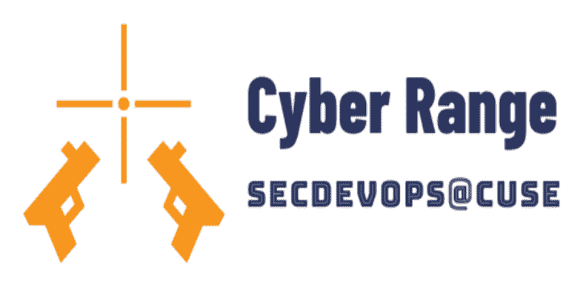
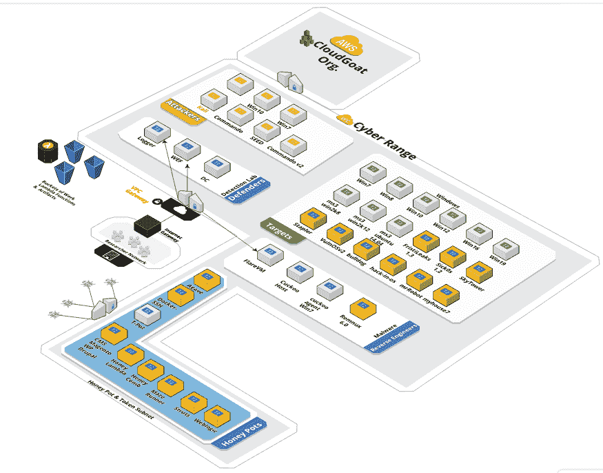
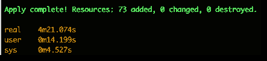

# CyberRange:开源的 AWS Cyber Range

> 原文：<https://kalilinuxtutorials.com/cyberrange-open-source-aws/>

这个 **CyberRange** 项目代表了世界上第一个开源的 CyberRange 蓝图。这个项目为一个使用 AWS 云的私人研究实验室中的一个完整的攻击、防御、逆向工程&安全情报工具提供了一个引导框架。

该项目包含易受攻击的系统和渗透测试人员已知的最强大的开源/社区版工具的工具包。它只是在不到 5 分钟的时间内为研究人员提供了一个基于 AWS 的一次性进攻/防御环境。

**也读作——[Hash cobra:哈希破解工具](https://kalilinuxtutorials.com/hashcobra-hash-cracking-tool/)**

**开始使用**

要获得访问权，你必须给我你的 AWS 账号，这样我就可以分享 30+亚马逊机器图像(ami)。

使用我的安全[Form assembly](https://www.formassembly.com)Form->[CyberRange 注册表单](https://www.tfaforms.com/4729221)

然后—[阅读入门指南](https://github.com/secdevops-cuse/CyberRange/blob/master/tutorials/getting_started.md)

**范围历史**

**发行说明:**

[查看变更日志](https://github.com/secdevops-cuse/CyberRange/blob/master/changelog.md)

**v2**—2019 年 9 月 6 日发布的 v2 是一个集合了一流工具、最新兴工具集和引导框架的集合，旨在创建一个能够实现巨大增长的集成解决方案。

**功能包括:makefile、inspec tests、detection lab integration、commandoVM v2、kali 2019.4 w/以下开源 github 工具:CyberRange、detection lab、IntruderPayloads、AWS-credential-compromise-detection、aws-nuke、blast-radius、cloudgoat、cloudmapper、packer-windows、pacu、security-monkey-terraform、sites-using-cloudflare、net-creds、Reconnoitre、shell_generator.sh、msploitego、awesome-nodejs-nodejs**

**靶场技术**

CyberRange 将最佳实践与新兴技术相结合。

*   亚马逊网络服务
*   迦利
*   涅索斯
*   突击队-虚拟机-一个基于 windows 的渗透测试虚拟机
*   将（行星）地球化（以适合人类居住）
*   开源易受攻击的虚拟机[参见资产清单](https://github.com/secdevops-cuse/CyberRange/blob/master/asset-inventory.md)
*   使用 CI/CD 工具验证构建 [CircleCI](https://circleci.com/)
*   坞站/坞站-合成
*   VulnHub 上的 metasplotable 2/3 和其他开源 vuln 虚拟机
*   检测实验室
*   inspec–测试您的环境、应用程序、系统、流程、配置等的状态。
*   此外，还有许多东西需要设置、配置和试验。

**知识领域**

这个开源研究实验室为研究任何一种“三巨头”技术技能的技术专家提供了一个引导学习平台。

*   网络安全
*   云计算
*   DevOps

这个项目支持 7 个极其广泛的技术知识领域。

*   进攻性安全
*   SecDevOps
*   建筑与工程
*   漏洞、变更和配置管理
*   质量保证
*   审计–处理、系统、应用
*   开发–基础设施/网络应用

**使命陈述**

最终期望是模仿[锡拉丘兹大学赛博 SEED 实验室](http://www.cis.syr.edu/~wedu/seed/Labs_16.04/)的质量、形式和演示，同时创建网络安全卓越中心合作伙伴关系的战略中心，通过将培训路径集中在人员、产品和流程上来解决企业经验&学术学习之间的差距。

[**Download**](https://github.com/secdevops-cuse/CyberRange)