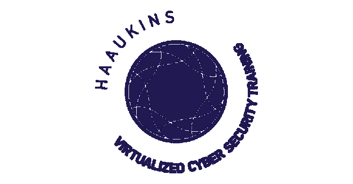

# Haaukins:面向安全教育的高度可访问的自动化虚拟化平台

> 原文：<https://kalilinuxtutorials.com/haaukins-highly-accessible-automated-virtualization-platform/>

**Haaukins** 是一个高度可访问和自动化的安全教育虚拟化平台，它有三个主要组件(Docker、Virtualbox 和 Golang)，组件之间的通信和编排使用 Go 编程语言管理。

让 Go 环境在 Haaukins 平台上管理和部署一些东西的主要原因是 Go 的简单并发和并行机制。想了解更多关于 Haaukins 建筑的信息，请访问[建筑页面](https://github.com/aau-network-security/haaukins/wiki/Architecture-of-Haaukins)

我们的主要目标是让任何想要学习网络安全中捕获标志概念的人参与进来，这是一种被广泛接受的学习如何发现系统漏洞的方法。

尽管所有现有的平台，Haaukins 提供了自己的虚拟化环境和操作系统，旨在发现漏洞。

**先决条件**

下列依赖项是必需的，必须单独安装，以便在您的本地环境中运行守护程序。

*   Linux 操作系统
*   码头工人
*   Go 1.13+

在您的环境中安装客户端没有先决条件。

> **注意** : Linux 也可以用在虚拟化环境中。

**安装**

要安装 daemon 或 Haaukins 的客户端，有一些选项，通过二进制文件，可以随时使用，请访问[版本](https://github.com/aau-network-security/haaukins/releases)页面。

有关安装过程的更多信息，请查看以下页面；

*   [客户端安装](https://github.com/aau-network-security/haaukins/wiki/Installation)
*   [守护程序的配置](https://github.com/aau-network-security/haaukins/wiki/Configuring-the-daemon)
    *   有一些配置文件来配置守护进程，这些配置文件应该与您刚刚从[发布](https://github.com/aau-network-security/haaukins/releases)页面下载的二进制文件在同一个目录中。
    *   想在你的本地计算机上使用预先配置的流浪者文件来尝试守护进程，查看这个[报告](https://github.com/aau-network-security/sec0x)以获得更多信息。

**获取依赖关系**

Haaukins 平台从版本 [1.6.4](https://github.com/aau-network-security/haaukins/releases/tag/1.6.4) 开始使用`**go modules**`，因此管理依赖关系相当容易，你只需要运行`**go mod download**`

**测试**

确保您在`**$GOPATH/src/github.com/aau-network-security/haaukins/**`目录中，要运行所有测试文件，可以使用以下命令

**去考-v -short。/…**

**重新编译原型**

Haaukins 平台在客户端和守护进程的通信中使用 gRPC，因此在更新协议缓冲区规范(即 daemon/proto/daemon.proto)后，通过执行以下操作来生成相应的 golang 代码:

**CD＄GOPATH/src/github . com/AAU-network-security/haaukins/daemon/proto-I proto/proto/daemon . proto–go _ out = plugins = grpc:proto**

## **版本发布**

为了发布新版本，运行如下 **`script/release/release.go`** 脚本(根据发布类型选择):

**$ go run $ GOPATH/src/github . com/AAU-network-security/haaukins/scripts/release/release . go major
$ go run $ GOPATH/src/github . com/AAU-network-security/haaukins/scripts/release/release . go minor
$ go run $ GOPATH/src/github . com/AAU-network-security/haaukins/scripts/release/release . go 补丁**

该脚本将执行以下操作:

*   在 **`VERSION`** 中提升版本并提交给 git
*   用新版本标记当前的 **`HEAD`**
*   创建新的分支，这取决于发布的类型。
*   推到 git

Travis 在 GitHub 上自动创建一个发布，并在`**server**`上部署。

注意:默认情况下，脚本使用`**~/.ssh/id_rsa**`键推送到 GitHub。您可以通过`**HKN_RELEASE_PEMFILE**` env 变量覆盖这些设置。

[**Download**](https://github.com/aau-network-security/haaukins)