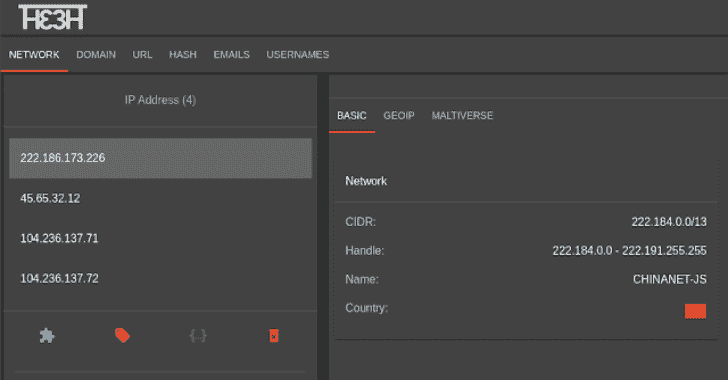

# 主题:威胁狩猎环境

> 原文：<https://kalilinuxtutorials.com/thethe-threat-hunting-environment/>

你是一个威胁猎人。在调查的时候，你有没有发现自己的浏览器里打开了 20 多个标签页，零散的。txt 文件的数据和一些终端显示在后台？**将一项调查的所有信息集中到一个项目中，并与你的团队分享调查结果(不与任何人分享)。**

 **缓存您的 API 响应，所以您不需要重复请求。不要共享您的密钥，让用户调用服务。

它还包含一些集成的命令行工具，这样你就不必打开一个终端并把结果保存在一个. txt 文件中。

**安装**

首先，使用以下内容克隆此存储库:

**git 克隆 https://github . com/elevppets/the the . git**

最后，构建映像并运行容器

**坞站-合成 up -d**

你应该可以在 [http://localhost](http://localhost) 中看到**和**

**又读-[Nginx 日志检查:Nginx 日志安全分析脚本](https://kalilinuxtutorials.com/nginx-log-check/)**

**默认用户**

*   默认情况下，只有一个用户 **admin** ，密码为 **admin**
*   第一次登录**后，立即更改**管理员**密码。**

**API 键**

*   默认情况下，系统中没有存储 API 密钥。
*   要添加 API 密钥，用户菜单中有一个选项(右上角)。
*   所有 API 密钥(**新的 API 管理系统正在开发中**)必须以 CSV 值的形式写入:

**服务名 1，api 值 1
服务名 2，api 值 2
……
服务名 n，api 值 n**

如果一个服务必须有一个以上的 API 密钥、秘密等，那该怎么办

**secret，API _ value

……

cookie，cookie_value**

诸如此类…

**数据库备份&恢复**

MongoDB 有一个绑定卷来简化文件夹**中的外部存储和备份**

无论如何，我们已经为您提供了几个脚本来备份(一个压缩文件)和恢复 mongo 容器中的数据。

在**实用程序**文件夹内:

制作备份

**backup _ the _ db . sh<MongoDB _ container _ name>**

从备份中恢复

**restore _ the _ db . sh<MongoDB _ container _ name>**

**更新**

**进行数据库备份！**(参见“数据库备份和恢复”一节)

**git pull**

如果源代码已经更改，所有已挂载的卷都应该反映这些更改，但是在某些情况下(第三方库等)，必须重建映像。

停止容器:

**坞站-化合物停止**

重建图像:

**坞站-复合构建**

重启系统

**坞站-合成 up -d**

**开发环境**

如果您想与该项目合作，我们提供了一个开发版本:

**获取存储库**

**git 克隆 https://github . com/elevppets/the the . git**

**码头工人**

**坞站-复合-f 坞站-复合 _dev.yml up -d**

**运行前端**

**cd 前端
npm 安装
npm 运行服务**

[**Download**](https://github.com/ElevenPaths/thethe)**