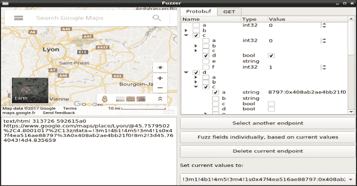
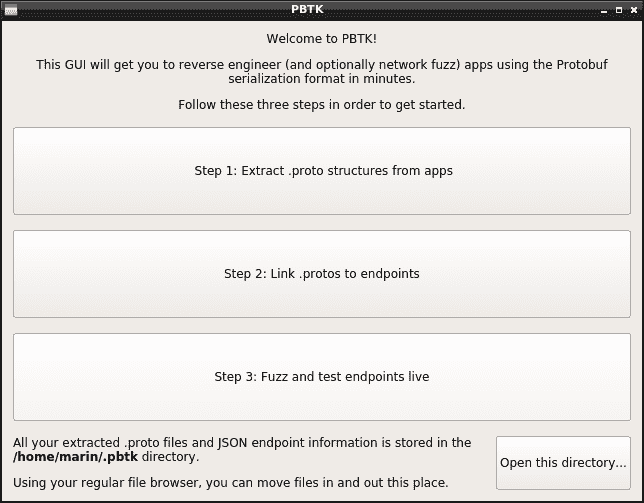
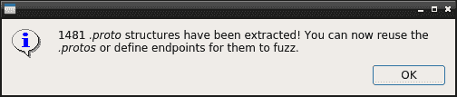
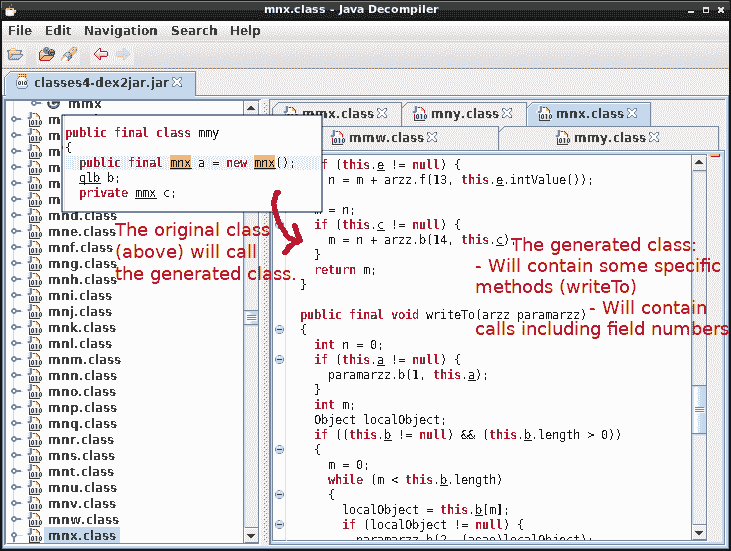
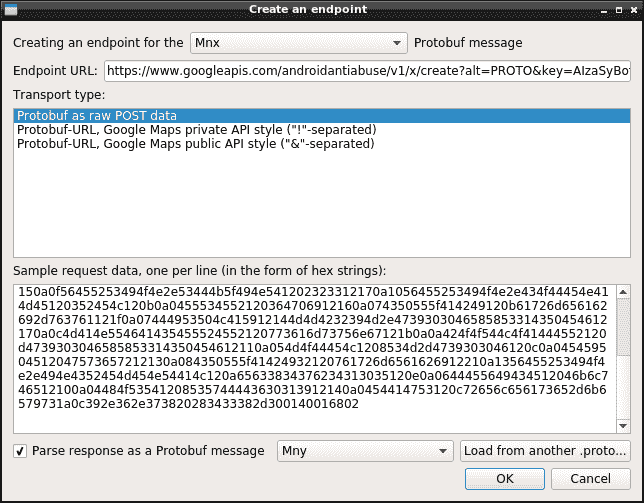
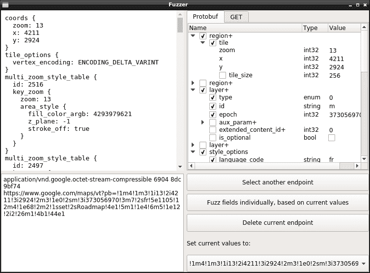

# PBTK:逆向工程工具集&模糊化基于 Protobuf 的应用程序

> 原文：<https://kalilinuxtutorials.com/pbtk-toolset-reverse-engineering-fuzzing-protobuf-based/>

**PBTK** 是一个工具，可用于逆向工程和模糊化基于 protobuf 的应用程序。 **Protobuf 是由 Google 开发的一种序列化格式**，在越来越多的 Android、web、桌面和更多应用程序中使用。

它由一个用于声明数据结构的**语言组成，然后根据目标实现将其编译成代码或另一种结构。**

它是一套成熟的脚本，可通过统一的 GUI 访问，提供两个主要功能:

*   从程序中提取 Protobuf 结构，将它们转换回可读的*。proto* s，支持各种实现:
    *   所有主要的 Java 运行时(基本、精简、纳米、微、J2ME)，完全支持 Proguard，
    *   包含嵌入式反射元数据的二进制文件(通常是 C++，有时是 Java 和大多数其他绑定)，
    *   使用 JsProtoUrl 运行时的 Web 应用程序。
*   **编辑、重放和模糊发送到 Protobuf 网络端点的数据**，通过一个方便的图形界面，您可以实时编辑 Protobuf 消息的字段并查看结果。

**另请阅读-[Haaukins:一个高度可访问的&安全教育自动化虚拟化平台](https://kalilinuxtutorials.com/haaukins-highly-accessible-automated-virtualization-platform/)**

**安装**

PBTK 需要 Python ≥ 3.5、PyQt 5、Python-Protobuf 3 和少量可执行程序(chromium、jad、dex 2 jar……)来运行提取器脚本。

Archlinux 用户可以通过[包](https://aur.archlinux.org/packages/pbtk-git/)直接安装:

**$酸奶-s pbtk-git
【pbtk】**

在大多数其他发行版中，您会希望直接运行它:

**# For Ubuntu/Debian 测试派生:
$ sudo apt 安装 python 3-pip git open JDK-9-JRE
$ sudo pip 3 安装 protobuf pyqt5 请求 web socket-client
$ git 克隆 https://github.com/marin-m/pbtk
$ CD pbtk
$。/gui.py**

也支持 Windows(需要相同的模块)。一旦您运行 GUI，它应该会根据您尝试做的事情来警告您错过了什么。

**命令行用法**

可以通过主脚本启动 GUI:

**。/gui.py**

以下脚本也可以独立使用，无需 GUI:

**。/extractors/jar _ extract . py[-h]input _ file[output _ dir]
。/extractors/from _ binary . py[-h]input _ file[output _ dir]
。/extractors/web _ extract . py[-h]input _ URL[output _ dir]**

**典型工作流程**

假设您正在对一个 Android 应用程序进行逆向工程。您用您最喜欢的反编译器研究了一下这个应用程序，发现它以典型的方式通过 HTTPS 将 Protobuf 作为 POST 数据传输。

你打开 PBTK，会以一种意味深长的方式受到问候:

第一步是得到你的。转换成文本格式。如果你的目标是一个 Android 应用程序，放入一个 APK 并等待应该会产生神奇的效果！(除非它是一个非常奇特的实现)

完成后，您跳转到`**~/.pbtk/protos/<your APK name>**`(或者通过命令行，或者通过欢迎屏幕底部的按钮，以您喜欢的方式打开您的文件浏览器)。所有的应用程序。原型确实在这里。

回到您的反编译器，您偶然发现了构造发送到您感兴趣的 HTTPS 端点的数据的类。它通过调用由生成的代码组成的类来序列化 Protobuf 消息。

后一个类应该在您的。protos 目录(即`**com.foo.bar.a.b**`将匹配`**com/foo/bar/a/b.proto**`)。无论哪种方式，grepping 它的名字应该使你能够引用它。

太好了:接下来的事情是进入**步骤 2** ，选择您想要的输入。proto，并填充一些关于您的端点的信息。

您还可以给出一些样本原始 Protobuf 数据，这些数据被发送到这个端点，通过 mitmproxy 或 Wireshark 捕获，并以十六进制编码的形式粘贴。

**步骤 3** 是关于点击按钮并观察会发生什么的有趣部分！您有一个代表 Protobuf 结构中每个字段的树视图(重复的字段以“+”为后缀，必填字段没有复选框)。

只需将鼠标悬停在某个字段上即可获得焦点。如果字段是整数类型，使用鼠标滚轮增加/减少它。悬停时也会显示枚举信息。

在这里！你可以用它来确定每个字段的含义。如果你提取了。在精简代码的基础上，你可以根据你注意到的它们的意思，通过点击它们的名字来重命名字段。

[**Download**](https://github.com/marin-m/pbtk)