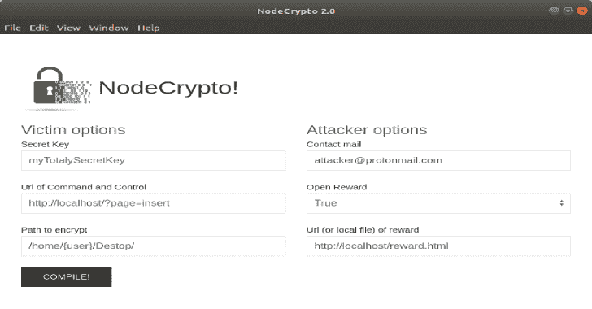
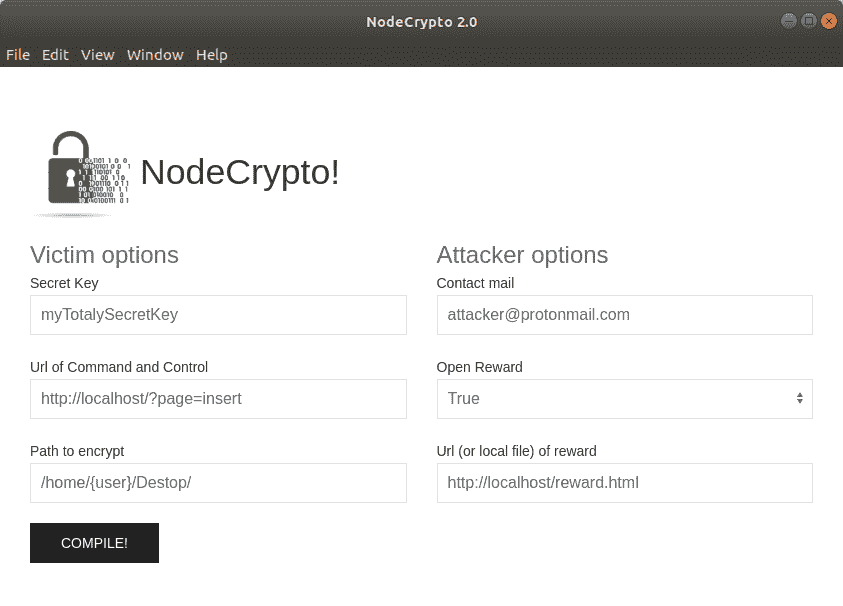
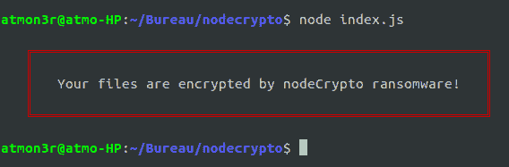
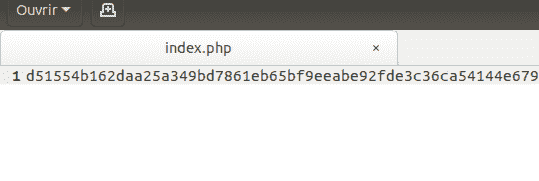

# NodeCrypto:用 NodeJs 编写的 Linux 勒索软件

> 原文：<https://kalilinuxtutorials.com/nodecrypto-ransomware-written-nodejs/>

**NodeCrypto** 是一个用 NodeJs 编写的 Linux 勒索软件，加密预定义的文件。这个项目是为教育目的而创建的，你对它的使用负有唯一的责任。

**安装服务器**

*   将[服务器/](https://github.com/atmoner/nodeCrypto/tree/master/server) 文件夹中的所有文件上传到您的网络服务器上。
*   创建一个 sql 数据库并导入 [sql/nodeCrypto.sql](https://github.com/atmoner/nodeCrypto/blob/master/sql/nodeCrypto.sql)
*   编辑 [server/libs/db.php](https://github.com/atmoner/nodeCrypto/blob/master/server/libs/db.php) 并添加您的 SQL ID。

**安装&运行**

**git 克隆 https://github . com/atmoner/nodecrypto . git
CD no crypto&&【NPM 安装】
cd 源& & npm 安装
cd-什么&&【NPM 启动】**

配置完成后，运行 compile！
可以启动勒索软件了。

**光盘来源& &。/输出**

web 服务器根目录下的文件将被加密并发送到服务器。

**也可阅读-[PBTK:逆向工程工具集&模糊化基于 Protobuf 的应用](https://kalilinuxtutorials.com/pbtk-toolset-reverse-engineering-fuzzing-protobuf-based/)**

**待办事项**

*   **GUI exe 创建者**
    *   编辑基本变量
    *   导出跨平台
*   **客户(受害者)**
    *   加密 web 服务器
    *   使用私钥进行加密
    *   适配 SSL
*   **服务器**
    *   恢复数据(用户+加密文件)
    *   格式化数据库
    *   为 web 服务器制作 GUI
*   **制作一个可执行文件来解密文件**

**截图**

[**Download**](https://github.com/atmoner/nodeCrypto)