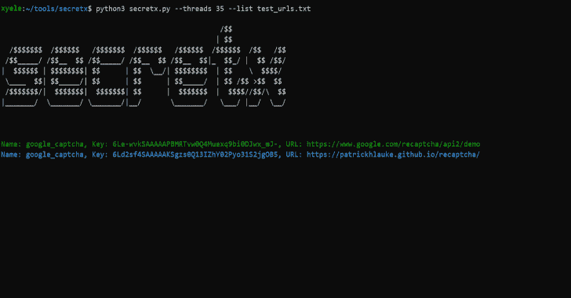

# Secretx:通过请求您的列表中的每个 URL 来提取 API 密钥和秘密

> 原文：<https://kalilinuxtutorials.com/secretx-extracting-api-keys-secrets/>

**Secretx** 是一个工具，主要用于通过请求您的列表中的每个 url 来提取 api 密钥和秘密。

**安装**

**python3 -m pip 安装要求. txt**

**也可理解为-[Exist:Web App For aggregate&分析网络威胁情报](https://kalilinuxtutorials.com/exist-web-app-aggregating-analyzing-cyber-threat-intelligence/)**

**用途**

**python 3 secretx . py–list URL list . txt–threads 15

可选参数:–help–无色**

[**Download**](https://github.com/xyele/secretx)