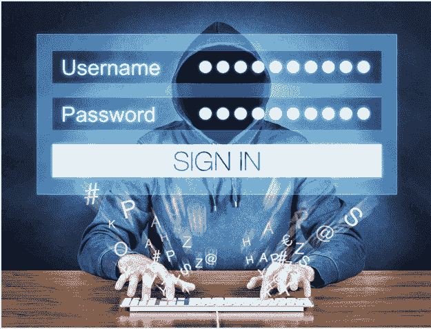
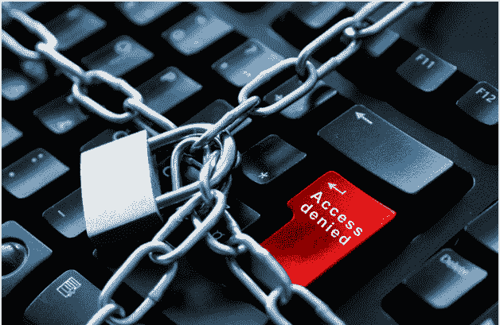
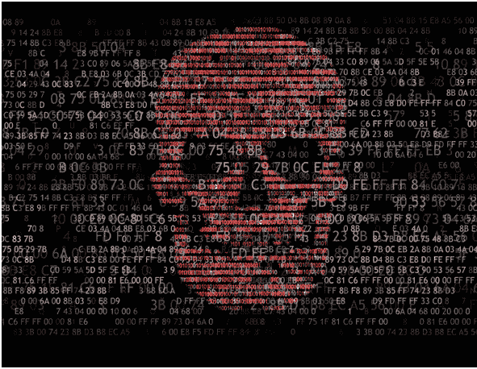
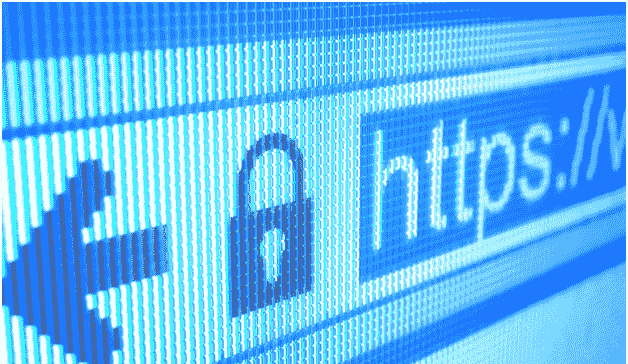
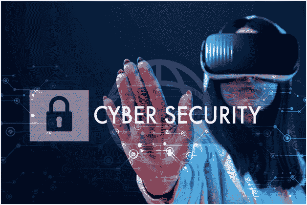

# 保护您的网站免受黑客攻击的最重要的安全提示

> 原文：<https://kalilinuxtutorials.com/security-tips-to-protect-website-from-hackers/>

你认为他们需要你的约会吗？你认为他们需要你的信用卡吗？对黑客来说有比你想象的更有价值的东西。

现代黑客的主要目标之一是进入你的服务器。这使得他们可以利用它作为垃圾邮件的中继。

## 但是他们还能用这种访问做些什么呢？

作为僵尸网络的一部分，一些黑客可以访问你的服务器。这是什么意思？

这意味着他们可以使用你的资源来挖掘比特币。这就是为什么他们通常对你的银行卡或数据不感兴趣。他们有自己的目标。你惊讶吗？

不要害怕。在这篇文章中，你将学习如何保护你的网站。长话短说，你会学到:

*   如何保护个人数据；
*   如何不成为某人的比特币农场；
*   如何防止黑客进入你的服务器？

如果你不希望有人利用你的[网页设计和开发公司](https://rondesign.agency/)来挖掘比特币或其他东西，那么请把这篇文章读完。

让我们深入这个有价值的话题吧！

## **软件安全**

也许这听起来很明显，但是保持你的软件更新是非常重要的。这会增加你保持安全的机会。

如果你使用托管解决方案，你不需要担心，因为托管公司会处理理论上可能发生的最危险的事情。

如果您使用 CMS 或论坛，那么请确保您能快速应用任何安全补丁。顺便说一下，大多数供应商都有一个 RSS 提要，如果有黑客干扰的威胁，它会通知您。

更新是安全的关键。不要偷懒，定期这样做。你可能感觉不到每一次更新都有显著的改进，但是你可以确定黑客攻击你变得更加困难了。

## **我们来谈谈 SQL 注入**

SQL 注入袭击通常是按照这样的计划发生的。

黑客使用输入表单或 URL 参数。通过它们，他可以在简单操作的帮助下访问数据库。如果您使用的是 Transact SQL，这很容易做到。此外，通常这种情况不会被注意到，更可能的是你根本不会怀疑任何事情。

几乎所有的编程语言都有参数化查询这样的特性。很容易实现。如果你想远离 SQL 注入，你应该这么做。

## **密码问题**

密码的主要问题是没有多少人想出真正强的密码。

以下是强密码标准:

*   至少 8 个字符，但越多越好；
*   它应该包含字母和数字；
*   它应该包含不同语域的字母；
*   无论如何，不要把你的出生日期作为密码。

遵循这些准则来创建真正强有力的密码。鼓励你的站点用户为他们的帐户创建强密码。

如何将用户推送到这？这很简单。您需要创建一个注册表单，以便网站拒绝少于 8 个字符的密码。那么你的用户或多或少都会受到保护。

此外，创建一个弹出窗口，提醒用户强密码的重要性。做起来很简单，你的用户会觉得你关心他们。

## **好的网站审核**

这是保护你的网站的最可靠的方法之一。你需要确保每天和良好的网站适度。适度的要点如下:

*   检查整个网站；
*   垃圾邮件删除
*   及时提供网站的任何技术变更。

这些只是需要注意的最基本的几点。你的网站有可靠的审核吗？

## **季度扫描**

你必须记住，每 3-4 个月你需要扫描。忘记它很容易，但如果有一天你丢失了自己的数据，那么你会开始更负责任地对待它。如果你能听到这个建议，并把扫描添加到网站工作的强制任务列表中，这是否值得从糟糕的经历中学习呢？

PCI 通过 Trustwave 服务执行季度扫描。这很容易做到，而且不会像缺少这一项那样带来很多问题。

三思而后行，永远不要跳过季度扫描。

## **使用 HTTPS 获得更好的保护**

HTTPS 是一种提供比 HTTP 更强保护的协议。该协议使用下一代加密算法。它在用户的浏览器和网站之间提供了一个安全的通信通道。

当然，你需要一张信用卡来注册。但是当现在每个人都用信用卡支付时，这真的是一个问题吗？

这样可以提高网站的安全级别。如果你真的关心你的用户，你就应该这么做。

虽然很多网站已经转到了 HTTPS。

## **使用专用安全工具**

有一些特殊的安全工具可以帮助您跟踪安全性:

*   OpenVAS

你正在寻找一个完美的安全扫描仪吗？你来对地方了。超过 25000 次扫描。也是开源的。检查它以获得 OpenVAS 的所有优点。

*   SecurityHeaders.io

这也是一个非常重要的安全工具。它会帮助你尽快报告。如果出了差错，你不会浪费时间。尝试一下就知道如何保护你的网站了。

*   网络火花

有一个免费的社区。此外，您可以获得试用版。Netsparker 是测试 SQL 注入的最佳工具。

## **安全不是一切**

想让你的网站更安全，别忘了安全只是你网站发展的一个好条件。你的网站有多有用取决于内容的质量。

保护您的网站。用它来满足你的需求，而不是黑客的需求。