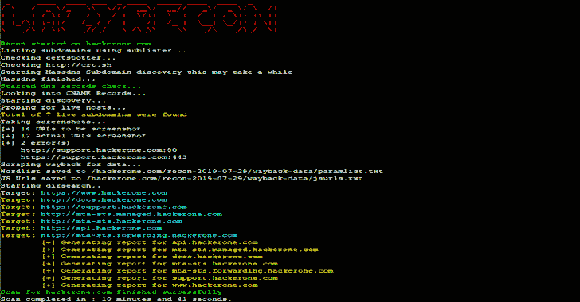
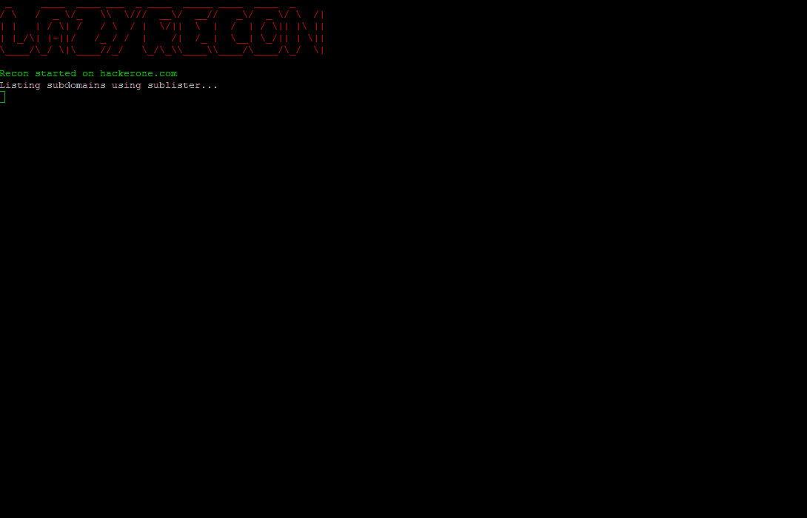
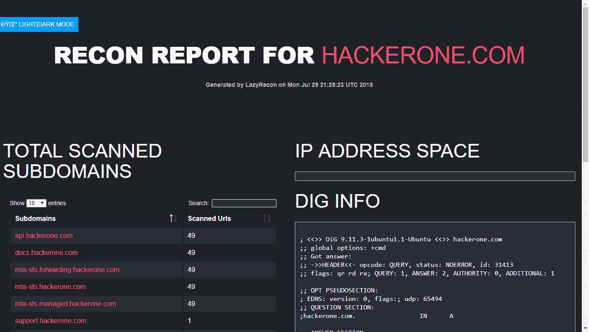

# 以一种有组织的方式自动化你的侦察过程

> 原文：<https://kalilinuxtutorials.com/lazyrecon-automate-your-reconnaissance-process/>

LazyRecon 是一个用 Bash 编写的脚本，它旨在自动化一些繁琐的侦察和信息收集任务。此工具允许您收集一些信息，这些信息应该有助于您确定下一步该做什么以及在哪里寻找。

**主要特点**

*   用侦察笔记创建一个有日期的文件夹
*   使用以下方式获取子域:

**T2`* Sublist3r, certspotter and cert.sh * Dns bruteforcing using massdns`**

*   找到任何指向 aws 等未使用的云服务的 CNAME 记录
*   通过端口 80/443 探测活动主机
*   抓取响应主机的屏幕截图
*   收集数据的途径:

`* **Extract javascript files * Build custom parameter wordlist, ready to be loaded later into Burp intruder or any other tool * Extract any urls with .jsp, .php or .aspx and store them for further inspection**`

*   在特定端口上执行 nmap
*   获取每个子域的 dns 信息
*   对所有子域执行目录搜索
*   使用上述工具的输出生成一个 HTML 报告
*   改进报告，减少工作时的输出
*   html 报告的黑暗模式

**也可阅读-[Secretx:通过请求您的列表](https://kalilinuxtutorials.com/secretx-extracting-api-keys-secrets/)** 中的每个 URL 来提取 API 密钥&秘密

**新功能**

*   目录搜索模块现在是多线程的(一次最多扫描 10 个子域名)
*   增强的 html 报告，能够搜索字符串、端点、响应大小或状态代码

**安装&要求**

*   从[https://github.com/nahamsec/bbht](https://github.com/nahamsec/bbht)下载安装脚本。
*   转到版本 1.10 或更高版本。

**系统要求**

*   建议在具有 1 个 VCPU 和 2GB ram 的 vps 上运行。

**用途**

**。/lazy recon . sh-d target.com**

**演示**

[**Download**](https://github.com/nahamsec/lazyrecon)