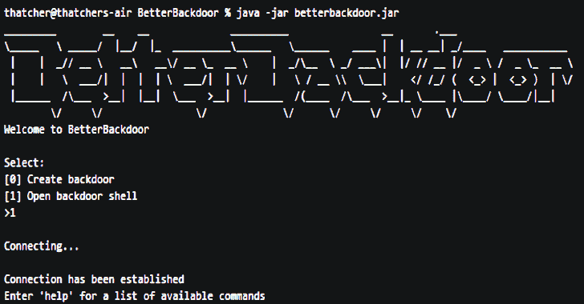

# BetterBackdoor:具有多种功能的后门

> 原文：<https://kalilinuxtutorials.com/betterbackdoor-backdoor-with-a-multitude-features/>

后门是一种用来远程访问机器的工具。通常，NetCat 之类的后门实用程序有两个主要功能:将远程输入传输到 cmd 或 bash，并输出响应。

这是有用的，但也是有限的。BetterBackdoor 通过包含注入击键、获取屏幕截图、传输文件和许多其他任务的能力克服了这些限制。

**特性**

BetterBackdoor 可以创建和控制后门。

这种创建的后门可以:

*   运行命令提示符命令
*   运行 PowerShell 脚本
*   运行 DuckyScripts 来注入击键
*   基于扩展名过滤文件
*   泄露 Microsoft Edge 和 WiFi 密码
*   在受害者的电脑上收发文件
*   启动键盘记录器
*   拿到受害者电脑的截图
*   将文本复制到受害者的剪贴板
*   从受害者的文件中获取内容(cat)

这个后门程序使用客户端和服务器套接字连接进行通信。攻击者启动一个服务器，受害者作为客户端连接到该服务器。一旦建立了连接，就可以向客户端发送命令来控制后门。

要创建后门，更好的后门:

*   创建后门 jar 文件“run.jar ”,并将其复制到目录“backdoor”。
*   将包含服务器 IPv4 地址的文本文件追加到“run.jar”中。
*   如果需要，将 Java 运行时环境复制到“后门”并创建批处理文件“run.bat ”,以便在打包的 Java 运行时环境中运行后门。

要在受害者 PC 上启动后门，请将目录“后门”中的所有文件转移到受害者 PC 上。

如果 JRE 与后门打包在一起，则执行 run.bat，否则执行 run.jar。

这将启动受害者电脑的后门。

一旦运行，要控制后门，您必须返回到 BetterBackdoor，并在启动时运行选项 1，同时连接到受害者计算机的同一 WiFi 网络。

**演示**

**又念——[自动 API 攻击工具 2019](https://kalilinuxtutorials.com/automatic-api-attack-tool/)**

**要求**

*   必须安装> =8 的 Java JDK 发行版并将其添加到路径中。
*   您必须使用同一台计算机来创建和控制后门。
    *   用于创建后门的计算机必须与受害者的计算机在同一个 WiFi 网络上。
    *   这台计算机的 IPv4 地址在创建后门和控制它之间必须保持静态。
*   用于控制后门的计算机必须关闭防火墙，如果计算机有 Unix 操作系统，必须以“sudo”的身份运行 BetterBackdoor。

**兼容性**

BetterBackdoor 兼容 Windows、Mac、Linux，而 Backdoor 只兼容 Windows。

**安装**

**#克隆 BetterBackdoor**
git 克隆 https://github.com/ThatcherDev/BetterBackdoor.git

**#将工作目录改为 better back door**
CD better back door

**#用 Maven 构建 better back door
#用于 Windows 运行**
mvnw.cmd 清理包

**#用于 Linux 运行**
chmod +x mvnw。/mvnw 清理包

**# for Mac 运行**
sh mvnw 清理包

**用途**

java -jar betterbackdoor.jar

[**Download**](https://github.com/ThatcherDev/BetterBackdoor)