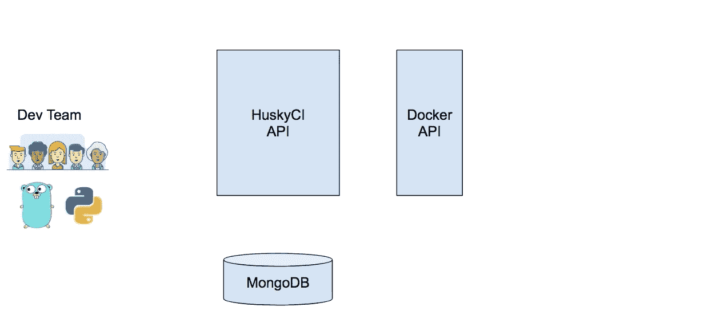
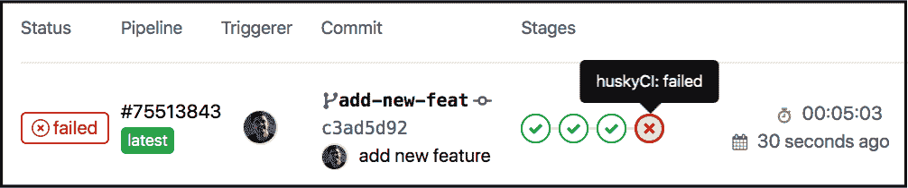

# HuskyCI:在您的 CI 内部执行安全测试

> 原文：<https://kalilinuxtutorials.com/huskyci-performing-security-tests-inside-ci/>

HuskyCI 是一个开源工具，它协调安全测试并将所有结果集中到一个数据库中，以供进一步分析和衡量。可以用 Python ( [Bandit](https://github.com/PyCQA/bandit) 和 [Safety](https://github.com/pyupio/safety) )、Ruby ( [Brakeman](https://github.com/presidentbeef/brakeman) )、JavaScript ( [Npm Audit](https://docs.npmjs.com/cli/audit) 和 [Yarn Audit](https://yarnpkg.com/lang/en/docs/cli/audit/) )、Golang ( [Gosec](https://github.com/securego/gosec) )、Java ( [SpotBugs](https://spotbugs.github.io) 加 [Find Sec Bugs](https://find-sec-bugs.github.io) )进行静态安全分析。它还可以使用 [GitLeaks](https://github.com/zricethezav/gitleaks) 审计仓库中的秘密，如 AWS 秘密密钥、私有 SSH 密钥和许多其他秘密。

它是如何工作的？

开发人员可以在其 CI 渠道中设置一个新的阶段来检查漏洞:

**又念——[自动 API 攻击工具 2019](https://kalilinuxtutorials.com/automatic-api-attack-tool/)**

**安装**

**MongoDB**

使用您想要的操作系统/配置设置一个 MongoDB(最好是安全的)。

**码头 API(百条指令)**

**安装坞站 API:**

*   安装 **`docker-engine`** :

**yum install docker-engine**

*   创建 docker 服务文件夹:

**mkdir/etc/system/dock . service . d**

*   将这些配置设置到 override.conf 中:

**我来/etc/system/dock . service . d/override . conf**

*   将此内容添加到 override.conf:

**[Service]ExecStart = ExecStart =/usr/bin/dockerd-H FD://-H TCP://0 . 0 . 0 . 0:2376**

*   Reload daemon:

**systemctl daemon-reload**

*   重启 docker:

**systemctl 重启 docker.service**

*   本地测试 docker API:

**curl localhost:2376/v 1.24/version**

**保护您的 Docker API(推荐):**

*   创建证书文件夹:

**mkdir/data/certs&CD/data/certs**

从中下载`**create-certs.sh**`脚本:

**wget https://raw . githubusercontent . com/globo com/huskyCI/master/deployments/scripts/create-certs . sh**

使用证书信息设置环境变量:

echo ' export CERT _ pass phrase = " my password $ RANDOM " ' >。env
echo ' export CERT _ DOCKER _ API _ HOST = " address . to . DOCKER API . HOST " '>>。env
echo ' export CERT _ HUSKYCI _ HOST = " address . to . HUSKYCI . HOST " '>>。包封/包围（动词 envelop 的简写）

**。。环境**

*   创建 CA 证书:

**。/create-certs . sh-m ca-pw $ CERT _ pass phrase-t .-e 900**

*   创建 docker API 服务器证书:

**。/create-certs . sh-m server-h＄CERT _ DOCKER _ API _ HOST-pw＄CERT _ pass phrase-t .-e 365**

*   创建 docker API 客户端证书:

**。/create-certs . sh-m client-h＄CERT _ husky ci _ HOST-pw＄CERT _ pass phrase-t .-e 365**

*   更新 override.conf 配置:

**我来/etc/system/dock . service . d/override . conf**

*   将此新内容添加到 override.conf:

**[Service]ExecStart =/usr/bin/dockerd–TLS verify–tlscacert =/data/certs/ca . PEM–TLS cert =/data/certs/server-cert . PEM–TLS key =/data/certs/server-key . PEM-H FD://-H TCP://0 . 0 . 0 . 0:2376**

*   Reload daemon:

**systemctl daemon-reload**

*   重启 docker:

**systemctl 重启 docker.service**

*   在本地测试安全 docker API:

**curl-k https://localhost:2376/v 1.24/version–cert/data/certs/client-cert . PEM–key/data/certs/client-key . PEM–cacert/data/certs/ca . PEM**

您现在需要保存 **`ca.pem`、`client-key.pem`** 和`**client-cert.pem**`以便在它的主机中使用，这样它就可以安全地连接到 docker API！🔒

**拉动图像**

设置 Docker API 后，您可以将 [huskyCI 图像](https://hub.docker.com/u/huskyci)放入该主机，或者让它在收到第一个请求时自动执行此操作(可能需要一些时间)。如果您喜欢第一种策略，请使用以下命令:

**坞站拉胡基奇/恩里
坞站拉胡基奇/土匪
坞站拉胡基奇/安全
坞站拉胡基奇/布拉凯曼
坞站拉胡基奇/戈斯 ec
坞站拉胡基奇/斯邦特布瓦
坞站拉胡基奇/npmaud**

**API ( [tsuru](https://github.com/tsuru/tsuru) PaaS 指令)**

*   转到工具文件夹:

**CD＄GOPATH/src/github . com/globo com/huskyCI**

*   将生成的证书复制到`api`文件夹:

**cp $MYCERTFOLDER/{ca.pem，client-key.pem，client-cert.pem} api/**

重命名`**client-key.pem**`和`**client-cert.pem**`，以便它在部署时可以读取正确的文件:

**mv client-key . PEM key . PEM
mv client-cert . PEM cert . PEM**

*   构建它:

**进行构建**

*   创建新的鹤应用程序:

**tsuru app-创建 huskyCI go**

*   设置所有需要的环境变量([完整列表](https://github.com/globocom/huskyci/wiki/API-Environment-Variables)):

**tsuru env-set MONGO _ HOST = urlto . MONGO . com-p**

如果您希望它使用 HTTPS，请在部署之前生成`**api-tls-cert.pem**`和`**api-tls-key.pem**`。另外，您应该将`**HUSKY_API_ENABLE_HTTPS**`环境变量设置为`**true**`。

*   如果您决定使用上面提到的 Docker API 安全方法，您需要使用下面的命令设置这些环境变量:

**tsuru env-set-p-a<my-app ' s-name>HUSKYCI _ docker API _ CERT _ FILE _ VALUE = " $(cat/path/to/my/FILE)"
tsuru env-set-p-a<my-app ' s-name>HUSKYCI _ docker API _ CERT _ KEY _ VALUE = " $(cat/path/to/my/FILE)"
tsuru env-set-p-a<my-app ' s-name**

*   在 tsuru (HTTP)中部署它:

**tsuru app-deploy-a huskyCI API/huskyCI API/config . YAML proc file**

*   在鹤部署它(HTTPS 已启用):

**tsuru env-set-p-a<my-app ' s-name>HUSKYCI _ docker API _ API _ TLS _ CERT _ VALUE = " $(cat/path/to/my/file)"
tsuru env-set-p-a<my-app ' s-name>HUSKYCI _ docker API _ TLS _ KEY _ VALUE = " $(cat/path/to/my/file)"
tsuru app-deploy-a HUSKYCI API/HUSKYCI**

**客户端( [tsuru](https://github.com/tsuru/tsuru) PaaS 指令)**

*   本地构建客户端(Linux 二进制):

**制作 build-client-linux**

*   创建静态鹤应用程序:

**tsuru app-创建 huskyCI-客户端静态**

*   在鹤部署 it 客户端:

**tsuru app-deploy-a huskyCI-client huskyCI-client**

**开发商的 CI**

恳请您的开发团队在他们的项目 CI 中添加一个新阶段(`**.gitlab-ci.yml**`示例):

阶段:
–husky ci
husky ci:
阶段:huskyCI
变量:
husky ci _ CLIENT _ URL:http://URL to . husky ci-CLIENT
husky ci _ CLIENT _ API _ ADDR:http://URL to . husky ci-API
husky ci _ CLIENT _ REPO _ URL:git lab @ git lab。your org . com:$ CI _ PROJECT _ path . git
husky CI _ CLIENT _ REPO _ BRANCH:$ CI _ COMMIT _ REF _ NAME
husky CI _ CLIENT _ API _ USE _ HTTPS:" false "
脚本:
–wget $ husky CI _ CLIENT _ URL/husky CI-CLIENT
–chmod+x husky CI-CLIENT
–/husky ci-客户端

[**Download**](https://github.com/globocom/huskyCI)