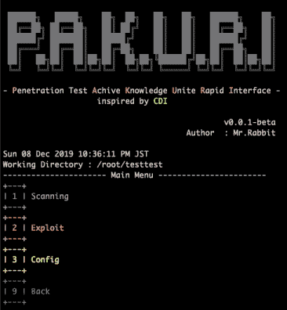
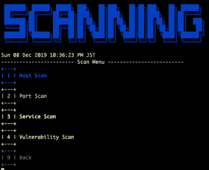
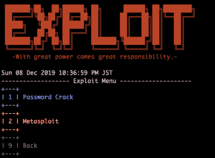
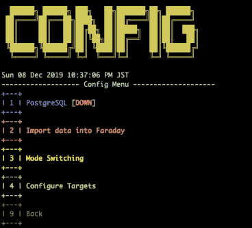
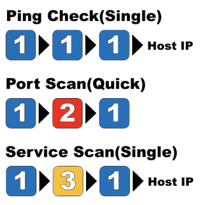

# PAKURI:渗透测试实现知识统一的快速接口

> 原文：<https://kalilinuxtutorials.com/pakuri-penetration-test-achieve-knowledge-unite-rapid-interface/>

**Pakuri** 是一个渗透测试实现知识联合的快速接口。圣灵降临者喜欢移动他们的手。然而，我不喜欢麻烦的工作。

简单的工作通过简单的操作半自动完成。它通过简单地操作数字键盘来执行渗透测试中经常使用的命令。你可以像玩格斗游戏一样测试穿透力。

## “帕库里”的能力。

*   情报收集。
*   漏洞分析。
*   想象一下。
*   暴力攻击。
*   剥削。

**您的优势**

通过使用我们的 PAKURI，您将从以下方面受益。

*   **对于红队:**
    *   这样就省去了你输入常用命令的麻烦。
    *   初学者 pentester 可以使用 PAKURI 学习攻击的 floe。

*   **对于 blueteam:**
    *   可以通过简单的操作生成攻击包。

**注意**:如果您有兴趣，请在您控制的环境**中使用，风险自担**。此外，如果您在不受您控制的系统上执行 PAKURI，可能会被视为攻击，您可能需要为您的行为承担法律责任。

**特性**

*   扫描
    *   [Nmap](https://tools.kali.org/information-gathering/nmap)
    *   [自动恢复](https://github.com/Tib3rius/AutoRecon.git)
    *   [OpenVAS](https://tools.kali.org/vulnerability-analysis/openvas)
*   剥削
    *   [BruteSpray](https://tools.kali.org/password-attacks/brutespray)
    *   [Metasploit](https://tools.kali.org/exploitation-tools/metasploit-framework)
*   设想
    *   [法拉第](https://github.com/infobyte/faraday.git)
*   崔-桂转换

**也可阅读-[lazy recon:以一种有组织的方式自动化你的侦察过程](https://kalilinuxtutorials.com/lazyrecon-automate-your-reconnaissance-process/)**

**安装**

bash install.sh

**用途**

**root @ kali:/usr/share/pak uri #。/pakuri.sh**

**主**

**扫描**

**利用**

**配置**

**命令**

**操作检查环境**

*   OS: KAli Linux 2019.4 版
*   内存:8.0GB

这个工具还没有完成。它将按顺序更新。

[**Download**](https://github.com/01rabbit/PAKURI)