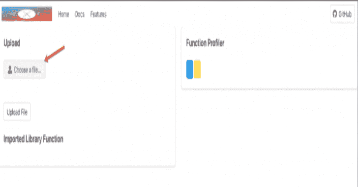
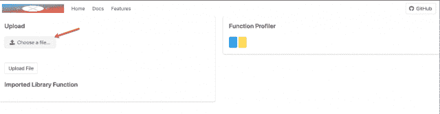
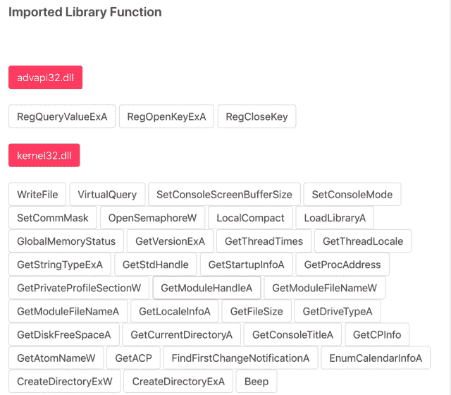
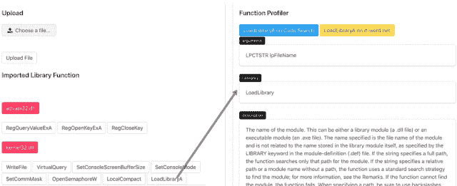
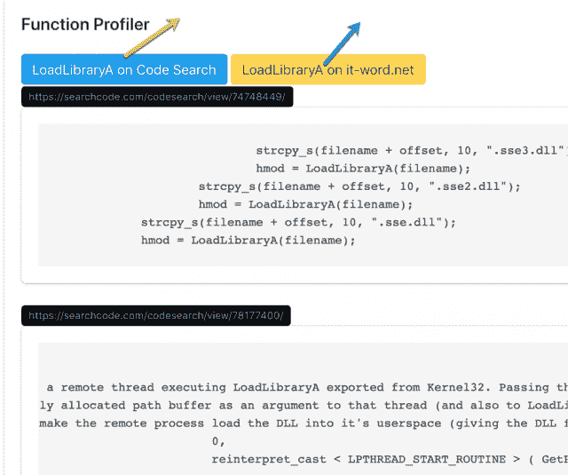

# Malwinx:只是一个普通的 Flask Web 应用程序，通过代码片段和引用来理解 Win32api

> 原文：<https://kalilinuxtutorials.com/malwinx-web-app-win32api/>

**Malwinx** 是一个普通的 flask web app，通过代码片段和引用来学习 win32api。

**Malwinx 先决条件**

在启动之前，您需要下载以下软件包

**pip 安装烧瓶
pip 安装文件
pip 安装请求**

**用途**

**$ python flaskapp.py**

**演示**

[https://www.youtube.com/embed/_z7snPXRG3M?feature=oembed&enablejsapi=1](https://www.youtube.com/embed/_z7snPXRG3M?feature=oembed&enablejsapi=1)

**投稿**

我已经开始了这个项目，通过集成不同的源来获得关于 win32api 的快速参考。该项目正处于发展阶段，所以如果你面临任何问题或想提出任何建议，请随意。

**也可阅读-[确认管理员:管理员面板查找器/管理员登录页面查找器](https://kalilinuxtutorials.com/okadminfinder/)**

**这里是演练**

*   上传 exe 或 dll。

*   exe 和 dll 的功能就会出现。

*   我们只需要点击任何一个功能。例如，让我们选择 LoadLibraryA。

*   任何函数的代码使用都可以通过点击这些选项来提取。

[**Download**](https://github.com/MohitDabas/malwinx)