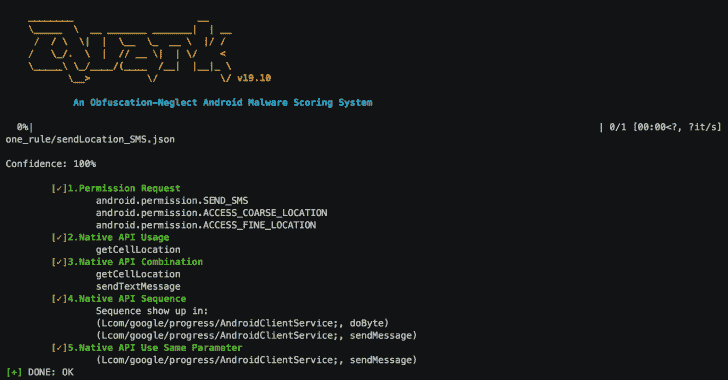
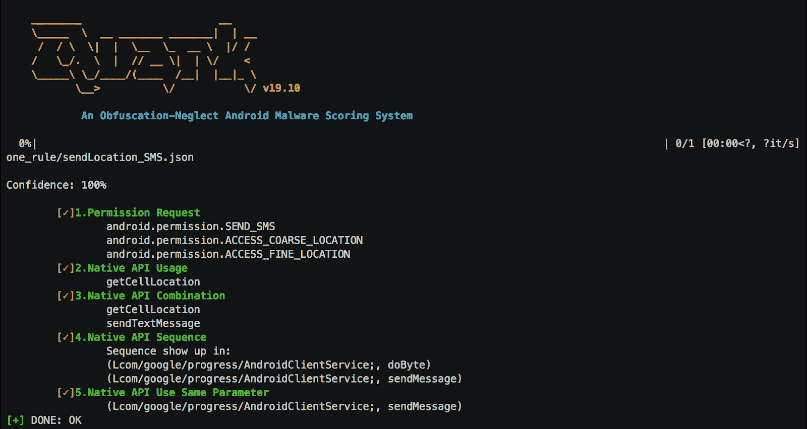
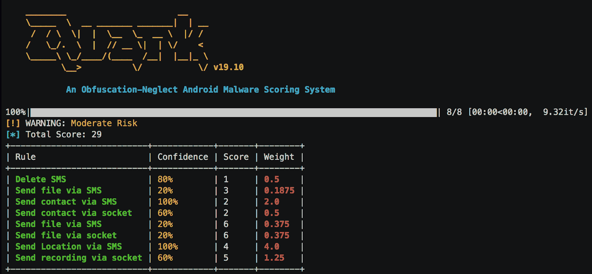

# 夸克引擎:一个忽略混淆的 Android 恶意软件评分系统

> 原文：<https://kalilinuxtutorials.com/quark-engine-obfuscation-neglect-android-malware-scoring-system/>

Quark Engine 是一个忽略混淆的 Android 恶意软件评分系统。Android 恶意软件分析引擎并不是一个新的故事。每个反病毒公司都有自己的秘密来建立它。带着好奇心，我们从台湾刑法的角度出发，以一种简单而扎实的方式开发了一个恶意软件评分系统。

我们有一个犯罪顺序理论来解释犯罪的各个阶段。例如，谋杀罪由五个阶段组成，它们是决心、共谋、准备、开始和实行。越往后的阶段，我们越能确定犯罪是被实施的。

根据以上原理，`**we developed our order theory of android malware**`。我们开发了五个阶段来查看恶意活动是否正在实施。他们是 1。请求许可。2.本机 API 调用。3.本机 API 的某些组合。4.本机 API 的调用序列。5.处理相同寄存器的 API。我们不仅定义恶意活动及其阶段，还开发权重和阈值来计算恶意软件的威胁级别。

恶意软件随着新技术的发展为逆向工程增加了难度。模糊处理是最常用的技术之一。在这次演讲中，我们提出了一个 Dalvik 字节码加载器，它利用 android 恶意软件的顺序理论来忽略某些混淆的情况。

我们的 Dalvik 字节码加载器包含一些功能，如 1。查找本机 API 的交叉引用和调用序列。2.跟踪字节码寄存器。这些功能的组合(是的，顺序理论)不仅可以忽略混淆，还可以完美地匹配我们的恶意软件评分系统的设计。

**详细报告**

这就是我们如何用一个规则(犯罪)检查一个真正的 android 恶意软件(糖果玉米)。

**$ quark-a sample/14d 9 f1 a 92 DD 984d 6040 c 41 ed 06 e 273 e . apk \
-r rules/\
-detail**

**总结报告**

用规则检查。

**quark-a sample/14d 9 f1 a 92 DD 984d 6040 c 41 ed 06 e 273 e . apk \
-r rules/\
-summary**

**安装**

**$ git 克隆 https://github.com/quark-engine/quark-engine.git; CD 夸克引擎/夸克
$ pipenv 安装–跳过锁
$ pipenv 外壳**

确保你的 python 版本是`**3.7**`，或者你可以把它从 **`Pipfile`** 改成你现有的版本。

**用途**

**$ quark–help
用法:Quark【选项】

Quark 是一个混淆-忽略 Android 恶意软件评分系统

选项:
-s，–summary 显示摘要报告
-d，–detail 显示详细报告
-a，–apk 文件 apk 文件【必需】
-r，–rule 目录规则文件夹需要检查【必需】
–help 显示此消息并退出。**

[**Download**](https://github.com/quark-engine/quark-engine)