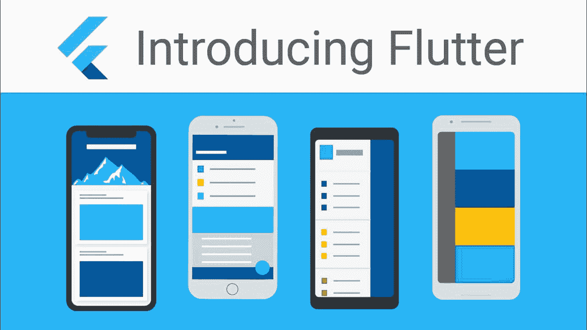

# 为什么要用 Flutter 来构建你的下一个 app？

> 原文：<https://kalilinuxtutorials.com/why-should-you-build-your-next-app-with-flutter/>

如果你想跟上时代，你需要为你的产品或服务开发一个应用程序。而一旦你决定开发一个 app，主要问题就出现了？应该是一个[安卓](https://www.android.com/intl/en_in/)还是 iOS？还是两者都有？我可以同时开发这两种产品，而且成本更低吗？在回答这些之前，我们先来深入了解一下手机操作系统的历史。

我们曾一度受限于操作系统。

进步从未停止前进。有手机操作系统，如 Symbian，Tizen，甚至 Windows Mobile。为每个人开发应用程序需要不同的编码技能。

当 Android 和 iOS 开始主导移动操作系统市场时，这一过程并没有改变。除了 Android 和 iOS 之外的任何东西都将被终止，这给大多数开发者提出了一个最重要的问题。

尽管有不同的 API、库和 SDK，有没有一种方法可以用一个代码库构建应用程序，并将其用于多个移动操作系统和其他操作系统？由于有不同分辨率、大小和其他方面的移动应用程序，开发一个“一刀切”的框架并不是一件容易的事情。

情况是，如果您修复前端，您可能会破坏后端，反之亦然。大多数人会说名为 React Native 的框架是解决这个问题的最好方法。

然而，这款游戏在 2017 年发生了变化，它在 2014 年开始开发。

我们都知道的大公司，谷歌，公布了他们，我们可以毫不夸张地说，隐藏的“武器”把这个“武器”当成你梦寐以求很久的东西。

它是一种“武器”,扼杀你为不同的移动操作系统寻找不同的开发者。起初，Flutter 打算用于移动应用程序的开发。

然后，一段时间后，它被开发用于其他平台，web 和桌面。你可能会问为什么有人会选择 Flutter？它的优点是什么？

尽管有些人可能会说，这种动荡还处于初级阶段，但在当今这个技术以对数方式增长的时代，很难说两年是一个短时期。这里，我们来列举一下使用 Flutter 的一些好处。

*   更少的编码时间。你可以在 YouTube 上搜索，找到展示通过 Flutter 和其他框架编译应用程序的比较的视频。在某些情况下，用于编码的时间是惊人的；
*   预期设计和实际设计之间的差异较小；
*   比其他框架快，比如 React Native
*   潜在的“一刀切”；
*   克服跨平台方法带来的挑战；
*   使用 Dart 语言可以为前端和后端编写一次代码。
*   由于 [Flutter](https://flutter.dev/) 是 Google 开发的，它内置了对材质设计的支持。这增强了你的用户界面；
*   作为一个开源软件。这为开发人员实现无限的应用程序留下了余地。极限是开发者的想象力。
*   易于与不同平台集成；
*   根据您的操作系统的主题；
*   构建过程由代码魔术提供动力；
*   来自相信 Flutter 的开发者和社区的巨大支持。

考虑到所有这些，我们，来自 Bekey 的专业人员，在我们不同的项目中使用 flutter。

它的可伸缩性和解决跨平台相关问题的能力使我们的项目选择它是可行的。尽管处于开发阶段，但 flutter 提供了很多，Bekey 的 [flutter 开发团队预计，一段时间后，这个框架将提供更多。](https://bekey.io/hireflutterdeveloper)