# Pown:一个安全测试开发工具包

> 原文：<https://kalilinuxtutorials.com/pown-security-testing-toolkit/>

[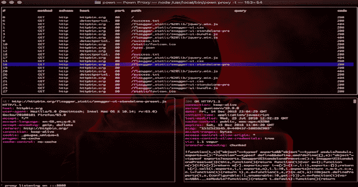](https://1.bp.blogspot.com/-_SF62UXs0a8/XhCVVeJwQwI/AAAAAAAAEPE/jdEcWoi6FZcCf6auJ-tfKVEbdivpVocNQCLcBGAsYHQ/s1600/pown%25281%2529.png)

**Pown** (Pown.js)是一个构建在 Node.js 和 NPM 之上的安全测试和开发工具包。与 Metasploits 等传统安全工具不同，Pown.js 认为框架是一种反模式。

因此，其中的每个模块实际上是一个独立的 NPM 模块，允许更大程度的重用和灵活性。创建新模块就是发布到 NPM，并给它贴上正确的标签。其余的是自动处理的。

**快速入门**

用 npm 或者 yarn 全局安装 Pown.js。

**$ npm install -g pown@latest**

**也可阅读-[Shelly:使用 Python 的简单后门管理器](https://kalilinuxtutorials.com/shelly-simple-backdoor-manager-python/)**

**用途**

**模块**

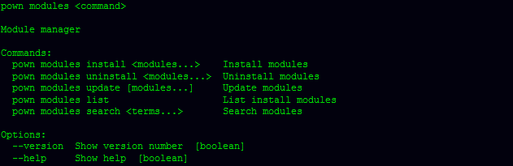

**更新**

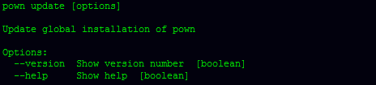

**巴斯特**

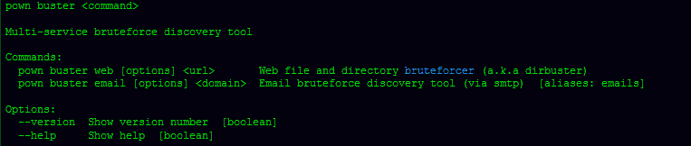

**学分**

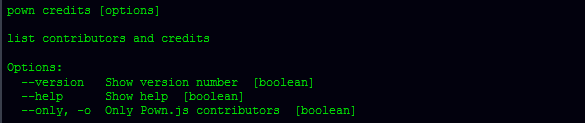

**格言**

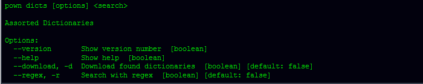

**导管**

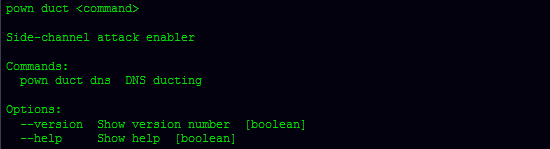

**偏好**

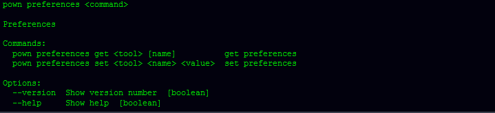

**侦察**

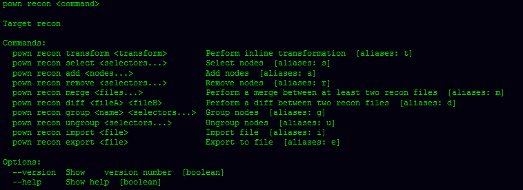

**脚本**

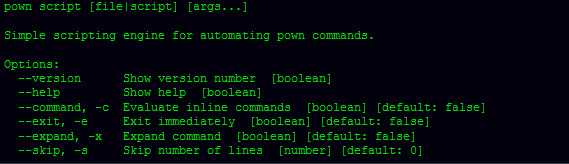

**外壳**

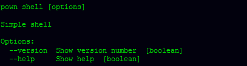

**他们是谁**

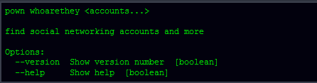

**模块**

为了方便起见，Pown.js 附带了几个内置模块。但是，可以使用`**it modules**`命令直接从 NPM 注册表安装其他模块。可选模块安装在当前用户的主文件夹中`**.pown/modules**`下。

[**Download**](https://github.com/pownjs/pown)