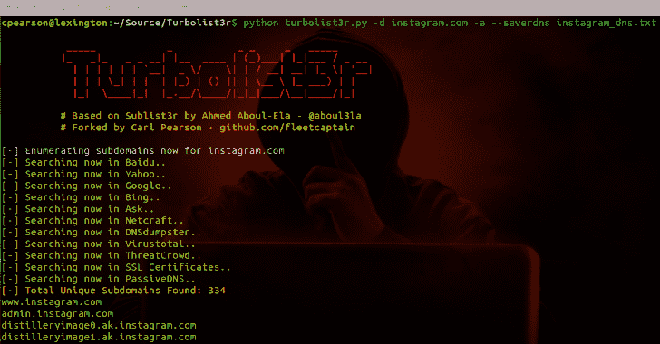
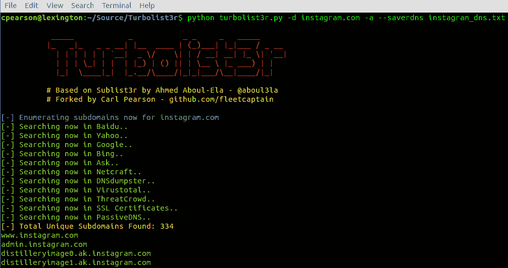
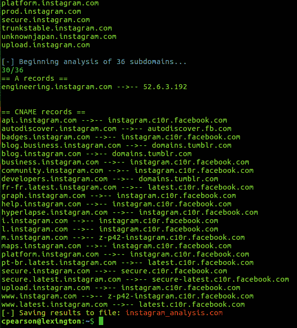

# Turbolist3r:子域枚举工具，具有发现域的分析功能

> 原文：<https://kalilinuxtutorials.com/turbolist3r-subdomain-enumeration-tool/>

**Turbolist3r** 是[子列表 3r](https://github.com/aboul3la/sublist3r) 子域发现工具的一个分支。除了 sublist3r 原有的 OSINT 功能之外，turbolist3r 还自动化了一些结果分析，重点是子域接管。

Turbolist3r 查询每个发现的子域的公共 DNS 服务器。如果子域存在(即解析程序回复了地址)，答案将被归类为 CNAME 或记录。通过检查记录，有可能发现给定领域的潜在渗透测试目标。同样，寻找子域收购的过程也很简单；查看发现的 CNAME 记录，并调查任何指向适用云服务的记录。

请不要用于非法目的。

**也可理解为-[attack surface mapper:旨在自动化侦察过程的工具](https://kalilinuxtutorials.com/attacksurfacemapper/)**

**用途**

| 简易格式 | 长格式 | 描述 |
| --- | --- | --- |
| -d | –域 | 要枚举其子域的域名 |
| -乙 | -布鲁特斯 | 启用 subbrute bruteforce 模块 |
| -p | –端口 | 根据特定的 tcp 端口扫描找到的子域 |
| -v | –冗长 | 启用详细模式并实时显示结果 |
| 相当于-ED | –螺纹 | 用于 subbrute 强制的线程数 |
| -e | –发动机 | 指定逗号分隔的搜索引擎列表 |
| 表示“具有…性质的” | –输出 | 将发现的域名保存到指定的文本文件 |
| -h | 救命 | 显示帮助信息并退出 |
| ［构成动植物的古名或拉丁化的现代名］ | –分析 | 进行反向 DNS 分析并输出结果 |
| (无) | –saver DNS | 将反向 DNS 分析保存到指定文件 |
| (无) | –inputfile | 从指定文件中读取域，并使用它们进行分析 |
| (无) | –调试 | 在分析模块期间打印调试信息(-a)。主要打印原始 DNS 数据，熟悉 DIG Linux DNS 实用程序及其输出有助于解释调试输出 |
| -r | –解析器 | 包含要作为解析程序填充的 DNS 服务器的文件。文件每行只能有一个服务器 IP 地址，并且只接受 IP 地址 |
| 问 | 安静 | 仅打印找到的域和/或 CNAME 映射。注意错误也可能被打印出来 |

**例题**

*   要列出所有基本选项和开关，请使用-h 开关:

python turbolist3r.py -h

*   要枚举特定域的子域，请执行高级分析，并将分析保存到文件中:

**python turbo list 3r . py-d example.com-a–saver DNS analysis _ file . txt**

*   从文件中读取子域并对它们执行高级分析:

**python turbo list 3r . py-d example.com-a–input file sub domains . txt**

*   使用-r 从文件中填充 DNS 解析器(解析器与-a 分析模块一起使用):

**python turbo list 3r . py-d example.com-a–输入文件子域名. txt -r dns_servers.txt**

*   要枚举特定域的子域:

**python turbo list 3r . py-d example.com**

*   要枚举特定域的子域并将发现的子域保存到文件中:

**python turbo list 3r . py-d example.com-o example _ hosts . txt**

*   要枚举特定域的子域并实时显示结果:

**python turbo list 3r . py-v-d example.com**

*   要枚举子域并启用 bruteforce 模块:

**python turbo list 3r . py-b-d example.com**

*   枚举子域和使用特定的引擎，如谷歌，雅虎和病毒总引擎

**python turbolist3r.py -e 谷歌，雅虎，virus total-d example.com**

**依赖关系**

Turbolist3r 依赖于`dnslib`、`requests`和`argparse` python 模块。`subbrute`模块是 bruteforce 功能所必需的，但是只要不调用 bruteforce，Turbolist3r 应该可以在没有它的情况下运行。提交一份公关或联系我，如果你有问题。

**dnslib 模块**

dnslib 模块可以从[https://bitbucket.org/paulc/dnslib/](https://bitbucket.org/paulc/dnslib/)下载或安装在许多系统上，使用:

**pip 安装 dnslib**

**请求模块**

*   为 Ubuntu/Debian 安装:

**sudo apt-get 安装 python-requests**

*   为 Centos/Redhat 安装:

**sudo yum 安装 python-请求**

*   在 Linux 上使用 pip 安装:

**sudo pip 安装请求**

**Argparse 模块**

*   为 Ubuntu/Debian 安装:

**sudo apt-get 安装 python-argparse**

*   为 Centos/Redhat 安装:

**sudo yum 安装 python-argparse**

*   使用 pip 安装:

**sudo pip**
安装 argparse

**截图**

[**Download**](https://github.com/fleetcaptain/Turbolist3r)