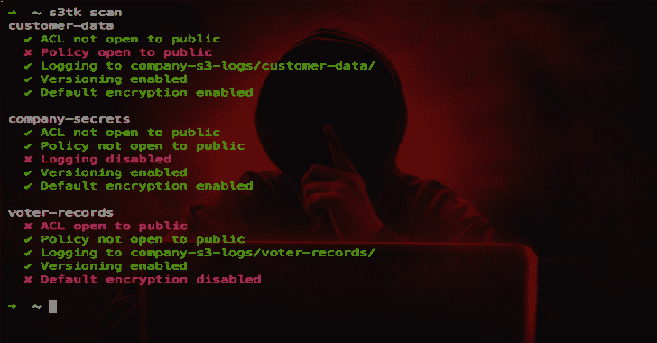
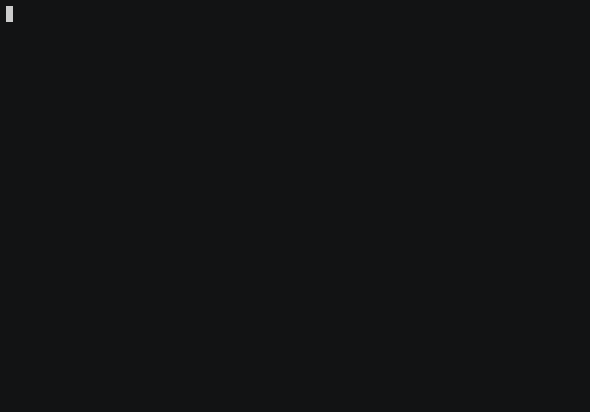

# S3TK:亚马逊 S3 的安全工具包

> 原文：<https://kalilinuxtutorials.com/s3tk-security-toolkit-amazon-s3/>

S3TK 是亚马逊 S3 的一个安全工具包。

**安装**

运行:

**pip 安装 s3tk**

您可以使用 [AWS CLI](https://github.com/aws/aws-cli) 来设置您的 AWS 凭证:

**pip 安装 awscli
aws 配置**

**命令**

**扫描**

扫描您的存储桶以查找:

*   ACL 对公众开放
*   对公众开放的政策
*   日志记录已启用
*   版本控制已启用
*   启用默认加密

**s3tk 扫描**

仅在特定存储桶上运行

**s3tk 扫描 my-bucket my-bucket-2**

也适用于通配符

**s3tk 扫描“我的-bucket *”**

确认正确的日志存储桶和前缀

**s3tk 扫描–log-bucket my-S3-logs–log-bucket other-region-logs–log-prefix " { bucket }/"**

跳过日志记录、版本控制或默认加密

**s3tk 扫描–跳过记录–跳过版本控制–跳过默认加密**

获得失败的电子邮件通知(通过社交网络)

**s3tk 扫描–SNS-topic arn:AWS:SNS:…**

**也可阅读-[夸克引擎:一个混淆-忽略安卓恶意软件评分系统](https://kalilinuxtutorials.com/quark-engine-obfuscation-neglect-android-malware-scoring-system/)**

**列表策略**

列出存储桶策略

**s3tk 列表-策略**

仅在特定存储桶上运行

**s3tk list-policy my-bucket my-bucket-2**

显示命名语句

**s3tk 列表-策略-命名为**

**设置策略**

**注意:**这将取代之前的政策

仅限私人上传

**s3tk set-policy my-bucket–no-object-ACL**

**删除策略**

删除策略

**s3tk 删除策略 my-bucket**

**启用日志记录**

启用所有存储桶的日志记录

**s3tk enable-logging–log-bucket my-S3-logs**

仅在特定桶上

**s3tk enable-logging my-bucket my-bucket-2-log-bucket my-S3-logs**

设置日志前缀(默认为`{bucket}/`

**s3tk enable-logging–log-bucket my-S3-logs–log-前缀“logs/{ bucket }/”**

使用`**--dry-run**`标志进行测试

关于日志记录的几点注意事项:

*   已经启用日志记录的存储桶根本不会更新
*   日志存储桶必须与源存储桶位于同一区域–针对不同区域多次运行此命令
*   日志可能需要一个多小时才能显示出来

**启用版本控制**

在所有存储桶上启用版本控制

**s3tk 启用版本控制**

仅在特定桶上

**s3tk 启用版本控制 my-bucket my-bucket-2**

使用`**--dry-run**`标志进行测试

**启用默认加密**

在所有桶上启用默认加密

**s3tk 启用-默认-加密**

仅在特定桶上

**s3tk enable-default-encryption my-bucket my-bucket-2**

这不会加密现有的对象-为此使用 **`encrypt`** 命令

使用`**--dry-run**`标志进行测试

**扫描对象 ACL**

扫描存储桶中所有对象的 ACL

**s3tk scan-object-ACL my-bucket**

只有某些物体

**s3tk scan-object-ACL my-bucket–only " *。pdf"**

除了某些物体

**s3tk scan-object-ACL my-bucket–除了" *。jpg"**

**重置对象 ACL**

重置存储桶中所有对象的 ACL

**s3tk reset-object-ACL my-bucket**

这使得所有对象都是私有的。请参见[存储桶政策](https://github.com/ankane/s3tk#bucket-policies)了解如何继续执行。

使用`**--dry-run**`标志进行测试

以与 [scan-object-acl](https://github.com/ankane/s3tk#scan-object-acl) 相同的方式指定某些对象

**加密**

使用[服务器端加密](https://docs.aws.amazon.com/AmazonS3/latest/dev/serv-side-encryption.html)加密桶中的所有对象

**s3tk 加密 my-bucket**

默认使用 [S3 管理的密钥](https://docs.aws.amazon.com/AmazonS3/latest/dev/UsingServerSideEncryption.html)。对于 [KMS 管理的密钥](https://docs.aws.amazon.com/AmazonS3/latest/dev/UsingKMSEncryption.html)，使用:

**s3tk 加密 my-bucket–kms-key-id arn:AWS:kms:…**

对于[客户提供的密钥](https://docs.aws.amazon.com/AmazonS3/latest/dev/ServerSideEncryptionCustomerKeys.html)，使用:

**s3tk 加密 my-bucket-customer-key 秘钥**

使用`**--dry-run**`标志进行测试

以与 [scan-object-acl](https://github.com/ankane/s3tk#scan-object-acl) 相同的方式指定某些对象

**注意:**对象将丢失任何自定义 ACL

**删除未加密版本**

删除存储桶中对象的所有未加密版本

**s3tk 删除未加密版本 my-bucket**

出于安全考虑，这不会删除对象的任何当前版本

使用`**--dry-run**`标志进行测试

以与 [scan-object-acl](https://github.com/ankane/s3tk#scan-object-acl) 相同的方式指定某些对象

**扫描 DNS**

扫描 53 号公路的桶，以确保你拥有它们

**s3tk 扫描-dns**

否则，您可能容易受到[子域接管](https://hackerone.com/reports/207576)的影响

**凭证**

凭证可以在`**~/.aws/credentials**`中指定，也可以用环境变量指定。关于环境变量的解释，参见本指南。

您可以指定一个配置文件用于:

**AWS _ PROFILE = your-PROFILE s3tk**

**升级**

运行:

**pip 安装 s3tk–升级**

要使用 master，请运行:

**pip 安装 git+https://github . com/ankane/s3tk . git–升级**

**码头工人**

运行:

**docker run -it ankane/s3tk aws 配置**

提交您的凭据:

**docker commit $(docker PS-l-q)my-s3tk**

并运行:

**docker run -it my-s3tk s3tk 扫描**

[**Download**](https://github.com/ankane/s3tk)