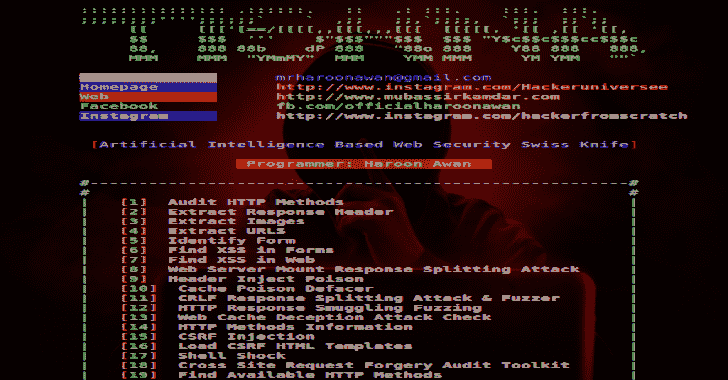
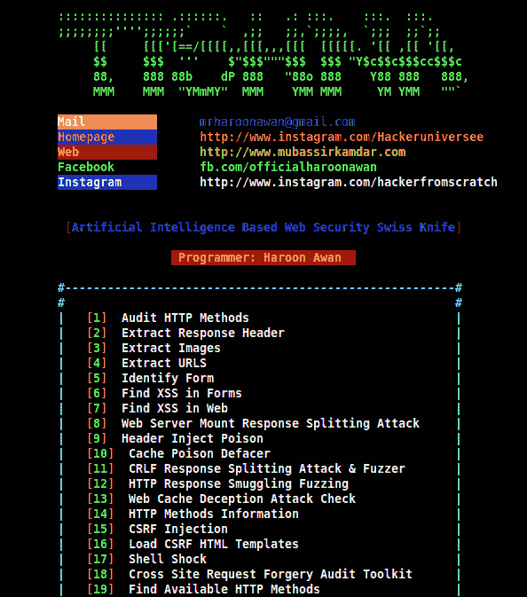
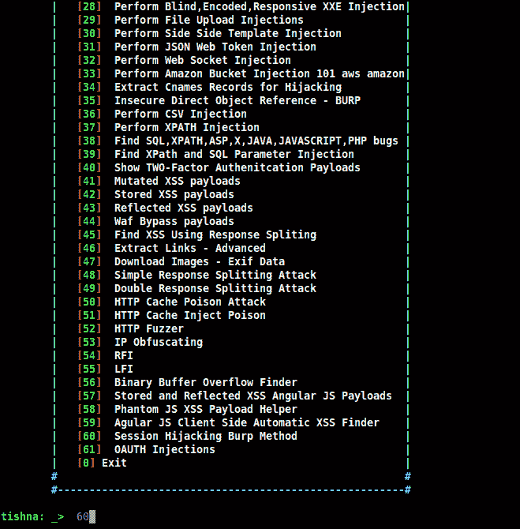

# Tishna:自动化网络应用黑客 2020

> 原文：<https://kalilinuxtutorials.com/tishna-automated-web-application-hacker/>

Tishna 是一个完整的自动化 pentest 框架，适用于服务器、应用层和网络安全。这个软件有 62 个全自动选项，可用于网络安全瑞士刀。

*   Tishna 是用于终极安全分析的 Web 服务器安全渗透软件
*   Kali，Parrot OS，Black Arch，Termux，Android Led 电视

**也可以理解为-[av class++:又一个大规模恶意软件标记工具](https://kalilinuxtutorials.com/avclass-yet-another-massive-malware-labeling-tool/)**

**简介**

*   Tishna 在银行、私人组织和道德黑客人员的法律审计中很有用。
*   它作为一种防御方法，尽可能多地查找信息，以获得未经授权的访问和入侵。
*   随着更先进技术的出现，网络犯罪分子也找到了更多进入许多组织系统的方法。
*   Tishna 软件可以审计，服务器和网络行为。
*   Tishna 可以对目标进行尽可能多的扫描和枚举。
*   这是通过保护您的服务器和 Web 应用程序安全来阻止网络犯罪的第一步。
*   提什那是无假阳性的，当有什么东西时，它无论如何都会显示，如果没有，它会给出空白结果而不是错误。

**卡利安装**

**git 克隆[https://github . com/haroonawanofficiel/tish na . git](https://github.com/haroonawanofficial/Tishna.git)
tish CD
sudo chmod u+x *。sh〔t5〕。/Kali_Installer.sh**

Tishna 将作为系统软件集成。依赖关系将被自动处理。第三方软件/依赖关系/模块将被自动处理。

[**Download**](https://github.com/haroonawanofficial/Tishna-Automated-Web-Application-Hacker)