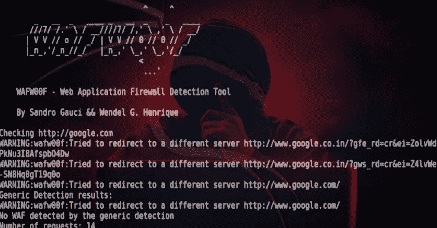
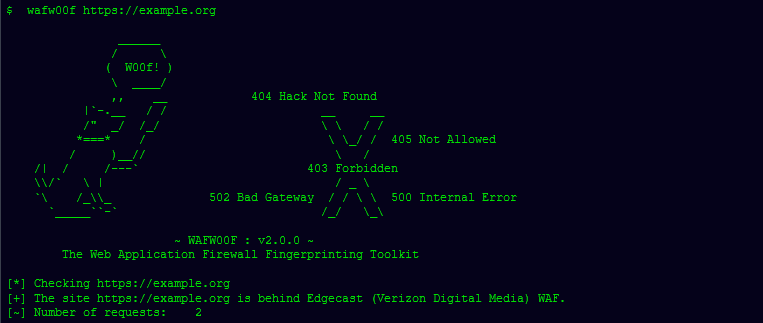

# Wafw00f:识别和指纹网络应用防火墙

> 原文：<https://kalilinuxtutorials.com/wafw00f-identify-fingerprint-waf/>

**WAFW00F** 允许识别和指纹识别保护网站的网络应用防火墙(WAF)产品。为了发挥它的魔力，WAFW00F 做了以下事情:

*   发送一个普通的 HTTP 请求并分析响应；这确定了许多 WAF 解决方案。
*   如果不成功，它会发送许多(潜在的恶意)HTTP 请求，并使用简单的逻辑来推断它是哪个 WAF。
*   如果还是不成功，它会分析之前返回的响应，并使用另一种简单的算法来猜测 WAF 或安全解决方案是否正在积极响应我们的攻击。

它检测什么？

WAFW00F 可以检测许多防火墙，列表如下:

**WAF Name** **Manufacturer**
——– ————
ACE XML Gateway Cisco
aeSecure aeSecure
AireeCDN Airee
Airlock Phion/Ergon
Alert Logic Alert Logic
AliYunDun Alibaba Cloud Computing
Anquanbao Anquanbao
AnYu AnYu Technologies
Approach Approach
AppWall Radware
Armor Defense Armor
ArvanCloud ArvanCloud
ASP.NET Generic Microsoft
ASPA Firewall ASPA Engineering Co.
Astra Czar Securities
AzionCDN AzionCDN
Barikode Ethic Ninja
Barracuda Barracuda Networks
Bekchy Faydata Technologies Inc.
Beluga CDN Beluga
BinarySec BinarySec
BitNinja BitNinja
BlockDoS BlockDoS
Bluedon Bluedon IST
CacheWall Varnish
CacheFly CDN CacheFly
Comodo cWatch Comodo CyberSecurity
Chuang Yu Shield Yunaq
Cloudbric Penta Security
Cloudflare Cloudflare Inc.
Cloudfloor Cloudfloor DNS
Cloudfront Amazon
CrawlProtect Jean-Denis Brun
DataPower IBM
DenyALL Rohde & Schwarz CyberSecurity
Distil Distil Networks
DOSarrest DOSarrest Internet Security
DotDefender Applicure Technologies
Edgecast Verizon Digital Media
Eisoo Cloud Firewall Eisoo
Expression Engine EllisLab
BIG-IP AppSec Manager F5 Networks
BIG-IP AP Manager F5 Networks
Fastly Fastly CDN
FirePass F5 Networks
FortiWeb Fortinet
Greywizard Grey Wizard
Huawei Cloud Firewall Huawei
HyperGuard Art of Defense
Imunify360 CloudLinux
Incapsula Imperva Inc.
IndusGuard Indusface
Instart DX Instart Logic
ISA Server Microsoft
Jiasule Jiasule
Kona SiteDefender Akamai
KS-WAF KnownSec
KeyCDN KeyCDN
LimeLight CDN LimeLight
LiteSpeed LiteSpeed Technologies
Open-Resty Lua Nginx FLOSS
Oracle Cloud Oracle
Malcare Inactiv
MaxCDN MaxCDN
ModSecurity SpiderLabs
NAXSI NBS Systems
Nemesida PentestIt
NevisProxy AdNovum
NetContinuum Barracuda Networks
NetScaler AppFirewall Citrix Systems
Newdefend NewDefend
NexusGuard Firewall NexusGuard
NinjaFirewall NinTechNet
NullDDoS Protection NullDDoS
NSFocus NSFocus Global Inc.
OnMessage Shield BlackBaud
PerimeterX PerimeterX
PentaWAF Global Network Services
pkSecurity IDS pkSec
PowerCDN PowerCDN
Profense ArmorLogic
Puhui Puhui
Qiniu Qiniu CDN
Reblaze Reblaze
RSFirewall RSJoomla!
Sabre Firewall Sabre
Safe3 Web Firewall Safe3
Safedog SafeDog
Safeline Chaitin Tech.
SecKing SecKing
eEye SecureIIS BeyondTrust
SecuPress WP Security SecuPress
SecureSphere Imperva Inc.
Secure Entry United Security Providers
SEnginx Neusoft
ServerDefender VP Port80 Software
Shield Security One Dollar Plugin
Shadow Daemon Zecure
SiteGround SiteGround
SiteGuard Sakura Inc.
Sitelock TrueShield
SonicWall Dell
UTM Web Protection Sophos
Squarespace Squarespace
SquidProxy IDS SquidProxy
StackPath StackPath
Sucuri CloudProxy Sucuri Inc.
Teros Citrix Systems
Trafficshield F5 Networks
TransIP Web Firewall TransIP
URLScan Microsoft
UEWaf UCloud
Varnish OWASP
Viettel Cloudrity
VirusDie VirusDie LLC
Wallarm Wallarm Inc.
WatchGuard WatchGuard Technologies
WebARX WebARX Security Solutions
WebKnight AQTRONIX
WebLand WebLand
RayWAF WebRay Solutions
WebSEAL IBM
WebTotem WebTotem
West263 CDN West263CDN
Wordfence Defiant
WP Cerber Security Cerber Tech
WTS-WAF WTS
360WangZhanBao 360 Technologies
XLabs Security WAF XLabs
Xuanwudun Xuanwudun
Yundun Yundun
Yunsuo Yunsuo
Yunjiasu Baidu Cloud Computing
YXLink YxLink Technologies
Zenedge Zenedge
ZScaler Accenture

**也可理解为-[multi scanner:模块化文件扫描/分析框架](https://kalilinuxtutorials.com/multiscanner-modular-file-scanning-analysis/)**

我如何使用它？

首先，安装此处所述的[工具。](https://github.com/EnableSecurity/wafw00f#how-do-i-install-it)

如需帮助，您可以使用`**--help**`选项。基本用法是将 URL 作为参数传递。示例:

如何安装它？

以下内容应该可以解决问题:

**python setup.py 安装**

[**Download**](https://github.com/EnableSecurity/wafw00f)