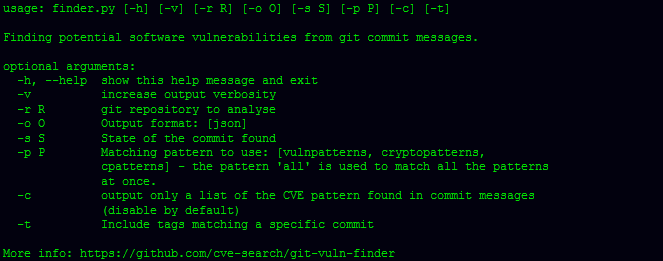

# Git Vuln Finder:从 Git 提交消息中发现潜在的软件漏洞

> 原文：<https://kalilinuxtutorials.com/git-vuln-finder-finding-potential-software-vulnerabilities/>

**Git Vuln Finder** 从 Git 提交消息中发现潜在的软件漏洞。输出格式是带有相关提交的 JSON，其中可能包含关于软件漏洞的修复。该搜索基于一组仅针对提交消息的正则表达式。如果 CVE id 存在，它们会自动添加到输出中。

**要求**

**jq (sudo apt 安装 jq)**

**也可阅读-[Dsync:IDA python 插件，同步反汇编器&反编译器视图](https://kalilinuxtutorials.com/dsync-idapython-plugin/)**

**安装**

**把它当图书馆用**

git-vuln-finder 可以安装诗歌。如果没有安装诗词，可以做以下 **`curl -sSL https://raw.githubusercontent.com/python-poetry/poetry/master/get-poetry.py | python`。**

**$诗歌安装 git-vuln-finder
$诗歌外壳**

**将其作为命令行工具使用**

**$ pipx 安装 git-vuln-finder
$ git-vuln-finder–帮助**

也可以使用 pip。将 Python 包提供的脚本(全系统可用)安装到单独的 virtualenvs 中，以保护它们不受您的系统和彼此的影响。

**用途**

**图案**

git-vuln-finder 提供了 3 种默认模式，可以选择这些模式来查找提交消息中描述的潜在漏洞，例如:

*   [`**vulnpatterns**`](https://github.com/cve-search/git-vuln-finder/blob/master/patterns/en/medium/vuln) 是一种通用漏洞模式，专门针对 web 应用程序和通用安全提交消息。基于一篇学术论文。
*   [`**cryptopatterns**`](https://github.com/cve-search/git-vuln-finder/blob/master/patterns/en/medium/crypto) 是针对提交消息中提到的加密错误的漏洞模式。
*   [`**cpatterns**`](https://github.com/cve-search/git-vuln-finder/blob/master/patterns/en/medium/c) 是一组标准的漏洞模式，参见 C/C++类语言。

[**Download**](https://github.com/cve-search/git-vuln-finder)