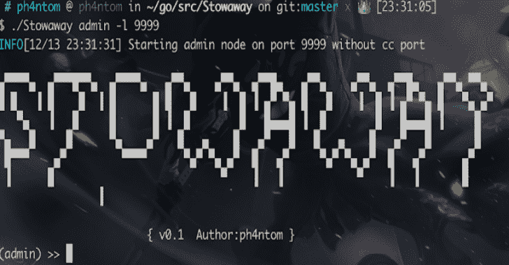
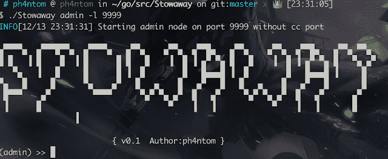
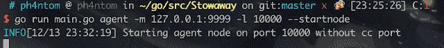
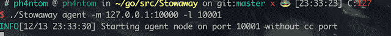
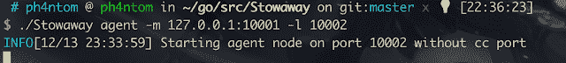
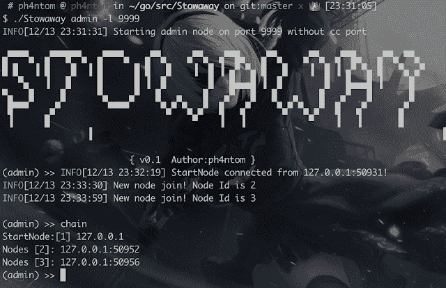
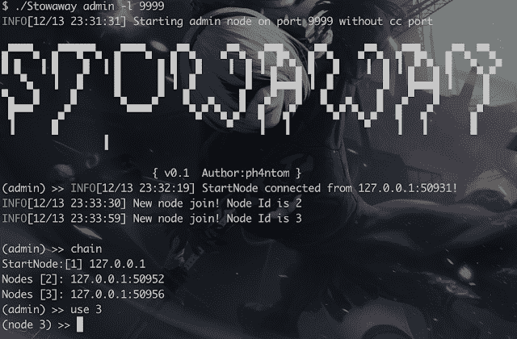
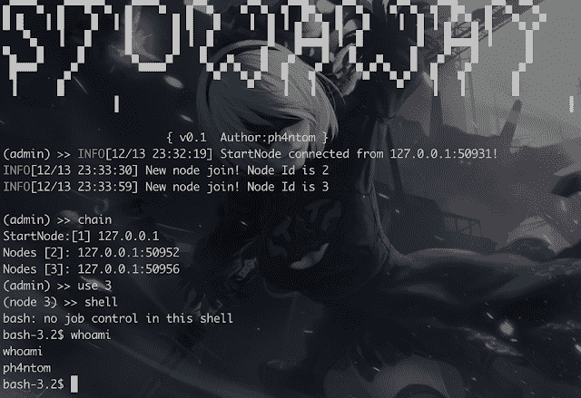
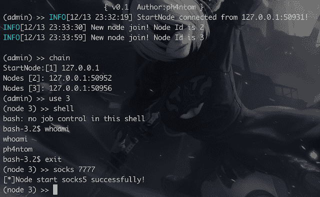

# 偷渡者:Pentesters 的多跳代理工具

> 原文：<https://kalilinuxtutorials.com/stowaway-multi-hop-proxy-tool-for-pentesters/>

**stowave**是安全研究人员和测试人员的多跳代理工具
用户可以轻松地将他们的网络流量代理到内部网节点(多层)
PS:演示文件夹下的文件是 stowave 的测试版，它仍然是功能性的，您可以通过演示文件夹下的 README.md 文件查看详细信息。

**特性**

*   明显的节点拓扑
*   多跳 socks5 流量代理
*   多跳 ssh 流量代理
*   远程交互外壳
*   AES-256 网络流量加密(CBC 模式)
*   支持 macos 和 linux

**用途**

它有两种模式:管理员模式和代理模式。如果你不想自己编译项目，你可以查看发布文件夹来获得一个！

简单的例子:

管理模式:。/stowave admin-l 9999-s 123

含义:

admin 表示 stowave 以管理模式

启动-l 表示 stowave 正在侦听端口 9999 并等待传入连接

-s 表示 stowave 在通信过程中使用了 123 作为加密密钥

请注意！-s 选项的值必须与代理的

相同，目前只支持以上三个选项！

代理模式:。/stowave agent-m 127 . 0 . 0 . 1:9999-l 10000–start node-s 123-r

含义:

agent 它表示 stowave 作为代理模式

启动-m 它表示 stowave 的监控节点的地址(在本例中，就是我们上面启动的节点)

-l 它表示 stowave 正在侦听端口 10000 并等待传入连接

-s 它！！代理模式有两个子模式，如果你想启动第二个，第三个…..，只需移除此选项)

-r 表示您希望以反向模式启动节点(例如:您可以通过节点 1 将节点 2 添加到网络中主动连接到节点 2，而不是节点 1 只是等待来自节点 2 的连接)

请注意！-s 选项的值必须与代理的

相同，目前只支持以上五个选项！

**例子**

例如(一个管理员；一个 startnode 两个简单节点)

*   **管理员**

*   **开始节点**

*   **第一个简单节点**(设置为反向模式)

现在，使用 admin 并键入“use 1”->“connect 127 . 0 . 0 . 1:10001”，然后您可以将节点 1 添加到网络中

*   **第二个简单节点**

当所有代理节点连接后，在 admin 中检查拓扑

现在我们通过 admin 操作第二个简单的节点

打开远程交互式外壳

现在，您可以通过 admin 使用交互式 shell(第二个简单的节点)

*   **启动 socks5 代理服务**

现在，您可以使用管理员的端口 7777 作为 socks5 代理服务
，它可以将您的流量代理到第二个简单节点，第二个简单节点将作为 socks 服务器完成其工作(当您想要关闭此 socks5 服务时，只需在此模式下键入“stopsocks”即可将其关闭)

*   **打开 ssh**

它可以将您的 ssh 流量代理到第二个简单节点，第二个简单节点将作为 ssh 客户端完成其工作。PS:在此功能中，您可以输入`pwd`来查看您当前所在的位置

要了解更多详细信息，只需键入 help 即可获得更多信息

**注意**

*   这个`**project**`编码只是为了好玩，逻辑结构和代码结构不够严谨，请不要太较真
*   当管理员离线时，所有代理节点也将离线(也许将来会改变)
*   当其中一个代理脱机时，它之后的代理节点也将脱机
*   一旦管理启动，在进行任何操作之前，您需要至少连接一个代理节点
*   如果你想编译这个项目来支持更多的平台，你可以使用`**go build -ldflags="-w -s"**`来完成
*   暂时不支持 Windows

鸣谢:[rootkiter #白蚁](https://github.com/rootkiter/Termite) & [毒液](https://github.com/Dliv3/Venom)

[**Download**](https://www.kitploit.com/2020/01/stowaway-multi-hop-proxy-tool-for.html)