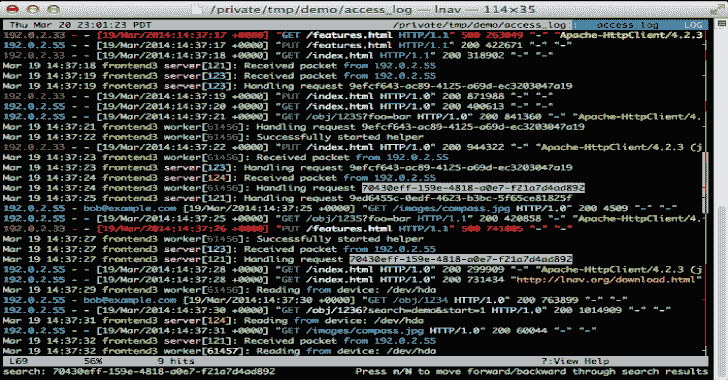

# LNAV:日志文件导航器 2020

> 原文：<https://kalilinuxtutorials.com/lnav-log-file-navigator/>

LNAV 是一个增强的日志文件查看器，它利用了可以从正在查看的文件中收集到的任何语义信息，比如时间戳和日志级别。

使用这些额外的语义信息，lnav 可以做一些事情，如交叉不同文件中的消息，生成消息随时间变化的直方图，并提供在文件中导航的热键。

希望这些功能能让用户快速有效地集中精力解决问题。

**先决条件**

构建 lnav 需要以下软件包:

*   gcc/clang——一个兼容 C++14 的编译器。
*   libpcre——Perl 兼容的正则表达式(pcre)库。
*   SQLite–SQLite 数据库引擎。需要 3.9.0 或更高版本。
*   ncurses–ncurses 文本用户界面库。
*   readline–readline 行编辑库。
*   zlib–zlib 压缩库。
*   bz2–bzip2 压缩库。
*   libcurl——用于从 url 下载文件的 curl 库。需要 7.23.0 或更高版本。

**亦读-[wafw 00 f:识别&指纹 Web 应用防火墙](https://kalilinuxtutorials.com/wafw00f-identify-fingerprint-waf/)**

**安装**

Lnav 遵循通常的 GNU 风格来配置和安装软件:

**$。/configure
$ make
$ sudo make install**

从克隆的存储库编译时，在运行上述任何命令之前运行`**./autogen.sh**`。

**Cygwin 用户**

它应该可以在 Cygwin 中很好地编译。

或者，您可以从 [AppVeyor](https://ci.appveyor.com/project/tstack/lnav) 工件中获得生成的二进制文件。

请记住，您仍然需要 Cygwin 下的 lnav 依赖项，这里有一个快速的方法:

**setup-x86 _ 64 . exe-q-P libpcre 1-P libpcrecpp 0-P libsqlite 3 _ 0-P libstdc++ 6**

目前，x64 版本似乎比 x86 版本运行得更好。

**用途**

唯一安装的文件是可执行文件`lnav`。您可以不带参数地执行它来查看默认的文件集:

**$ lnav**

您可以通过运行以下命令来查看所有系统日志消息:

**$ lnav /var/log/messages***

**用法同 S `ystemd-Journald`**

在运行`systemd-journald`的系统上，您可以将`lnav`用作寻呼机:

**$ journalctl | lnav**

或者在跟随模式下:

$ journalctl -f | lnav

由于 **`journalctl`的**默认输出格式省略了年份，如果您正在查看跨越多年的日志，您将需要更改输出格式以包含年份，否则`lnav`会混淆:

**$ journal CTL-o short-iso | lnav**

也可以使用`**journalctl**`的 json 输出格式，并且`**lnav**`将使用额外的字段，例如 PRIORITY 和 _SYSTEMD_UNIT:

**$ journalctl -o json | lnav**

如果某些消息字段包含特殊字符，如被 journalctl 视为不可打印的 ANSI 颜色代码，指定`journalctl`的`-a`选项可能更好，以便以非二进制表示输出这些消息:

**$ journalctl -a -o json | lnav**

如果使用 systemd v236 或更新版本，输出字段可以限制为由`lnav`实际识别的字段，以提高效率:

**$ journal CTL-o JSON–output-fields = MESSAGE，PRIORITY，_PID，SYSLOG_IDENTIFIER，_SYSTEMD_UNIT | lnav**

如果您的系统已经运行了很长时间，为了提高效率，您可能希望限制输入到`**lnav**`的日志行数，例如通过**T1 的`-n`或`--since=...`T5 选项。**

在持久日志的情况下，您可能希望通过 **`journalctl`的`-b`** 选项来限制输入到`**lnav**`中的日志行数。

**截图**

下面的屏幕截图显示了一个 syslog 文件。日志行高亮显示。错误为红色，警告为黄色。

[**Download**](https://github.com/tstack/lnav)