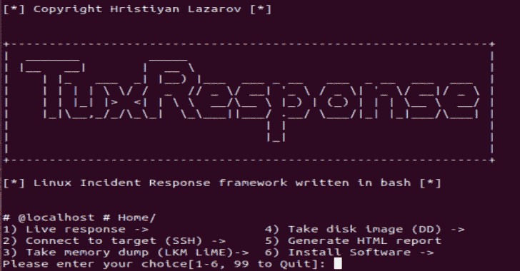

# TuxResponse : Linux 事件响应 2020

> 原文：<https://kalilinuxtutorials.com/tuxresponse-linux-incident-response/>

TuxResponse 是用 bash 编写的针对 linux 系统的事件响应脚本。它可以自动执行 Linux 系统上的事件响应活动，并使您能够快速对系统进行分类，同时不会影响结果。

通常，公司系统会有某种监控和控制，但也有例外，因为影子 IT 和公司中部署的非标准映像。试用结束测试相当于键入 10 个命令，只需按一下按钮就可以完成。

**测试于**

*   Ubuntu 14+
*   CentOS 7+

**主要目的**

*   利用 Linux 中的内置工具和功能(如 dd、awk、grep、cat、netstat 等工具)
*   减少事故响应者在响应场景中需要记住/使用的命令数量。
*   自动化

**包内外部工具:**

*   石灰
*   Exif
*   chkrootkit
*   Yara + Linux 扫描规则(需要网络来获取 repo)

**自动化示例:**

安装 LiME
函数 init _ LiME(){

if[-f/usr/bin/yum]；然后
yum-y install make kernel-headers kernel-devel gcc
elif[-f/usr/bin/apt-get]；然后
apt-add-repository universe
apt-get-y install make Linux-headers-$(uname-r)gcc
fi

RM-f/tmp/v 1 . 8 . 1 . zip
wget-P/tmp https://github.com/504ensicsLabs/LiME/archive/v1.8.1.zip
unzip/tmp/v 1 . 8 . 1 . zip
RM-f/tmp/v 1 . 8 . 1 . zip
pushd LiME-1 . 8 . 1/src【T12ko/tmp/LiME . ko
popd
RM-RF LiME-1 . 8 . 1
}

在响应事件时，如果您必须通过手动键入所有命令来安装 LiME，那将会大大降低您的速度。

**也可以理解为-[XoN:搜索暴露密码聚合库的工具](https://kalilinuxtutorials.com/xon-aggregated-repository-xposed-passwords/)**

**功能**

*   **现场回应**

**1)足迹系统**

*   系统信息，IP，日期，时间，本地 TZ，最后一次启动-' hostname CTL；who-b；uname-a；正常运行时间；ifconfig 日期；'上次重新启动'

**2)文件系统工具**

*   检查挂载的文件系统-“df-h”
*   哈希可执行文件(MD5)–' find/usr/bin-type f-exec 文件" { } " \；| grep-I " elf " | cut-f1-d:| xargs-I " { } "-n 1 MD 5 sum { } '
*   修改的文件-“修改的文件周期选择”(调用 tuxresponse.sh 中的函数)
*   列出所有隐藏的目录-“find/-type d-name”。*"'
*   没有用户/组名的文件/目录-' find/\(-nouser-o-no group \)-exec ls-l { } \；2>/dev/null '
*   包中已更改的文件-'packaged_files_changed '(调用 tuxresponse.sh 中的函数)

**【3】亚拉，chkrootkit，exiftol**

*   检查 rootkit–运行“chkrootkit”
*   yara scan–调用函数 tuxresponse.sh 'yara_select '(使用主报告中可用的所有 YARA linux 规则扫描系统)
*   EXIFTool–调用函数 tuxresponse.sh 'exiftool_select '(安装 EXIF tool)

**4)过程分析工具**

*   列出正在运行的进程-“PS-axu”
*   已删除的二进制文件仍在运行-“ls-alR/proc/*/exe 2 >/dev/null | grep deleted”
*   活动的网络连接(TCP、UDP)–' ss-tunap | sed " s/[\ t]\+/|/g " '
*   基于 PID 的转储进程-“转储进程选择”(调用 tuxresponse.sh 中的函数)
    *   输入要转储的 PID:*(这是执行的命令–gcore-a-o " $ { DUMP _ FILE } " $ { DUMP _ PID })* *
*   从/tmp，/dev-' ls-alR/proc/*/CWD 2 >/dev/null | grep-E " tmp | dev " '运行的进程

**5)网络连接分析**

*   列出所有活动的网络连接/原始套接字-' netstat-nalp；' netstat-工厂'

**6)用户**

*   列出连接到系统的所有用户-“w”
*   获取带密码的用户-“获取密码”

痛击

*   检查 bash 历史文件-' cat ~/。bash_history | nl '

**8)持续存在的证据**

*   列出所有 Cron 作业-“list _ All _ crontab”(调用 tuxresponse.sh 中的函数)
*   列出所有启动/引导程序-“list _ All _ onstartup”(调用 tuxresponse.sh 中的函数)

**9)转储所有日志(/var/log)**

*   转储用户。bash _ history-' cat _ all _ bash _ history '(调用 tuxresponse.sh 中的函数)
*   查找包含二进制文件的日志-' grep[[:cntrl:]]/var/log/*。“日志”

**2)连接到目标–使用 SSH 传输脚本并分析远程系统。**

*   该选项使您能够连接到远程系统，复制所有脚本和工具，并分析系统。

**3)取内存转储(LKM 石灰)**

*   该选项使您能够从源代码编译 LiME，并将 RAM 内存转储到系统之外。这是最简单的方法，因为另一种方法是从所有主要内核版本的源代码中编译并插入 LKM。

**4)拍摄磁盘映像(DD)**

*   该选项使您能够使用众所周知的工具 dd 制作目标系统的完整磁盘映像。该函数将源和目的地作为参数，并将它们插入到以下命令中' DD if = $ { IMAGE _ IN } | PV | DD of = ' $ { IMAGE _ OUT } ' bs = 4K conv = no error，sync '。如果您正在研究远程系统，该脚本会将自身复制到那里。然后，如果设置了参数${TARGET_HOST}，则脚本将使用以下命令将图像下载到分析师系统> >“ssh-p $ { TARGET _ PORT } $ { TARGET _ USER } @ $ { TARGET _ HOST } ' DD if = $ { IMAGE _ IN } bs = 4K·conv = no error，sync' | pv | dd of='${IMAGE_OUT} '”(我大量使用 pv 以确保跟踪进度)

**5)生成 HTML 报告**

*   您所做的一切都记录在文本文件中，因此很容易返回并查看输出。这种方法的美妙之处在于，你可以将它上传到你最喜欢的日志分析工具中，并在稍后阶段理解它。除此之外，您可以使用该函数生成 HTML 报告，并以更易于阅读形式查看命令生成的输出。

**6)安装软件**

*   安装脚本正常运行所需的二进制文件。
    *   从属关系
    *   塔拉和规则
    *   ExifTool
    *   初始化检查
    *   chkrootkit
    *   石灰

[**Download**](https://github.com/la3ar0v/TuxResponse)