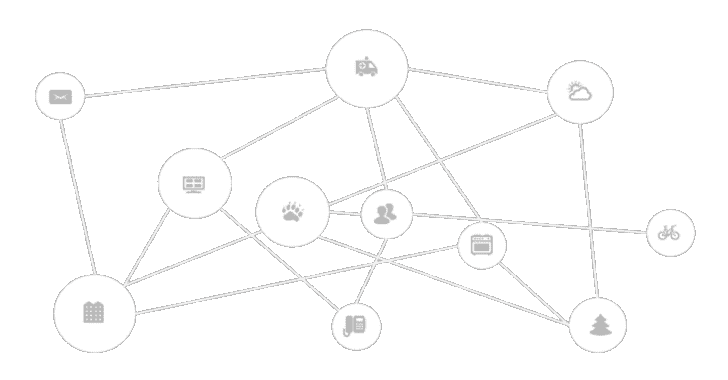

# IotShark:监控和分析物联网流量

> 原文：<https://kalilinuxtutorials.com/iotshark-monitoring-analyzing-iot-traffic/>

IoTShark 是一个 **IOT** 的监控服务，允许用户监控他们的 IOT 设备发送/接收数据的趋势。通常，使用适当的配置来设置中间人攻击会花费相当多的时间，对于那些很少或没有计算机安全甚至计算机科学经验的人来说，这似乎是不可能的。

它旨在为用户提供一个[几乎]全自动的解决方案，只需运行一个脚本就可以监控他们的 IOT 设备。用户只需选择他们希望监控的设备，该程序通过启动 ARP 中毒、设置数据包转发和中间人数据包嗅探器来完成剩下的繁重工作。它还有一个易于理解的交互式 web 用户界面，用户可以根据端口、类型和时间戳过滤数据包，以更广泛地了解传输的数量和时间。

我们还旨在对某些类型的数据进行分类，如心跳消息、数据传输和异常，尽管最后一种可能会在未加密的 RPi 测试中演示，因为在没有大量数据的情况下很难进行异常检测(我们需要许多设备和个人来收集这么多数据)。

**也可阅读-[Git Vuln Finder:从 Git 提交消息中发现潜在的软件漏洞](https://kalilinuxtutorials.com/git-vuln-finder-finding-potential-software-vulnerabilities/)**

**怎么跑？**

安装需要的库:**$ pip 3-r requirements . txt**
设置 ip 转发:**$ sudo sysctl net . inet . IP . forwarding = 1**
运行 app:**$ sudo python 3 mitm _ main . py**

**主脚本**

创建一个 Python 虚拟环境并安装依赖包。

**virtualenv–python = ` which python 3 ` venv
source venv/bin/activate
python-r requirements . txt**

确保在您的本地机器上启用了数据包转发。这是中间人攻击成功的必要条件。在 macOS 上，这可以通过以下方式完成:

**sudo sysctl net . inet . IP . forwarding = 1**

运行主程序`**mitm_main.py**`。有关可接受的选项，请参见该脚本。

目前该计划做三件事:

*   通过`**-s**`选项扫描给定子网或一组公共住宅子网中的所有主机
*   发现每台主机的硬件供应商和操作系统
*   在选定的主机和网关路由器之间执行 ARP 中毒
*   通过`**-f**`选项输出过去捕获数据的图形，后跟 csv 文件的相对路径

ARP 中毒运行后，您可以通过 Wireshark 使用显示过滤器检查来自目标设备的流量，如下所示:

**(ip.src==192.168.0.215 或 ip.dst==192.168.0.215)和 tcp.port！= 443**

**数据文件格式**

捕获的数据存储在 csv 文件中，格式如下:

{时间戳，传入字节，传出字节，srcport，dstport，传输协议，连接协议，srcip，dstip}

**123123213，0，240，36，80，65124，HTTP，UDP，192.168.0.215，104.24.4.5 123123240，300，0，800，443，65125，104.24.4.5 HTTPS，TCP，192.168.0.215**

**使用工具嗅探物联网设备**

例如，这里有一个很长的字符串，我们可以在嗅探他们的流量时对 Alexa Echo Dot/Google Home 说。注意设备是否在唤醒字之前传输数据。

***这是一个漆黑的暴风雨之夜。我和我的朋友们刚从约塞米蒂国家公园回来，在那里，敏捷的棕色狐狸跳过了懒惰的狗。下周是感恩节。

2019 年的黑色星期五也即将到来。这是做一些令人兴奋的事情的好时机，比如在加州大学洛杉矶分校上计算机安全课或编程语言课。顺便说一下，第一架空客 A380 大型喷气式飞机即将退役。我们喜欢乘那架飞机飞行。

WAKE_WORD，感恩节洛杉机的天气怎么样？不管怎样，我们有波音 787 梦想飞机用于洲际飞行。Web 和移动系统类用 Ravi I***

[**Download**](https://github.com/sahilmgandhi/IotShark)