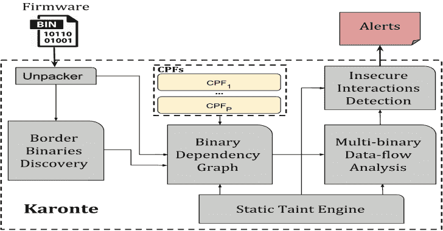

# Karonte:检测嵌入式固件中多二进制漏洞的静态分析工具

> 原文：<https://kalilinuxtutorials.com/karonte-detect-vulnerabilities-embedded-firmware/>

[](https://1.bp.blogspot.com/-rmdgwK6nYV8/Xhv-EsKB79I/AAAAAAAAEZ4/WINhHEotl7Q55BvwG5fcku9Acb4ioQK-gCLcBGAsYHQ/s1600/Karonte%25281%2529.png)

**Karonte** 是一款静态分析工具，用于检测嵌入式固件中的多二进制漏洞。

**研究论文**

我们在下面的研究论文中介绍了我们的方法和这项工作的发现:

**检测嵌入式固件中不安全的多二进制交互**[【PDF】](https://www.badnack.it/static/papers/University/karonte.pdf)

Nilo Redini、Aravind Machiry、Ruoyu Wang、Chad Spensky、Andrea Continella、Yan Shoshitaishvili、Christopher Kruegel、Giovanni Vigna。出现在 2020 年 5 月 IEEE 安全与隐私研讨会(S&P)的会议记录中

如果您在科学出版物中使用它，我们将感谢使用此 **Bibtex** 条目的引用:

```
@inproceedings{redini_karonte_20,
 author    = {Nilo Redini and Aravind Machiry and Ruoyu Wang and Chad Spensky and Andrea Continella and Yan Shoshitaishvili and Christopher Kruegel and Giovanni Vigna},
 booktitle = {To appear in Proceedings of the IEEE Symposium on Security & Privacy (S&P)},
 month     = {May},
 title     = {KARONTE: Detecting Insecure Multi-binary Interactions in Embedded Firmware},
 year      = {2020}
}
```

**也可以理解为-[偷渡者:偷渡者的多跳代理工具](https://kalilinuxtutorials.com/stowaway-multi-hop-proxy-tool-for-pentesters/)**

**储存库结构**

有四个主要目录:

*   **工具** : python 文件
*   **固件**:固件数据集
*   **配置**:分析数据集中固件样本的配置文件
*   **eval** :在其上运行各种评估的脚本。

**运行**

要运行它，只需从根目录运行

*   **剧情简介**python**tool/karonte . py**JSON _ CONFIG _ FILE[LOG _ NAME]
*   **描述**对 JSON_CONFIG_FILE 表示的固件样本运行 karonte，并将结果保存在 LOG_NAME 中
*   **示例**python tool/karonte . py config/NETGEAR/r _ 7800 . JSON 它在 R7800 NETGEAR 固件上运行 karonte

默认情况下，结果以后缀 **Karonte.txt** 保存在 **/tmp/** 中。

要检查生成的警报，只需运行:

**python 工具/pretty_print.py LOG_NAME**

**码头工人**

可以在[这里](https://hub.docker.com/r/badnack/karonte)找到可以使用的版本

**数据集**

您可以在此[链接](https://drive.google.com/file/d/1-VOf-tEpu4LIgyDyZr7bBZCDK-K2DHaj/view?usp=sharing)获取 it 数据集

[**Download**](https://github.com/ucsb-seclab/karonte)