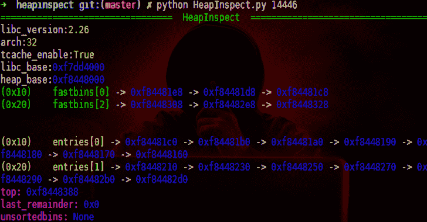
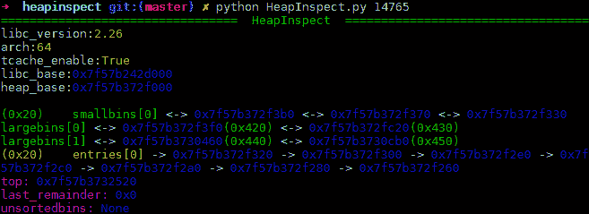
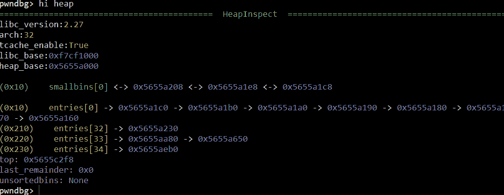
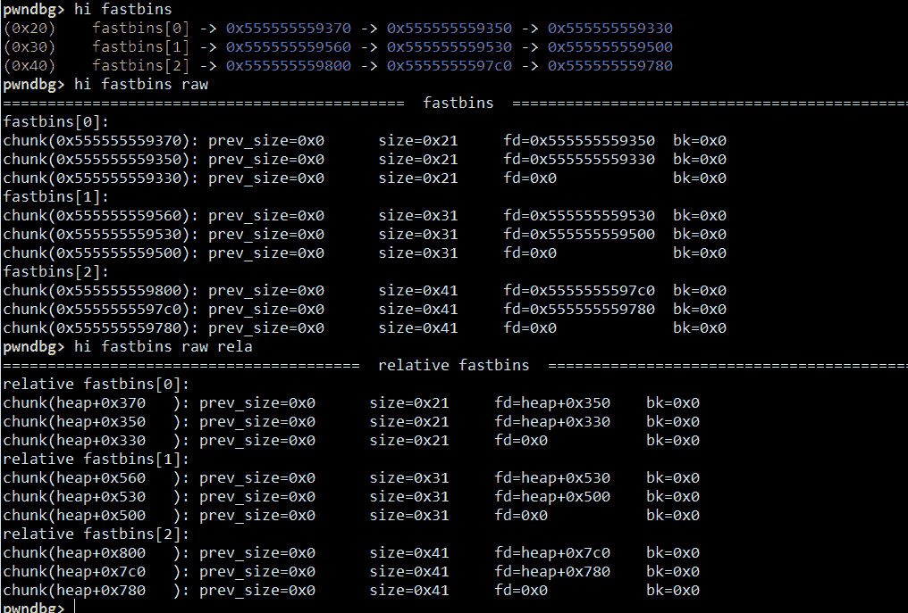
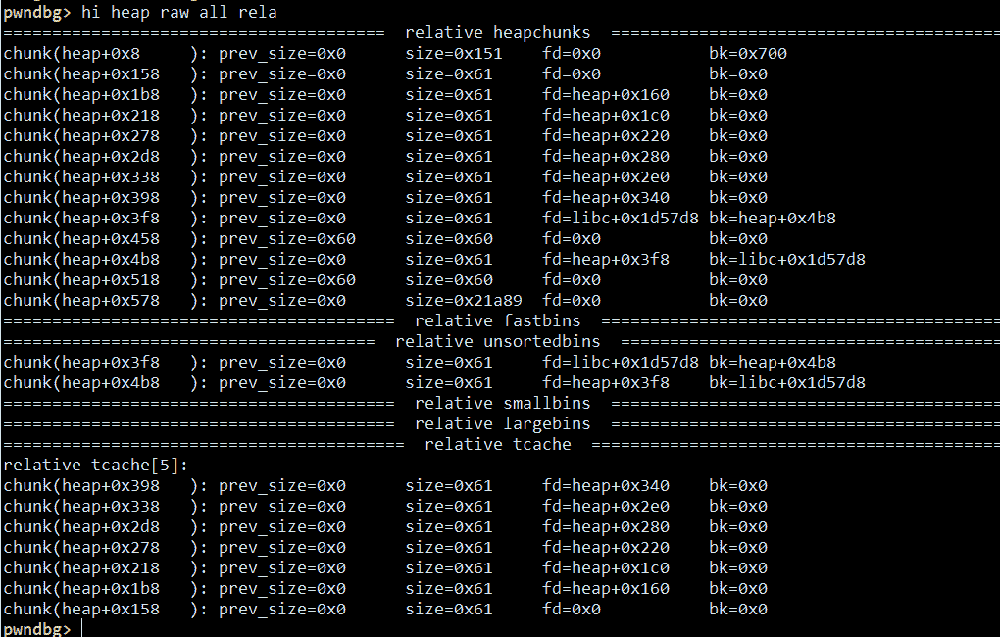

# HeapInspect:在 Python 中检查堆

> 原文：<https://kalilinuxtutorials.com/heapinspect-inspect-heap-in-python/>

heap SPECT 的设计是为了让 heap 更漂亮。因此，让我们了解一下这个工具的一些特性，它将检查 python 中的堆；

*   无 gdb 和其他要求
*   多 glibc 支持
    *   2.19，2.23-2.27(目前正在测试)
    *   32 位和 64 位
*   显示堆的漂亮用户界面
    *   `**HeapShower**`(详细)
    *   `**PrettyPrinter**`(丰富多彩，概要)
*   Heapdiff(工作中)
*   腐败检测和利用分析(工作)
*   也支持 gdb(仅 python2)

**也可阅读-[Karonte:检测嵌入式固件多二进制漏洞的静态分析工具](https://kalilinuxtutorials.com/karonte-detect-vulnerabilities-embedded-firmware/)**

**用法**

这个工具的快速使用。

你也可以把它作为一个 gdb 插件，当 **`pwndbg`** 或者其他插件无法分析堆时非常有用。

**sed-I " 1i source ` pwd `/gdsubscript . py " ~/。gdbinit #或者，您可以手动添加该行**

**注**

它暂时不支持 gdb python3。任何能让它兼容 python3 的人都受欢迎。

[**Download**](https://github.com/matrix1001/heapinspect)