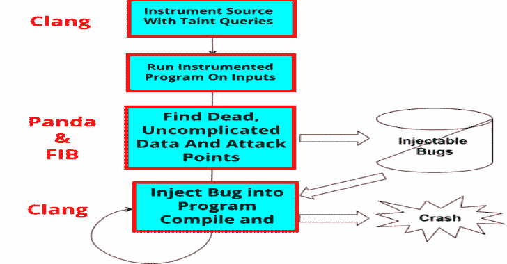

# Lava:大规模自动漏洞添加

> 原文：<https://kalilinuxtutorials.com/lava-large-scale-automated-vulnerability-addition/>

评估和改进缺陷发现工具目前很困难，因为缺乏基本事实语料库(即，已知具有触发输入的缺陷的软件)。 **LAVA** 试图通过自动向软件注入 bug 来解决这个问题。

每个 LAVA bug 都伴随着一个触发它的输入，而正常的输入是极不可能这样做的。我们认为，这些漏洞是合成的，但仍然是现实的，因为它们深深嵌入程序中，并由真实输入触发。

我们的工作为按需生成大型真实漏洞语料库的方法奠定了基础，实现了严格的工具评估，并为工具开发人员提供了高质量的目标。

它是麻省理工学院林肯实验室、NYU 和东北大学合作的产物。

另请参阅-[LNAV:日志文件导航器 2020](https://kalilinuxtutorials.com/lnav-log-file-navigator/)

**快速启动**

在运行 Ubuntu 16.04 的系统上，你应该可以直接运行`**python2 setup.py**`。请注意，此安装脚本将安装软件包并对您的系统进行更改。一旦它完成，你应该将[熊猫](https://github.com/panda-re/panda)安装到`**panda/build/**`(熊猫用于执行动态污点分析)。

接下来，运行`**init-host.py**`来生成一个`**host.json**`。LAVA 使用这个文件来存储特定于您的机器的设置。您可以根据需要编辑这些设置，但默认值应该有效。

项目配置位于`**target_configs**`目录中，其中每个配置位于`**target_configs/projectname/projectname.json**`。这些配置文件中指定的路径与您的`**host.json**`文件中设置的值相关。

最后，您可以运行`**./scripts/lava.sh**`来真正地将 bug 注入到程序中。只需提供位于`**target_configs**`目录中的项目名称，例如:

**。/scripts/lava.sh toy**

你现在应该有一个玩具的 buggy 副本！

如果你想在一个新的目标中注入 bug，你可能需要做一些修改。查看 [How-to-Lava](https://github.com/panda-re/lava/blob/master/docs/how-to-lava.md) 获取指导。

**作者**

熔岩是很多人几年发展的结果；贡献者的部分(按字母顺序)列表如下:

*   安迪·戴维斯
*   布伦丹·多兰-加维特
*   安德鲁·法萨诺
*   胡
*   帕特里克·胡林
*   艾米·江
*   恩金·基尔达
*   Tim Leek
*   安德烈亚·曼布雷蒂
*   威尔·罗伯逊
*   亚伦·塞德莱克
*   拉胡尔·斯里达尔
*   弗雷德里克·乌尔里希
*   瑞安·惠兰

[**Download**](https://github.com/panda-re/lava)