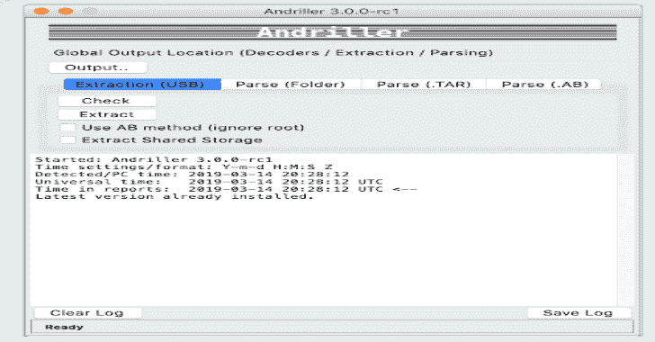

# Andriller:为智能手机提供一系列取证工具的软件工具

> 原文：<https://kalilinuxtutorials.com/andriller-software-utility-forensic-tools/>

Andriller 是一个为智能手机提供一系列取证工具的软件工具。它从 Android 设备上执行只读、法医声音、非破坏性的采集。

它的功能，如强大的锁屏破解模式，个人识别码，或密码；来自 Android(一些苹果 iOS 和 Windows)数据库的应用程序数据的自定义解码器，用于解码通信。提取和解码器产生 HTML 和 Excel 格式的报告。

**特性**

*   自动数据提取和解码
*   Android 备份对非根无设备的数据提取(Android 版本 4.x，多样/有限支持)
*   具有根权限的数据提取:根 ADB 守护进程、CWM 恢复模式或 SU 二进制(超级用户/SuperSU)
*   文件夹结构、Tarball 文件(来自 nanddroid 备份)和 Android 备份( *backup.ab* 文件)的数据解析和解码
*   为 Android 应用选择单独的数据库解码器
*   加密 WhatsApp 存档数据库的解密(。crypt 为. crypt12，必须有正确的*密钥*文件)
*   模式、PIN、密码的锁屏破解(非网守)
*   打开 Android 备份文件
*   设备显示屏的屏幕截图

**也读-[tux Response:Linux 事件响应 2020](https://kalilinuxtutorials.com/tuxresponse-linux-incident-response/)**

**Python 需求**

*   3.6+(推荐 64 位版本)

强烈建议设置一个虚拟环境来安装 Andriller 及其依赖项。不过不是必须的，全局环境也可以。根据 Python 的设置方式，可能需要将`python`和`pip`替换为`python3`和`pip3`来代替下面的指令。

仅限 Windows:从[https://www.python.org](https://www.python.org)安装 Python 时，确保勾选了**将 Python 添加到路径**。

**系统依赖关系**

*   `adb`
*   `python3-tk`

**【Ubuntu/Debian】从终端安装:**

**$ sudo apt-get 安装 android-tools-adb python3-tk**

**【Mac】从酿造桶安装:**

**$ brew buck 安装 Android-平台-工具**

**【Windows】:包含。**

**安装(推荐方式)**

使用 Python 3 创建虚拟环境:

**$ python3 -m venv env**

激活虚拟环境:

**$源环境/媒体夹/激活**

安装 Andriller 及其 Python 依赖项(升级时使用相同的命令):

**(env)$ pip install and riller-U**

**快速启动(运行 GUI)**

**(env) $ python -m andriller**

[**Download**](https://github.com/den4uk/andriller)